## `async`/`await` : du sucre syntaxique sur les promesses

`async`/`await` ne remplace pas les promesses : c'est une **syntaxe** qui
permet d'écrire du code asynchrone qui **se lit** comme du code synchrone,
tout en restant non bloquant en dessous.

```js
// Same logic as the .then() chain of the previous lesson, written with async/await
async function printInvoice(userId) {
  const user = await getUser(userId)
  const orders = await getOrders(user.id)
  const invoice = await getInvoice(orders[0].id)
  console.log("Invoice:", invoice)
}
```

- Une fonction `async` renvoie **toujours** une `Promise`, même si tu
  `return`-nes une valeur simple (elle est automatiquement enveloppée).
- `await` **suspend** l'exécution de la fonction `async` (et seulement elle,
  pas le thread entier) jusqu'à ce que la promesse se résolve, puis reprend
  avec la valeur résolue.

> **Passerelle PHP/Symfony.** Visuellement, `await getUser(userId)` ressemble
> à `$user = $repository->find($userId);` — une ligne, une valeur. La
> différence fondamentale : le `await` **rend la main à l'event loop** pendant
> l'attente (d'autres requêtes peuvent être traitées), alors que l'appel PHP
> **bloque** le worker jusqu'au retour — ce qui est acceptable en PHP
> puisque ce worker n'est dédié qu'à cette seule requête.

## `try`/`catch` : la gestion d'erreur redevient familière

Avec `async`/`await`, `try`/`catch` refonctionne exactement comme en PHP
synchrone — un vrai soulagement après les callbacks error-first.

```js
async function printInvoiceSafely(userId) {
  try {
    const user = await getUser(userId)
    const orders = await getOrders(user.id)
    const invoice = await getInvoice(orders[0].id)
    console.log("Invoice:", invoice)
  } catch (err) {
    // Catches a rejection from ANY of the three awaited calls above
    console.error("Failed to build invoice:", err.message)
  }
}
```

> 💡 **À retenir.** Une promesse **rejetée** rencontrée par un `await` se
> comporte comme un `throw` : elle interrompt la fonction `async` courante et
> est attrapable par un `try/catch` englobant — exactement le réflexe PHP.

## Séquentiel vs parallèle : le piège n°1 de `await`

> ⚠️ **Erreur fréquente — enchaîner des `await` indépendants dans une boucle
> (ou l'un après l'autre) alors qu'ils pourraient tourner en parallèle.**
> Chaque `await` **attend** avant de passer au suivant. Si les opérations sont
> **indépendantes**, les enchaîner ainsi gaspille du temps : elles auraient pu
> démarrer **toutes en même temps**.

```js
// ❌ SEQUENTIAL: each fetch waits for the previous one to finish.
// If each call takes 200ms, this takes ~600ms in total.
async function fetchAllSequential(ids) {
  const results = []
  for (const id of ids) {
    results.push(await fetchUser(id)) // waits here before starting the next one
  }
  return results
}

// ✅ PARALLEL: all calls START at the same time; we wait for all of them together.
// If each call takes 200ms, this takes ~200ms in total (not 600ms).
async function fetchAllParallel(ids) {
  const promises = ids.map((id) => fetchUser(id)) // all started immediately
  return Promise.all(promises)                    // then wait for all of them
}
```

Le point clé : `ids.map((id) => fetchUser(id))` **démarre** immédiatement
chaque appel (une fonction `async` commence à s'exécuter dès son appel, avant
même le premier `await` rencontré à l'intérieur) — c'est `Promise.all` qui
attend ensuite que **toutes** se terminent.

```mermaid
gantt
  dateFormat X
  axisFormat %L ms
  section Séquentiel (await en boucle)
  fetchUser(1) :a1, 0, 200
  fetchUser(2) :a2, after a1, 200
  fetchUser(3) :a3, after a2, 200
  section Parallèle (Promise.all)
  fetchUser(1) :b1, 0, 200
  fetchUser(2) :b2, 0, 200
  fetchUser(3) :b3, 0, 200
```



> **Réflexe à prendre.** Face à un `await` dans une boucle, demande-toi : « la
> requête N a-t-elle besoin du **résultat** de la requête N-1 ? » Si non
> (indépendantes), démarre-les toutes puis attends-les ensemble avec
> `Promise.all` (leçon suivante) plutôt que de les enchaîner une par une.

## Ne jamais oublier le `await` (ou le `return`)

> ⚠️ **Erreur fréquente — oublier `await` devant un appel qui renvoie une
> promesse.** Sans `await`, tu récupères l'objet `Promise` lui-même (toujours
> `pending` à cet instant), pas sa valeur résolue — et si cette promesse est
> rejetée, l'erreur devient une **unhandled rejection** silencieuse (sujet du
> module 8) au lieu d'être attrapée par ton `try/catch`.

```js
async function badExample() {
  try {
    saveToDatabase(data) // ❌ missing `await`: fires, but we don't wait for it
    console.log("Saved!") // prints IMMEDIATELY, possibly BEFORE the save finishes
  } catch (err) {
    // ❌ this catch will NEVER see an error from saveToDatabase:
    // its rejection is not linked to this try/catch without `await`
  }
}
```

## À retenir

- `async`/`await` est du **sucre syntaxique** sur les promesses : une fonction
  `async` renvoie toujours une `Promise`, `await` en suspend l'exécution (pas
  le thread) jusqu'à la résolution.
- `try`/`catch` redevient utilisable pour l'asynchrone — un vrai gain par
  rapport aux callbacks error-first.
- **`await` en boucle = séquentiel** (gaspille du temps sur des opérations
  indépendantes) ; démarre-les toutes puis attends-les ensemble pour un vrai
  parallélisme (`Promise.all`, prochaine leçon).
- Oublier un `await` (ou un `return`) casse le lien entre l'appel et son
  `try/catch` : l'erreur potentielle devient une rejection non gérée.
