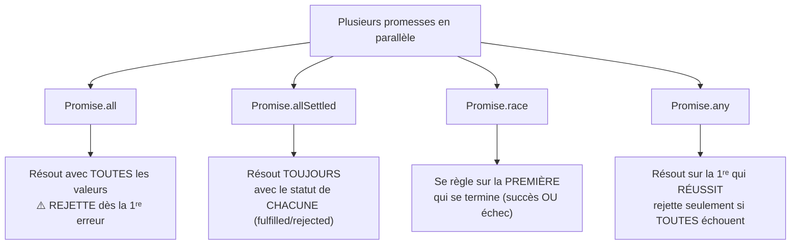

## Quatre façons d'attendre plusieurs promesses

Quand tu as **plusieurs** promesses indépendantes à attendre ensemble,
JavaScript propose quatre combinateurs, chacun avec une sémantique bien
différente à connaître par cœur.



### `Promise.all` : tout ou rien

```js
try {
  const [user, orders, invoice] = await Promise.all([
    getUser(userId),
    getOrders(userId),
    getInvoice(userId),
  ])
  console.log(user, orders, invoice)
} catch (err) {
  // If ANY of the three rejects, Promise.all rejects IMMEDIATELY —
  // you don't get the results of the ones that DID succeed.
  console.error("At least one call failed:", err.message)
}
```

> ⚠️ **Erreur fréquente — utiliser `Promise.all` quand un échec partiel est
> acceptable.** `Promise.all` **rejette dès la première erreur**, sans
> attendre les autres promesses ni te donner accès à leurs résultats
> éventuels. Si tu veux le statut de **chacune**, même en cas d'échecs
> partiels, il te faut `Promise.allSettled`.

### `Promise.allSettled` : le statut de chacune, toujours

```js
const results = await Promise.allSettled([
  getUser(1),
  getUser(2), // let's say this one fails
  getUser(3),
])

// results is ALWAYS an array of the SAME length, each entry shaped like:
//   { status: "fulfilled", value: ... }   OR
//   { status: "rejected", reason: ... }
for (const result of results) {
  if (result.status === "fulfilled") {
    console.log("OK:", result.value)
  } else {
    console.log("Failed:", result.reason.message)
  }
}
```

`Promise.allSettled` **ne rejette jamais** : elle résout toujours, avec un
rapport complet de ce qui a réussi et de ce qui a échoué.

### `Promise.race` et `Promise.any`

```js
// race(): settles as soon as ONE promise settles — success OR failure
const fastest = await Promise.race([
  fetchFromPrimaryServer(),
  fetchFromBackupServer(),
])

// any(): settles as soon as ONE promise SUCCEEDS; rejects only if ALL fail
const firstSuccess = await Promise.any([
  fetchFromMirror1(),
  fetchFromMirror2(),
  fetchFromMirror3(),
])
```

| Combinateur | Se résout quand… | Rejette quand… |
|---|---|---|
| `Promise.all` | **toutes** ont réussi | **une seule** échoue (immédiatement) |
| `Promise.allSettled` | **toutes** se sont réglées (succès ou échec) | jamais |
| `Promise.race` | la **première** s'est réglée (succès ou échec) | la première réglée est un échec |
| `Promise.any` | la **première** a réussi | **toutes** ont échoué |

> **Passerelle PHP/Symfony.** Rien d'équivalent en PHP synchrone (les appels
> se font un par un, dans l'ordre). Le combinateur le plus proche d'une
> intuition Symfony serait `Promise.allSettled` : un peu comme collecter les
> erreurs de validation de **plusieurs champs** d'un formulaire au lieu de
> s'arrêter à la première (`ConstraintViolationList` plutôt qu'une exception
> unique).

## Le piège du rejet non géré (« unhandled rejection »)

> ⚠️ **Erreur fréquente — une promesse rejetée sans `.catch()` ni `try/catch`
> englobant.** Si une promesse est rejetée et qu'**aucun** gestionnaire ne
> s'en occupe, Node émet un avertissement `UnhandledPromiseRejection` (et peut,
> selon la configuration, **arrêter le process**). C'est l'équivalent d'une
> exception PHP qui remonterait jusqu'en haut de la pile sans être attrapée —
> sauf qu'ici, l'erreur peut passer complètement **inaperçue** dans les logs
> si elle n'est pas surveillée.

```js
async function riskyOperation() {
  throw new Error("Something went wrong")
}

// ❌ No .catch(), no surrounding try/catch: this becomes an UNHANDLED REJECTION
riskyOperation()

// ✅ Always attach a .catch(), or await it inside a try/catch
riskyOperation().catch((err) => console.error("Handled:", err.message))
```

> 💡 **À retenir.** Une règle simple pour éviter ce piège : **toute promesse
> créée doit être `await`-ée dans un `try/catch`, ou explicitement suivie d'un
> `.catch()`.** Ne jamais laisser un appel « fire and forget » sans filet
> (détail complet dans le module 8, dédié à la gestion d'erreurs).

## À retenir

- **`Promise.all`** : tout ou rien, rejette dès le premier échec.
- **`Promise.allSettled`** : ne rejette jamais, donne le statut de chaque
  promesse individuellement.
- **`Promise.race`** : se règle sur la première réglée (succès ou échec).
- **`Promise.any`** : se règle sur la première **réussie**, rejette seulement
  si toutes échouent.
- Une promesse rejetée sans `.catch()`/`try-catch` devient une
  **unhandled rejection** — un signal d'alarme à ne jamais ignorer.
