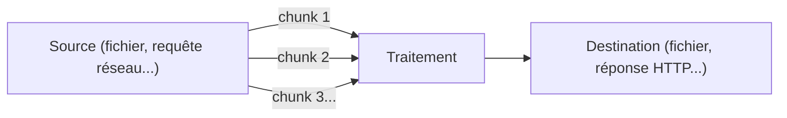

## Pourquoi les streams existent : la mémoire constante

Imagine copier un fichier de 5 Go. Une approche naïve : le lire
**entièrement** en mémoire (`fs.readFile`), puis l'écrire entièrement. Ton
process consomme alors 5 Go de RAM, juste pour un copier-coller.

Un **stream** traite les données par **petits morceaux** (des *chunks*, par
exemple 64 Ko), au fur et à mesure qu'ils arrivent, sans jamais charger
l'ensemble en mémoire. Que le fichier fasse 1 Ko ou 50 Go, la consommation
mémoire reste **constante**.



> **Passerelle PHP/Symfony.** Le concept existe en PHP (`StreamedResponse`,
> les *filtres de flux* `php://filter`, `fread()` en boucle), mais reste
> marginal dans une app Symfony classique où l'on manipule surtout des
> tableaux/objets déjà chargés en mémoire (une entité Doctrine, un tableau de
> résultats). En Node, les streams sont **omniprésents** : `fs`, `http`,
> `zlib` (compression), `crypto`... les utilisent nativement, précisément
> parce que garder la mémoire constante est vital sur un process qui doit
> rester réactif pour toutes les requêtes en cours (module 1).

## Les 4 types de stream

| Type | Rôle | Exemple |
|---|---|---|
| **Readable** | source de données, qu'on **lit** | `fs.createReadStream(...)`, le corps d'une requête HTTP entrante |
| **Writable** | destination de données, où l'on **écrit** | `fs.createWriteStream(...)`, la réponse HTTP sortante |
| **Duplex** | Readable **et** Writable en même temps (indépendants) | une socket TCP |
| **Transform** | Duplex qui **modifie** les données qui le traversent | `zlib.createGzip()`, un chiffrement |

```js
import fs from "node:fs"

const readable = fs.createReadStream("input.txt")
const writable = fs.createWriteStream("output.txt")

// Every Readable is an EventEmitter: it emits "data" chunk by chunk
readable.on("data", (chunk) => {
  console.log("Received a chunk of", chunk.length, "bytes")
  writable.write(chunk) // forward each chunk to the destination
})

readable.on("end", () => {
  console.log("All data has been read")
  writable.end()
})
```

> 💡 **À retenir.** Un `Readable` **hérite d'`EventEmitter`** (leçon
> précédente) : il émet `"data"` (un chunk disponible), `"end"` (plus rien à
> lire), `"error"` (échec). Rien de nouveau à apprendre côté API d'événements,
> juste un usage spécifique de ce que tu connais déjà.

## `pipe()` : la manière idiomatique de relier deux streams

Le code ci-dessus, manuel, peut se réduire à une seule ligne grâce à
`.pipe()` — qui gère en plus, nativement, un problème qu'on va détailler
juste après : la **backpressure**.

```js
import fs from "node:fs"

fs.createReadStream("input.txt").pipe(fs.createWriteStream("output.txt"))
```

## Les streams `Transform` : modifier les données au passage

```js
import fs from "node:fs"
import zlib from "node:zlib"

// Transform stream: compresses each chunk as it flows through
fs.createReadStream("input.txt")
  .pipe(zlib.createGzip())              // Transform: compress
  .pipe(fs.createWriteStream("input.txt.gz"))
```

Chaque `.pipe()` renvoie le stream de destination, ce qui permet de
**chaîner** plusieurs transformations à la suite, un peu comme un pipeline
Unix (`cat file | gzip | ...`).

## À retenir

- Les streams traitent des données **par morceaux (chunks)**, gardant la
  consommation mémoire **constante** quelle que soit la taille des données.
- Quatre types : **Readable** (source), **Writable** (destination),
  **Duplex** (les deux), **Transform** (Duplex qui modifie les données).
- Un `Readable` **est un `EventEmitter`** : `"data"`, `"end"`, `"error"`.
- `.pipe()` relie deux streams en une ligne, et peut se **chaîner** pour
  composer un pipeline de transformations.
