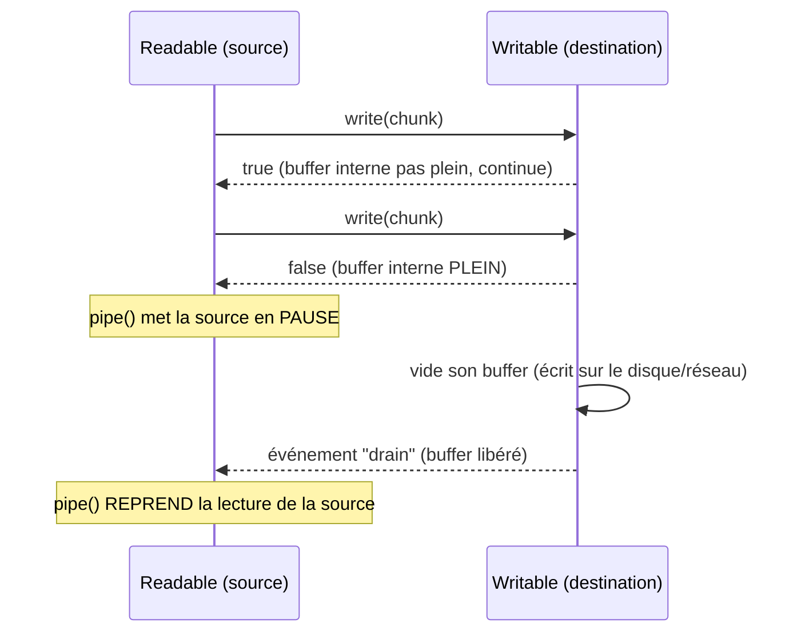

## La backpressure : le problème que `.pipe()` résout tout seul

Imagine une source qui **lit** un fichier depuis un SSD ultra-rapide, reliée
à une destination qui **écrit** vers un réseau lent. Si la source envoie des
chunks plus vite que la destination ne peut les absorber, les chunks
s'accumulent en mémoire côté destination, en attente d'être écrits — jusqu'à,
dans le pire cas, épuiser la mémoire disponible.

La **backpressure** (« contre-pression ») est le mécanisme qui permet à la
destination de dire à la source : « ralentis, je ne suis pas prêt à recevoir
plus ». `.pipe()` implémente cette contre-pression **automatiquement** :



- `writable.write(chunk)` renvoie `false` quand le buffer interne est plein.
- `.pipe()` **met en pause** la lecture du `Readable` dans ce cas.
- Une fois le `Writable` prêt à nouveau, il émet `"drain"` : `.pipe()`
  **reprend** la lecture.

> **Passerelle PHP/Symfony.** Sans équivalent direct en PHP synchrone : une
> boucle `fread()`/`fwrite()` classique est naturellement « au rythme » du
> code qui l'exécute (chaque itération attend la précédente, car tout est
> bloquant). En Node, les deux bouts d'un stream tournent de façon
> **asynchrone et indépendante** : sans backpressure, rien n'empêcherait
> naturellement la source d'aller plus vite que la destination.

> 💡 **À retenir.** C'est précisément **pourquoi** `.pipe()` est recommandé
> plutôt que de gérer manuellement les événements `"data"`/`"write"` : gérer
> soi-même la backpressure (vérifier la valeur de retour de `write()`, mettre
> en pause/reprendre la source) est facile à oublier et source classique de
> fuite mémoire en production.

## `pipeline()` : `.pipe()` en plus robuste

`.pipe()` a un défaut : il ne propage pas bien les **erreurs**, et ne ferme
pas toujours proprement tous les streams si l'un d'eux échoue en cours de
route (risque de fuite de descripteurs de fichiers ouverts). La fonction
`pipeline()` (module `node:stream`) corrige ça : elle relie plusieurs
streams **et** garantit qu'en cas d'erreur sur n'importe lequel, **tous**
sont proprement fermés.

```js
import { pipeline } from "node:stream/promises"
import fs from "node:fs"
import zlib from "node:zlib"

async function compressFile(input, output) {
  try {
    await pipeline(
      fs.createReadStream(input),
      zlib.createGzip(),
      fs.createWriteStream(output),
    )
    console.log("Compression complete")
  } catch (err) {
    // If ANY stream in the chain fails, ALL of them are properly closed —
    // no leaked file descriptors, no half-written output file.
    console.error("Pipeline failed:", err.message)
  }
}
```

> ⚠️ **Erreur fréquente — chaîner des `.pipe()` sans jamais écouter
> `"error"`.** Avec `.pipe()` seul, une erreur sur un stream intermédiaire
> (par exemple un fichier corrompu en entrée de `zlib.createGzip()`) **ne se
> propage PAS automatiquement** au stream suivant : il faut écouter
> `"error"` sur **chaque** stream de la chaîne individuellement. `pipeline()`
> (version `node:stream/promises`, utilisable avec `await`) résout ce
> problème une fois pour toutes.

> **Réflexe à prendre.** Pour un pipeline de streams en production, préfère
> systématiquement `pipeline()` à des `.pipe()` enchaînés à la main : la
> gestion d'erreur et le nettoyage des ressources sont pris en charge pour
> toi, avec une syntaxe `async/await` familière.

## À retenir

- La **backpressure** protège la mémoire quand une source est plus rapide que
  sa destination : `.pipe()` la gère automatiquement (pause/reprise via
  `write()` et l'événement `"drain"`).
- `.pipe()` seul propage mal les erreurs et peut laisser des ressources
  ouvertes en cas d'échec partiel.
- `pipeline()` (via `node:stream/promises`, utilisable avec `await`) relie
  plusieurs streams **et** garantit une fermeture propre de tous les flux en
  cas d'erreur — le réflexe à privilégier en production.
