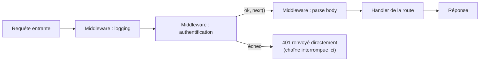

## Le problème : du code transversal répété partout

Authentification, logging, gestion centralisée des erreurs, parsing du
corps JSON... Ce sont des besoins **transversaux**, communs à (presque)
toutes les routes. Écrits « en dur » au début de chaque route, ils
dupliquent le même code partout.

```js
// ❌ Repeated in EVERY route: logging + auth check duplicated everywhere
const server = http.createServer((req, res) => {
  console.log(`${req.method} ${req.url}`)          // duplicated
  if (!req.headers.authorization) {                 // duplicated
    res.writeHead(401)
    res.end("Unauthorized")
    return
  }

  if (req.url === "/users") {
    // ... actual route logic ...
  }
})
```

## Le middleware : une chaîne de fonctions, chacune décidant de continuer

Un **middleware** est une fonction qui reçoit la requête, fait quelque chose
(logger, vérifier un token, parser un body...), puis **décide** : soit elle
passe la main au middleware suivant, soit elle **court-circuite** la chaîne
en renvoyant directement une réponse (par exemple un `401`).



Voici un mini-système de middleware, écrit à la main en HTTP natif — pour
comprendre le mécanisme **avant** de le voir apparaître, identique dans son
esprit, chez Express ou NestJS :

```js
import http from "node:http"

function applyMiddlewares(middlewares, req, res, finalHandler) {
  let index = 0

  function next() {
    if (index >= middlewares.length) {
      finalHandler(req, res) // no more middleware: run the actual route
      return
    }
    const middleware = middlewares[index]
    index++
    middleware(req, res, next) // each middleware decides whether to call next()
  }

  next()
}

function loggingMiddleware(req, res, next) {
  console.log(`${req.method} ${req.url}`)
  next() // continue to the next middleware
}

function authMiddleware(req, res, next) {
  if (!req.headers.authorization) {
    res.writeHead(401)
    res.end("Unauthorized")
    return // NOT calling next(): the chain stops here
  }
  next()
}

const server = http.createServer((req, res) => {
  applyMiddlewares([loggingMiddleware, authMiddleware], req, res, (req, res) => {
    res.writeHead(200)
    res.end("Welcome, authenticated user!")
  })
})
```

> **Passerelle PHP/Symfony.** C'est très exactement l'esprit du **kernel
> HTTP** de Symfony : les `EventSubscriber` écoutant `kernel.request` jouent
> le rôle des middlewares (logging, sécurité, CORS...), chacun pouvant
> **arrêter la propagation** (`$event->setResponse(...)` + `stopPropagation()`)
> ou laisser la main au listener suivant, jusqu'au `Controller`. Le `next()`
> d'un middleware Node correspond à « ne pas arrêter la propagation de
> l'événement » côté Symfony.

## Pourquoi on passe (vite) à un framework

Ce mini-système fait le travail, mais un vrai framework (Express, Fastify,
NestJS) t'évite de le réécrire à chaque projet, et ajoute :

- Un **routing déclaratif** (`/users/:id`, méthodes HTTP) au lieu de
  comparaisons manuelles (leçon précédente).
- Des middlewares **prêts à l'emploi** (parsing JSON, CORS, compression,
  sessions...) déjà testés en production par des milliers de projets.
- Une gestion d'erreurs **centralisée** (un middleware final qui attrape
  toute erreur non gérée, plutôt qu'un `try/catch` répété partout).
- Pour NestJS en particulier : une architecture **modulaire** avec injection
  de dépendances, très proche dans l'esprit du container de services
  Symfony — le sujet d'un prochain parcours dédié.

> 💡 **À retenir.** Comprendre le mécanisme manuel du middleware (une chaîne
> de fonctions, chacune pouvant continuer ou court-circuiter) démystifie ce
> qui se passe **réellement** derrière `app.use(cors())` ou un
> `@UseGuards(...)` NestJS : ce ne sont jamais de la magie, juste ce patron,
> industrialisé.

## À retenir

- Un **middleware** est une fonction `(req, res, next) => ...` qui traite la
  requête puis décide de continuer (`next()`) ou de court-circuiter la
  chaîne (renvoyer une réponse directement).
- C'est l'équivalent direct du pipeline d'`EventSubscriber` du kernel HTTP
  Symfony (`kernel.request`), avec la même logique de propagation/arrêt.
- Les frameworks HTTP Node (Express, Fastify, NestJS) industrialisent ce
  patron : routing déclaratif, middlewares prêts à l'emploi, gestion
  d'erreurs centralisée — d'où l'intérêt d'en connaître un une fois les
  bases natives comprises.
