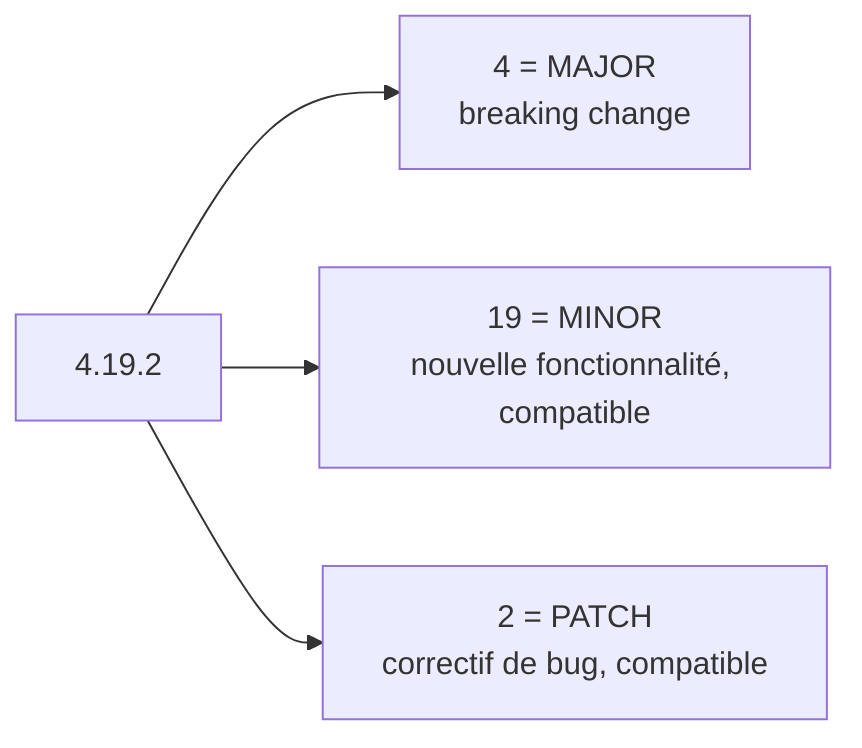
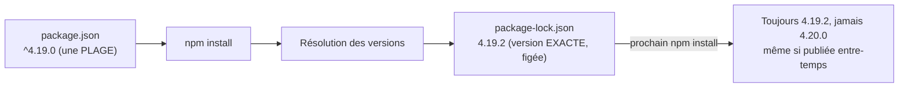

## Le versionnage sémantique (semver)

npm (comme Composer) suit le **versionnage sémantique** : `MAJOR.MINOR.PATCH`
(ex. `4.19.2`).

- **MAJOR** (`4`) : changement **incompatible** avec les versions
  précédentes (breaking change).
- **MINOR** (`19`) : nouvelle **fonctionnalité**, rétrocompatible.
- **PATCH** (`2`) : **correctif de bug**, rétrocompatible.



> **Passerelle Composer.** Exactement le même standard semver que Composer
> (et la quasi-totalité de l'écosystème logiciel moderne) : les règles
> `^`/`~` ci-dessous sont **identiques** dans les deux outils, syntaxe
> comprise.

## `^` (caret) et `~` (tilde) : quelles mises à jour sont autorisées

```json
{
  "dependencies": {
    "express": "^4.19.0",
    "lodash": "~4.17.0",
    "some-lib": "4.19.0"
  }
}
```

| Préfixe | Autorise | N'autorise PAS |
|---|---|---|
| `^4.19.0` (caret) | `4.19.1`, `4.20.0`, `4.99.9` | `5.0.0` (MAJOR différent) |
| `~4.19.0` (tilde) | `4.19.1`, `4.19.9` | `4.20.0` (MINOR différent) |
| `4.19.0` (exact) | uniquement `4.19.0` | tout le reste |

- **`^` (caret)** : la plage la plus permissive et **la plus utilisée par
  défaut** — accepte tout ce qui reste dans le même MAJOR (donc, en théorie,
  sans breaking change selon la convention semver).
- **`~` (tilde)** : plus restrictive — accepte uniquement les correctifs
  (PATCH) dans le même MINOR.

> ⚠️ **Erreur fréquente — croire que `^`/`~` garantissent l'absence de bug.**
> Semver est une **convention**, pas une garantie technique imposée par le
> langage : un mainteneur peut, par erreur, publier un breaking change en
> version MINOR ou PATCH. `^`/`~` réduisent le risque, ne l'éliminent pas —
> d'où l'intérêt du fichier de lock ci-dessous.

## `package-lock.json` : figer ce qui a réellement été installé

`package.json` déclare des **plages** de versions acceptables (`^4.19.0`).
`package-lock.json` enregistre les **versions exactes** réellement
installées (y compris pour les dépendances des dépendances) — pour que
`npm install` reproduise **exactement** la même arborescence sur toutes les
machines (CI, collègues, production).



> **Passerelle Composer.** Rôle **identique** à `composer.lock` :
> `composer.json` déclare des plages, `composer.lock` fige les versions
> exactement résolues. Dans les deux écosystèmes, la règle est la même :
> **committer** le fichier de lock dans le dépôt Git, pour que toute l'équipe
> (et la CI) installe rigoureusement les mêmes versions.

```bash
npm install    # reads package.json, may UPDATE package-lock.json if needed
npm ci         # reads ONLY package-lock.json, installs EXACTLY what's locked
               # (faster, deterministic — the command to use in CI/CD)
```

> **Réflexe à prendre.** En CI/CD et en production, préfère **toujours**
> `npm ci` à `npm install` : `npm ci` échoue si `package.json` et
> `package-lock.json` sont désynchronisés (garde-fou), installe strictement
> ce qui est figé, et supprime d'abord `node_modules/` pour repartir d'un état
> propre — l'équivalent du réflexe `composer install --no-dev` reproductible
> en CI.

## À retenir

- Semver : `MAJOR.MINOR.PATCH` — MAJOR casse la compatibilité, MINOR ajoute
  des fonctionnalités compatibles, PATCH corrige des bugs.
- `^` (caret, le plus permissif) accepte tout le même MAJOR ; `~` (tilde)
  n'accepte que les PATCH du même MINOR.
- `package-lock.json` fige les versions **exactes** installées (≈
  `composer.lock`) : à committer systématiquement.
- `npm ci` (déterministe, pour la CI/prod) plutôt que `npm install` en local
  de développement.
