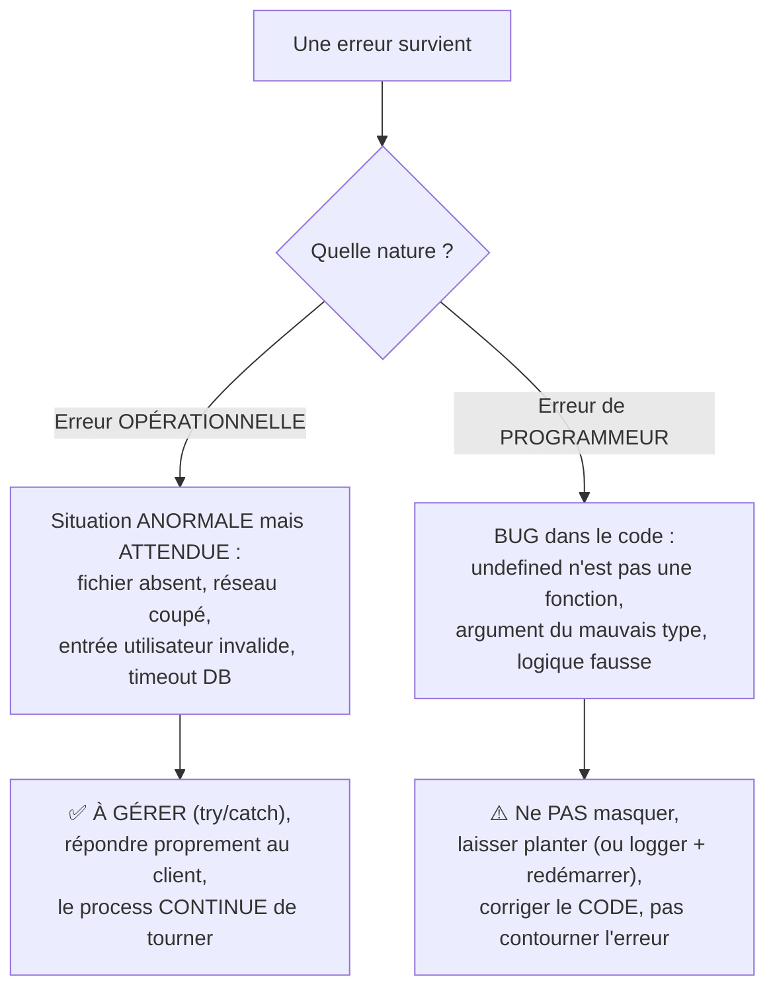

## Une distinction qui change TOUT ce qu'on fait avec une erreur

Toutes les erreurs ne se traitent pas de la même façon. Node (et la
communauté qui l'entoure) distingue traditionnellement deux familles bien
différentes.



- **Erreur opérationnelle** : une situation anormale mais **prévisible**
  dans le fonctionnement normal du système — un fichier manquant, une base
  de données injoignable, une entrée utilisateur invalide, un tiers externe
  qui timeout. On s'attend à ce que ça arrive, on doit la **gérer**.
- **Erreur de programmeur** : un **bug** — appeler une méthode sur
  `undefined`, passer un mauvais type d'argument, une boucle infinie logique.
  Le code lui-même est fautif : la « gérer » avec un `try/catch` masquerait
  le bug au lieu de le corriger.

> **Passerelle PHP/Symfony.** Assez proche de la distinction Symfony entre
> exceptions **métier** attendues (que tu attrapes et transformes en réponse
> HTTP propre, par exemple via un `ExceptionListener`) et les erreurs
> **fatales** de programmation (`TypeError`, `Error` PHP) que tu laisses
> remonter — en environnement de dev affichées en clair (Symfony profiler),
> en prod journalisées puis transformées en 500 générique, mais **jamais
> masquées ou avalées silencieusement**.

## Pourquoi cette distinction change la stratégie

```js
async function loadUserProfile(userId) {
  // OPERATIONAL error: the file might legitimately not exist yet.
  // We EXPECT this to happen sometimes: handle it gracefully.
  try {
    return await readFile(`./cache/${userId}.json`, "utf8")
  } catch (err) {
    if (err.code === "ENOENT") {
      return null // no cache yet: a perfectly normal situation
    }
    throw err
  }
}

function calculateDiscount(price, percentage) {
  // PROGRAMMER error: calling this with a non-number is a BUG in the
  // CALLING code, not something to silently work around.
  if (typeof price !== "number" || typeof percentage !== "number") {
    throw new TypeError("calculateDiscount expects numbers, got: " + typeof price)
  }
  return price * (1 - percentage / 100)
}
```

> ⚠️ **Erreur fréquente — envelopper TOUT dans un `try/catch` « au cas où ».**
> Attraper une `TypeError` née d'un bug de programmation et la transformer en
> valeur de repli silencieuse (`return 0`) **cache le bug** au lieu de le
> révéler : il resurgira ailleurs, plus tard, plus difficile à diagnostiquer.
> Un `try/catch` doit cibler des erreurs **opérationnelles attendues**, pas
> servir de filet de sécurité universel.

## Le choix radical de Node face à une erreur non gérée

> 💡 **À retenir.** Face à une exception non attrapée (`uncaughtException`)
> ou une promesse rejetée non gérée (`unhandledRejection`, module 3), la
> recommandation officielle de Node est de **laisser le process planter**
> puis de le **redémarrer** (via un gestionnaire de process comme PM2, ou
> l'orchestrateur — Kubernetes, Docker Swarm...), plutôt que d'essayer de
> continuer dans un état potentiellement corrompu.

> **Passerelle PHP/Symfony.** Un choix radicalement différent de PHP-FPM : un
> worker PHP qui plante sur une requête ne compromet que **cette** requête
> (rappel du module 1) — les suivantes repartent d'un état frais
> automatiquement. En Node, une erreur de programmeur non gérée peut avoir
> corrompu l'état **partagé** du process (rappel de la leçon 1 du module 1) :
> continuer risquerait de traiter les requêtes suivantes dans un état
> incohérent. Redémarrer *tout le process* est donc souvent le choix le plus
> sûr, contrairement à l'intuition PHP.

## À retenir

- **Erreur opérationnelle** (attendue, ex. fichier absent) : à **gérer**
  proprement, sans arrêter le process.
- **Erreur de programmeur** (un bug, ex. `TypeError`) : à **ne pas
  masquer** — laisser remonter, corriger le code source du problème.
- Un `try/catch` doit cibler des cas opérationnels précis, jamais servir de
  filet universel qui avale silencieusement n'importe quelle erreur.
- Contrairement à PHP-FPM (où un crash n'affecte qu'une requête), Node
  recommande de **laisser planter et redémarrer tout le process** face à une
  erreur de programmeur non gérée, pour éviter un état partagé corrompu.
