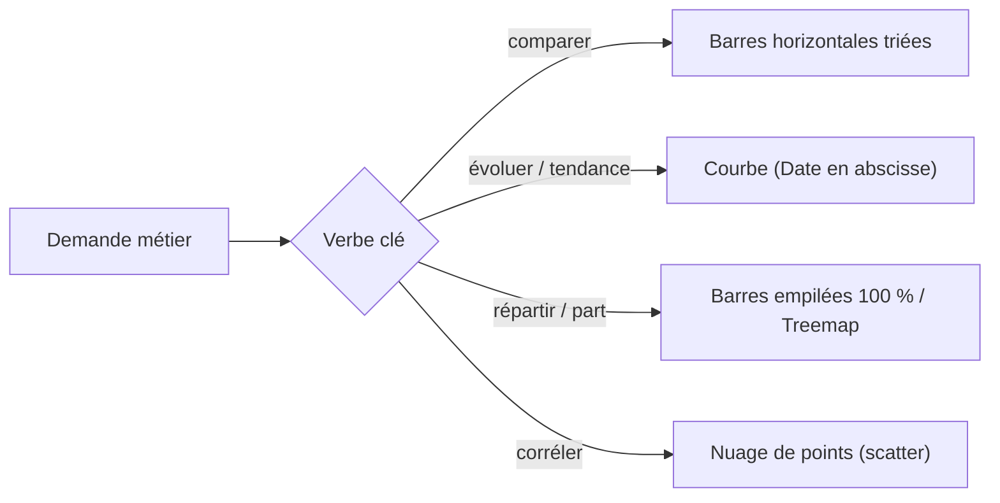

# Le graphique sert le message, pas l'inverse

Avant d'ouvrir Power BI, pose-toi **une** question : *qu'est-ce que je veux faire dire à ces données ?* Le type de message détermine le type de visuel. Il n'y a pas de « beau graphique » dans l'absolu — il y a un graphique adapté à une intention.

> **Objectif de l'étape —** savoir lire une demande métier (« montre-moi… ») et choisir le visuel qui répond, sans réflexe ni habitude.


## Quatre intentions, quatre familles de visuels

| Le message à faire passer | Question type | Visuel adapté |
|---|---|---|
| **Comparaison** entre catégories | « Quelle région vend le plus ? » | Barres / colonnes |
| **Évolution** dans le temps | « Le CA monte-t-il sur 12 mois ? » | Courbe (line chart) |
| **Répartition** (part d'un tout) | « Quelle part du CA fait chaque catégorie ? » | Barres empilées, treemap |
| **Corrélation** entre 2 mesures | « Le budget pub influe-t-il sur les ventes ? » | Nuage de points (scatter) |

## Le réflexe : barres horizontales pour comparer

Pour comparer des catégories (`category`, `region`, `Products`), les **barres horizontales triées** sont presque toujours le meilleur choix : l'œil compare des longueurs alignées sur une même base, et les libellés longs restent lisibles.

```text
Sales by category (top → bottom, sorted desc)

Electronics  ████████████████████  120 k€
Furniture    █████████████         78 k€
Office       ████████              45 k€
Toys         ███                   18 k€
```

Trier par valeur (et pas par ordre alphabétique) fait apparaître le classement *immédiatement* — c'est souvent ça, le message.

## La courbe pour le temps

Dès qu'il y a une dimension `Date` en abscisse, la **courbe** gagne : elle relie les points et rend la tendance visible. On réserve les colonnes au temps quand les périodes sont peu nombreuses et qu'on veut comparer des valeurs ponctuelles (CA de 4 trimestres, par ex.).

## La treemap pour la répartition hiérarchique

Quand les catégories sont nombreuses et qu'on veut visualiser **à la fois la part et la hiérarchie** (ex. CA par catégorie puis sous-catégorie), la **treemap** s'impose : chaque rectangle est proportionnel à sa valeur, et on peut les emboîter.



## Cas vente réels

| Demande métier | Visuel choisi | Raison |
|---|---|---|
| « Quelle région génère le plus de CA ? » | Barres horizontales triées | Comparer des catégories |
| « Le CA progresse-t-il depuis janvier ? » | Courbe mensuelle | Tendance temporelle |
| « Quelle part représente chaque catégorie dans les achats ? » | Barres empilées à 100 % | Répartition du total |
| « Le budget marketing influence-t-il les ventes ? » | Scatter (budget vs CA) | Corrélation entre 2 mesures |

> **À retenir —** « Comparer → barres. Évoluer → courbe. Répartir → empilé/treemap. Corréler → scatter. » Choisis le visuel à partir du **verbe** de la demande, pas par habitude. En cas de doute, teste les barres triées : elles trompent rarement.
