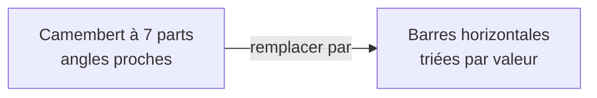

# Quand le graphique ment (souvent sans le vouloir)

Un visuel peut être techniquement correct et **trompeur**. Connaître les pièges classiques, c'est protéger ta crédibilité : un manager qui repère un axe truqué ne fait plus confiance à *aucun* de tes chiffres.

## 1. L'axe vertical tronqué

Commencer l'axe des Y ailleurs qu'à **zéro** exagère artificiellement les écarts. Une hausse de `amount` de 100 à 103 paraît spectaculaire si l'axe va de 99 à 104.

```text
Axe tronqué (trompeur)        Axe à 0 (honnête)
104 ┤        █                 103 ┤   █     █
103 ┤   █    █                  …  ┤   █     █
102 ┤   █    █                   0 ┴───────────
    → « +200 % !! »                 → « presque stable »
```

> Règle : pour des **barres**, l'axe commence **toujours à zéro** (la longueur encode la valeur). Pour une **courbe**, un zoom est tolérable s'il est assumé et annoté.

## 2. Le camembert (pie chart) à fuir

L'œil humain compare mal des **angles**. Au-delà de 2-3 parts, ou quand les valeurs sont proches, un camembert devient illisible. Préfère des **barres triées**.



Le seul cas presque acceptable : **deux parts** très contrastées (ex. 80 % / 20 %).

## 3. La surcharge

Trop de couleurs, trop de séries, des étiquettes partout, un fond chargé. Chaque élément ajouté **coûte** de l'attention. Demande-toi pour chaque pixel : *est-ce qu'il aide à comprendre le message ?* Sinon, on supprime.

## 4. Échelles et couleurs trompeuses

- **Double axe Y** (deux échelles différentes) : on peut faire dire n'importe quoi à une corrélation. À manier avec une extrême prudence.
- **Dégradé de couleur** sur une dimension non ordonnée (les régions ne sont pas « plus » ou « moins » que d'autres) : suggère un ordre qui n'existe pas.
- **Aires 3D / effets de volume** : déforment la perception des tailles. À bannir.

> **À retenir —** Les trois fautes les plus courantes en entretien comme en mission : *axe tronqué sur des barres*, *camembert illisible*, *surcharge*. Un visuel honnête est souvent un visuel plus simple.
