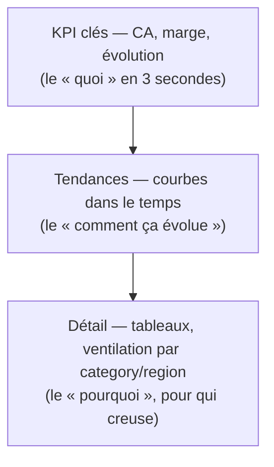

# Un dashboard raconte une histoire

Un rapport n'est pas une collection de graphiques : c'est un **propos**. Le lecteur doit, en quelques secondes, savoir *de quoi on parle*, *ce qui va bien ou mal*, et *où regarder ensuite*. C'est le travail de restitution — souvent ce qui distingue un analyste d'un « fabricant de graphiques ».

## La pyramide : du général au détail

On organise l'information du haut (lecture rapide) vers le bas (détail pour qui creuse).

En haut, **3 à 5 KPI** (cartes / KPI cards) répondent à la question principale. En dessous, les courbes montrent la dynamique. Tout en bas, les tableaux et ventilations permettent de creuser.

## Donner du contexte à un chiffre

Un nombre seul ne dit rien. **120 k€ de CA**, c'est bien ou mal ? On le rend parlant par comparaison :

- vs **objectif** (target) : 120 k€ pour un objectif de 100 k€ → +20 %
- vs **période précédente** : +8 % vs le mois dernier
- vs **moyenne** ou vs une autre `region`

> Tout KPI gagne à porter une **variation** (flèche, %, couleur). C'est exactement ce qu'on calculera en DAX au module 4.

## Titre = phrase, pas étiquette

Le titre d'un visuel devrait porter le **message**, pas décrire les axes.

- Mou : « CA par mois »
- Parlant : « Le CA recule depuis mars (-12 %) »

Un bon titre fait gagner au lecteur l'effort d'interpréter.

## Guider l'œil

- **Couleur d'accent** : une seule couleur forte pour le point important, le reste en gris/neutre.
- **Ordre de lecture** : on lit en Z (haut-gauche → bas-droite) ; place l'essentiel en haut à gauche.
- **Annotations** : une flèche, une note (« lancement produit ») valent un paragraphe.

> **À retenir —** Avant de construire, écris **la phrase** que le dashboard doit faire comprendre. Si un visuel ne sert pas cette phrase, il n'a rien à y faire.
