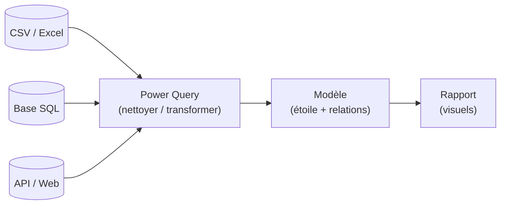

# Power Query : la porte d'entrée des données

Dans Power BI Desktop, **rien n'arrive directement** dans le rapport. Tout passe d'abord par **Power Query**, l'outil de préparation des données. C'est là qu'on importe, qu'on nettoie et qu'on transforme — avant même de penser visuels.

> **Objectif de l'étape —** savoir importer des sources variées et les nettoyer dans Power Query, en comprenant que ces transformations sont **rejouées à chaque rafraîchissement**.

## Le flux complet

Power Query occupe l'étape **« Transform »** d'un processus classique en BI : l'**ETL**.

## ETL : Extract, Transform, Load

- **Extract** — se connecter à la source et récupérer les données (CSV, Excel, base SQL…).
- **Transform** — nettoyer, typer, restructurer (le cœur du travail dans Power Query).
- **Load** — charger le résultat dans le modèle Power BI.

En pratique, on dit *« Obtenir les données »* (Get Data) pour l'extract, on travaille dans l'**éditeur Power Query** pour le transform, et **« Fermer & appliquer »** déclenche le load.

## Importer : « Obtenir les données »

Dans Power BI Desktop, le bouton **Obtenir les données** (Get Data) ouvre la liste des connecteurs :

| Source | Connecteur | Remarque |
|---|---|---|
| Fichier CSV | Texte/CSV | détecte le séparateur et l'encodage |
| Classeur Excel | Excel | choisir la feuille ou un tableau nommé |
| Base de données | SQL Server, MySQL… | mode Import ou DirectQuery |
| Dossier | Folder | combine tous les fichiers d'un dossier (ex. un export par mois) |

> Astuce SQL : pour une base, mieux vaut souvent écrire une **requête SQL** propre côté source (cf. `parcours-sql`) que tout ramener puis filtrer dans Power Query. On ne charge que ce dont on a besoin.

## Rien n'est destructif

Toutes les transformations sont **non destructives** : la source d'origine n'est jamais modifiée. Power Query enregistre la **suite des étapes** appliquées (le volet *Étapes appliquées*) et les **rejoue** à chaque rafraîchissement. Tu nettoies une fois ; le travail se répète tout seul sur les données mises à jour.

> **À retenir —** Toute donnée entre par Power Query (Extract → **Transform** → Load). Tu décris une recette d'étapes ; Power BI la rejoue à chaque rafraîchissement. La source n'est jamais touchée.
