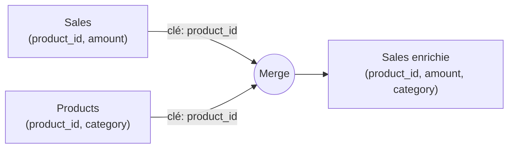

# Combiner et restructurer des tables

Au-delà du nettoyage colonne par colonne, trois opérations reviennent sans cesse pour assembler les données : **fusionner**, **ajouter** et **dépivoter**.

## Fusionner (Merge) = un JOIN

La **fusion** rapproche deux tables sur une **clé commune** — exactement comme un `JOIN` SQL. Exemple : enrichir `Sales` avec le nom de catégorie depuis `Products`.



Power Query propose les types de jointure habituels : **Left Outer** (garder toutes les ventes), Inner, etc. On choisit la table, la ou les clés, puis on **développe** (Expand) les colonnes voulues de la table jointe.

> Souvent, **on préfère ne pas fusionner** et garder les tables séparées pour les relier dans le **modèle en étoile** (module 3). La fusion est utile quand on veut une seule table plate, ou pour des lookups ponctuels.

## Ajouter (Append) = un UNION

L'**ajout** empile des tables qui ont **la même structure** — comme un `UNION ALL` SQL. Cas typique : `sales_2023`, `sales_2024`, `sales_2025`, un fichier par an, qu'on veut en une seule table `Sales`.

```text
Append:  sales_2023  ┐
         sales_2024  ├──►  Sales  (toutes les lignes empilées)
         sales_2025  ┘
```

Le connecteur **Dossier** (Folder) automatise ça : pointe un dossier, Power Query combine tous les fichiers de même format. Un nouvel export déposé → il entre au prochain rafraîchissement.

## Dépivoter (Unpivot) : du « large » au « long »

Les fichiers bricolés à la main sont souvent au format **large** (wide) : une colonne par mois. Inexploitable tel quel pour un graphique temporel.

```text
AVANT (format large — wide)
| category    | Jan | Feb | Mar |
| Electronics | 120 | 130 | 110 |
| Furniture   |  78 |  80 |  90 |

APRÈS unpivot (format long — tidy)
| category    | month | amount |
| Electronics | Jan   | 120    |
| Electronics | Feb   | 130    |
| Electronics | Mar   | 110    |
| Furniture   | Jan   | 78     |
| ...         | ...   | ...    |
```

On sélectionne les colonnes de mois → **Dépivoter les colonnes** (Unpivot Columns). Power BI **adore** le format long : une ligne = une observation, avec `month` comme dimension et `amount` comme mesure. C'est la forme « tidy » qu'on cherche toujours à obtenir.

> **À retenir —** **Merge** = JOIN (clé commune, élargit). **Append** = UNION (même structure, empile). **Unpivot** = passer du large au long pour rendre la donnée exploitable. Power BI veut du **long / tidy**.
