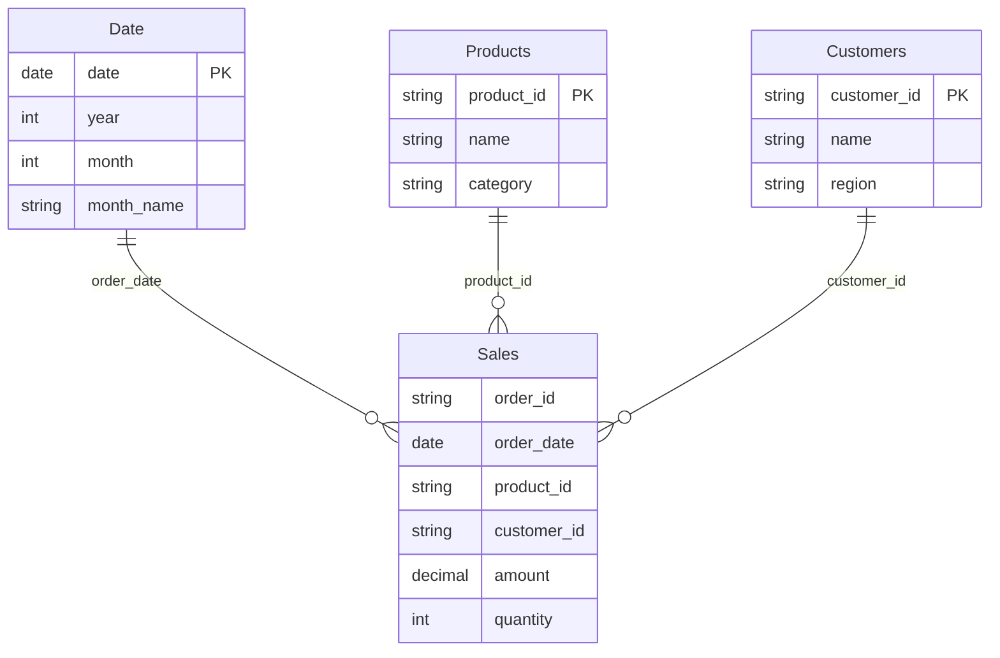
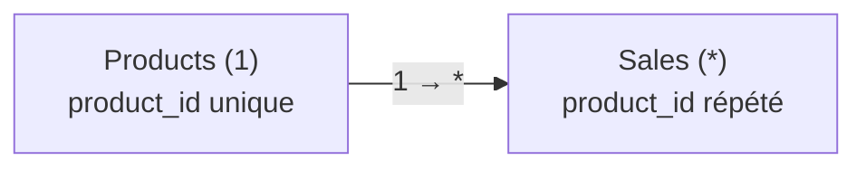
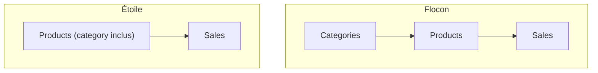

# Relier les tables : l'étoile

Dans la **vue Modèle** de Power BI, on relie la table de faits aux dimensions par des **relations**. Le résultat ressemble à une étoile : le fait au centre, les dimensions autour.

## Le schéma en étoile

`Sales` est au centre ; `Products`, `Customers` et `Date` rayonnent autour. C'est le modèle **que Power BI préfère** : performant, lisible, et c'est sur lui que DAX raisonne le mieux.

## Relations 1-* (un-à-plusieurs)

Chaque relation va du côté **un** (la dimension, clé unique) vers le côté **plusieurs** (le fait). Un produit apparaît dans **plusieurs** ventes ; une vente concerne **un** produit.

La relation rend le **filtre dimensionnel** possible : filtrer `Products[category] = "Electronics"` propage le filtre vers `Sales` et ne garde que les ventes correspondantes. Le sens du filtre va naturellement du **un** vers le **plusieurs**.

## Étoile vs flocon

- **Étoile (star)** : dimensions directement reliées au fait, chacune en une table « aplatie » (ex. `Products` contient déjà `category`). Simple, rapide. **À privilégier.**
- **Flocon (snowflake)** : une dimension est elle-même éclatée en sous-tables (`Products` → `Categories` séparée). Plus normalisé, mais plus de relations, plus lent, plus complexe.

En Power BI, on **dénormalise volontairement** vers l'étoile : on fait remonter `category` dans `Products` (souvent via un *Merge* en Power Query). Le moteur est optimisé pour ça.

> **À retenir —** Fait au centre, dimensions autour, relations **1-\*** (dimension → fait). Filtrer une dimension filtre le fait. Vise l'**étoile**, pas le flocon : c'est plus simple et c'est ce que DAX attend.
