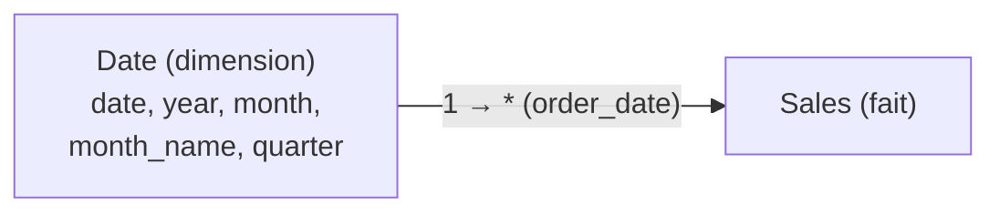

# Deux détails qui font (ou cassent) le modèle

## La granularité du fait

La **granularité**, c'est *ce que représente une ligne* de la table de faits. Une ligne = une vente ? une ligne de commande ? un agrégat journalier ?

> Règle d'or (revue dans le hub) : on garde la granularité **la plus fine** disponible. On peut toujours **agréger** (lignes → mois) ; on ne peut **jamais redescendre** une fois agrégé.

Si `Sales` est déjà agrégé au mois, impossible de produire un détail journalier : la donnée fine est perdue. Au moment de l'import, vérifie donc ce qu'une ligne représente.

## La table de dates dédiée

Le piège classique du débutant : utiliser directement la colonne `order_date` de `Sales` pour l'axe temporel. Ça « marche » un peu, mais ça plafonne vite. La bonne pratique est une **table de dates dédiée**, reliée à `Sales` par `order_date`.

Pourquoi une table de dates séparée ?

- elle est **continue** : toutes les dates de la plage, même celles **sans vente** (sinon des trous dans les courbes) ;
- elle porte des **colonnes d'analyse** prêtes à l'emploi : `year`, `quarter`, `month`, `month_name`, `day_of_week`, `is_weekend`… ;
- elle débloque la **time intelligence** DAX (`TOTALYTD`, `SAMEPERIODLASTYEAR` — module 4), qui exige une vraie dimension date marquée comme telle.



## La créer — deux voies

**Option A : table calculée DAX** (simple et rapide pour commencer) :

```text
// DAX calculated table — generate a continuous date range
Date =
CALENDAR ( DATE ( 2023, 1, 1 ), DATE ( 2025, 12, 31 ) )
```

Puis on ajoute des **colonnes calculées** dans la table `Date` :

```text
// Add columns to the Date table (calculated columns, not measures)
Year         = YEAR ( 'Date'[date] )
Quarter      = "Q" & QUARTER ( 'Date'[date] )
Month        = MONTH ( 'Date'[date] )
Month Name   = FORMAT ( 'Date'[date], "MMMM" )          // "January", "February"…
Month Year   = FORMAT ( 'Date'[date], "MMM YYYY" )       // "Jan 2024"
Day of Week  = WEEKDAY ( 'Date'[date], 2 )              // 1 = Monday (ISO)
Is Weekend   = IF ( WEEKDAY ( 'Date'[date], 2 ) >= 6, TRUE, FALSE )
Week Number  = WEEKNUM ( 'Date'[date], 2 )
```

**Option B : table en Power Query (M)** (plus flexible, gère les fériés, les décalages d'année fiscale) :

```text
// Generate a date table in Power Query
// Source: a list of dates from 2023-01-01 to 2025-12-31
let
    StartDate = #date(2023, 1, 1),
    EndDate   = #date(2025, 12, 31),
    DateList  = List.Dates(StartDate, Duration.Days(EndDate - StartDate) + 1, #duration(1,0,0,0)),
    DateTable = Table.FromList(DateList, Splitter.SplitByNothing(), {"date"}),
    TypedDate = Table.TransformColumnTypes(DateTable, {{"date", type date}}),
    AddYear   = Table.AddColumn(TypedDate,  "year",       each Date.Year([date]),  Int64.Type),
    AddMonth  = Table.AddColumn(AddYear,    "month",      each Date.Month([date]), Int64.Type),
    AddMName  = Table.AddColumn(AddMonth,   "month_name", each Date.MonthName([date]), type text),
    AddQ      = Table.AddColumn(AddMName,   "quarter",    each "Q" & Text.From(Date.QuarterOfYear([date])), type text),
    AddWE     = Table.AddColumn(AddQ,       "is_weekend", each Date.DayOfWeek([date], Day.Monday) >= 5, type logical)
in
    AddWE
```

Enfin, étape **indispensable** : *Marquer comme table de dates* (Mark as Date Table) dans Power BI, pour que la time intelligence fonctionne.

## Vérifier la continuité

La table de dates doit couvrir **toutes** les dates de `Sales[order_date]` sans trou. Une façon simple de vérifier :

```text
// DAX check — should return 0 if the Date table is continuous
Date Coverage Check =
COUNTROWS ( 'Date' ) - (DATEDIFF ( MIN ( 'Date'[date] ), MAX ( 'Date'[date] ), DAY ) + 1)
```

Si la valeur est positive, des dates manquent.

> **À retenir —** Garde la granularité **la plus fine**. Crée **toujours** une table de dates dédiée et continue, relie-la au fait sur `order_date`, et **marque-la comme table de dates**. Sans cette marque, toute la time intelligence DAX est muette.
