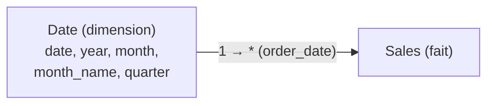

# Deux détails qui font (ou cassent) le modèle

## La granularité du fait

La **granularité**, c'est *ce que représente une ligne* de la table de faits. Une ligne = une vente ? une ligne de commande ? un agrégat journalier ?

> Règle d'or (revue dans le hub) : on garde la granularité **la plus fine** disponible. On peut toujours **agréger** (lignes → mois) ; on ne peut **jamais redescendre** une fois agrégé.

Si `Sales` est déjà agrégé au mois, impossible de produire un détail journalier : la donnée fine est perdue. Au moment de l'import, vérifie donc ce qu'une ligne représente.

## La table de dates dédiée

Le piège classique du débutant : utiliser directement la colonne `order_date` de `Sales` pour l'axe temporel. Ça « marche » un peu, mais ça plafonne vite. La bonne pratique est une **table de dates dédiée**, reliée à `Sales` par `order_date`.

Pourquoi une table de dates séparée ?

- elle est **continue** : toutes les dates de la plage, même celles **sans vente** (sinon des trous dans les courbes) ;
- elle porte des **colonnes d'analyse** prêtes à l'emploi : `year`, `quarter`, `month`, `month_name`, `day_of_week`, `is_weekend`… ;
- elle débloque la **time intelligence** DAX (`TOTALYTD`, `SAMEPERIODLASTYEAR` — module 4), qui exige une vraie dimension date marquée comme telle.



## La créer

Deux voies courantes :

```text
// DAX calculated table — generate a continuous date range
Date =
CALENDAR ( DATE ( 2023, 1, 1 ), DATE ( 2025, 12, 31 ) )
```

Puis on ajoute des colonnes calculées (`year`, `month`…), **ou** on construit la table en Power Query. Enfin, étape **indispensable** : *Marquer comme table de dates* (Mark as Date Table) dans Power BI, pour que la time intelligence fonctionne.

> **À retenir —** Garde la granularité **la plus fine**. Crée **toujours** une table de dates dédiée et continue, relie-la au fait sur `order_date`, et **marque-la comme table de dates**. C'est le prérequis de toute analyse temporelle.
