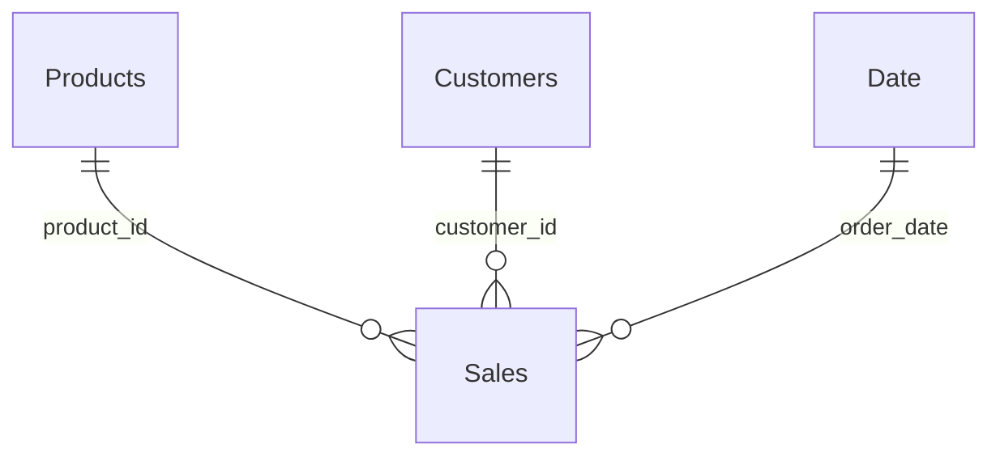

## Énoncé

On te livre **une seule grosse table plate** `sales_flat`, issue d'un export :

```text
sales_flat
| order_id | order_date | product_name | category    | customer_name | region | amount | quantity |
```

Conçois le **modèle en étoile** correspondant. Pour chaque table proposée :

1. donne son **rôle** (fait ou dimension) et ses colonnes ;
2. indique les **relations** (sens et cardinalité) ;
3. justifie l'ajout d'une table que `sales_flat` ne contient pas.

<!--correction-->

## Correction

On éclate la table plate en **un fait + trois dimensions**.

**Table de faits — `Sales`** (granularité : une ligne de vente)

```text
Sales | order_id | order_date | product_id | customer_id | amount | quantity |
```

On y remplace les libellés (`product_name`, `category`, `customer_name`, `region`) par des **clés** (`product_id`, `customer_id`) pour ne garder que mesures + clés.

**Dimension — `Products`**

```text
Products | product_id (PK) | product_name | category |
```

**Dimension — `Customers`**

```text
Customers | customer_id (PK) | customer_name | region |
```

**Dimension à ajouter — `Date`** (absente de `sales_flat`)

```text
Date | date (PK) | year | quarter | month | month_name |
```

On l'ajoute parce qu'une table de dates **dédiée et continue** est nécessaire pour combler les périodes sans vente et débloquer la time intelligence DAX. On la **marque comme table de dates**.

**Relations** (toutes 1-\*, de la dimension vers le fait) :



- `Products (1) → Sales (*)` sur `product_id`
- `Customers (1) → Sales (*)` sur `customer_id`
- `Date (1) → Sales (*)` sur `order_date`

> Pour passer de `sales_flat` à ce modèle, on fait le ménage en **Power Query** : extraire les dimensions (colonnes distinctes), créer les clés, puis relier les tables dans la **vue Modèle**. Résultat : chaque info à un seul endroit, et une étoile que DAX adore.
