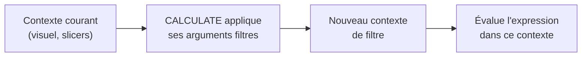

# `CALCULATE` : modifier le contexte de filtre

Si tu ne devais retenir **qu'une** fonction DAX, ce serait `CALCULATE`. Elle évalue une expression **en modifiant le contexte de filtre**. C'est la porte d'entrée vers 90 % des mesures avancées (variations, % du total, time intelligence).

## La syntaxe

```text
CALCULATE ( <expression> , <filter1> , <filter2> , ... )
```

- `<expression>` : ce qu'on veut calculer (souvent une mesure existante) ;
- les `<filter>` : des conditions qui **s'ajoutent à / remplacent** le contexte courant.

## Exemple : forcer une catégorie

```text
// Total sales, but only for Electronics — whatever the visual's context
Electronics Sales = CALCULATE ( [Total Sales], Products[category] = "Electronics" )
```

Même dans un tableau découpé par `region`, cette mesure ne compte **que** les ventes d'Electronics. `CALCULATE` a **remplacé** le filtre sur `category` par `"Electronics"`.

## Exemple : ignorer un filtre avec `ALL`

`ALL` retire un filtre. Combiné à `CALCULATE`, il sert à calculer un **total de référence** pour faire un pourcentage du total :

```text
// Sales ignoring any category filter → the grand total
All Categories Sales = CALCULATE ( [Total Sales], ALL ( Products[category] ) )

// Share of each category in the grand total
Category Share % =
DIVIDE ( [Total Sales], [All Categories Sales] )
```

Dans un tableau par `category` : `[Total Sales]` suit le contexte (le CA de la ligne), tandis que `[All Categories Sales]` ignore le découpage et renvoie toujours le total → le ratio donne bien la **part** de chaque catégorie.

> Utilise **toujours** `DIVIDE(a, b)` plutôt que `a / b` : `DIVIDE` gère proprement la division par zéro (renvoie un blanc, ou une valeur par défaut) sans erreur.

## Comment lire `CALCULATE`



`CALCULATE` part du contexte courant, applique ses filtres (qui ajoutent ou remplacent), puis évalue l'expression dans ce **nouveau** contexte.

## Aller plus loin : `ALLEXCEPT`, `ALLSELECTED`, `KEEPFILTERS`

Ces modificateurs étendent le vocabulaire de `CALCULATE` :

```text
// % du total par région — ignore le filtre catégorie mais GARDE le filtre région
Category Share In Region % =
DIVIDE (
    [Total Sales],
    CALCULATE ( [Total Sales], ALLEXCEPT ( Products, Customers[region] ) )
)
```

- **`ALLEXCEPT(table, col1, col2…)`** : retire tous les filtres de la table sauf ceux des colonnes listées. Utile pour des % "dans le contexte de la région" par exemple.
- **`ALLSELECTED()`** : calcule le total en tenant compte uniquement des slicers et filtres de page (pas du découpage interne du visuel). Parfait pour des parts relatives à la sélection courante.
- **`KEEPFILTERS()`** : au lieu de **remplacer** le filtre courant, l'**intersecte** avec le nouveau.

```text
// With KEEPFILTERS: only Electronics if Electronics is already visible in context
Electronics Kept =
CALCULATE (
    [Total Sales],
    KEEPFILTERS ( Products[category] = "Electronics" )
)
```

Sans `KEEPFILTERS`, un tableau filtré sur `Furniture` afficherait quand même les ventes Electronics. Avec, la mesure respecte le filtre existant.

## Cas complet : tableau de bord vente

```text
// Building a typical sales dashboard measure by measure

// 1. Atomic base
Total Sales     = SUM ( Sales[amount] )
Total Qty       = SUM ( Sales[quantity] )
Order Count     = COUNTROWS ( Sales )
Distinct Cust   = DISTINCTCOUNT ( Sales[customer_id] )

// 2. Derived
Avg Basket      = DIVIDE ( [Total Sales], [Order Count] )

// 3. Ratio vs total
Category Share % =
DIVIDE (
    [Total Sales],
    CALCULATE ( [Total Sales], ALL ( Products[category] ) )
)

// 4. Conditional
Top Category Sales =
CALCULATE ( [Total Sales], Products[category] = "Electronics" )
```

> **À retenir —** `CALCULATE(expr, filtres…)` = évaluer `expr` en **changeant le contexte de filtre**. C'est l'outil de base des % du total (`ALL`, `ALLEXCEPT`), des sous-ensembles (`category = "…"`) et de la time intelligence. Utilise `DIVIDE` pour tous les ratios. Compose les mesures en couches (atomique → dérivée → ratio).
