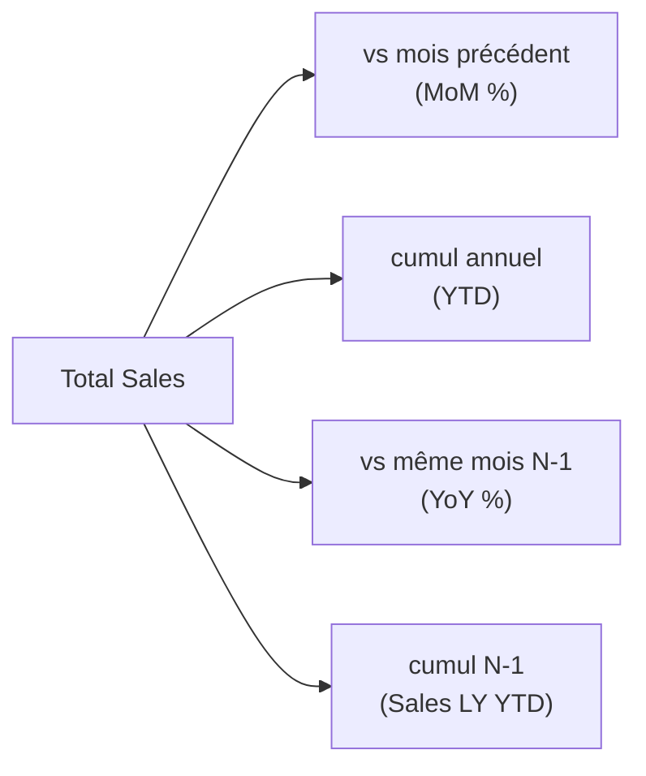

# Comparer dans le temps

Un CA absolu intéresse moins que son **évolution**. « +8 % vs le mois dernier » est l'indicateur que tout manager regarde en premier. DAX a des fonctions dédiées — qui exigent la **table de dates** marquée du module 3.

## Variation vs période précédente

On combine `CALCULATE` avec une fonction de décalage temporel. `PREVIOUSMONTH` renvoie le mois précédent du contexte courant :

```text
// Sales of the previous month, relative to the current context
Sales Prev Month = CALCULATE ( [Total Sales], PREVIOUSMONTH ( 'Date'[date] ) )

// Absolute and relative variation
Sales MoM        = [Total Sales] - [Sales Prev Month]
Sales MoM %      = DIVIDE ( [Sales MoM], [Sales Prev Month] )
```

Dans un tableau par mois, chaque ligne compare son CA à celui du mois d'avant. On construit la variation en **étapes lisibles** (`Prev`, puis `MoM`, puis `MoM %`) plutôt qu'une formule monolithique.

## Cumul depuis le début d'année (YTD)

`TOTALYTD` cumule une mesure depuis le 1er janvier jusqu'à la date du contexte :

```text
// Year-to-date sales
Sales YTD = TOTALYTD ( [Total Sales], 'Date'[date] )
```

En mars, `Sales YTD` = janvier + février + mars. Très demandé pour suivre l'atteinte d'un objectif annuel.

## Comparaison à l'an dernier (YoY)

`SAMEPERIODLASTYEAR` décale d'un an la même période :

```text
// Same period one year earlier
Sales LY    = CALCULATE ( [Total Sales], SAMEPERIODLASTYEAR ( 'Date'[date] ) )

// Year-over-year growth
Sales YoY % = DIVIDE ( [Total Sales] - [Sales LY], [Sales LY] )
```

Comparer mars 2025 à mars 2024 neutralise la **saisonnalité** (un pic de décembre se compare à décembre, pas à novembre).

## Le tableau de bord temporel typique



## Cas vente complet : les 5 mesures temporelles essentielles

```text
// 1. Current period
Total Sales = SUM ( Sales[amount] )

// 2. Previous month
Sales Prev Month =
CALCULATE ( [Total Sales], PREVIOUSMONTH ( 'Date'[date] ) )

// 3. MoM variation in %
Sales MoM % =
DIVIDE ( [Total Sales] - [Sales Prev Month], [Sales Prev Month] )

// 4. Year-to-date cumulative
Sales YTD = TOTALYTD ( [Total Sales], 'Date'[date] )

// 5. Same period last year + year-over-year growth
Sales LY      = CALCULATE ( [Total Sales], SAMEPERIODLASTYEAR ( 'Date'[date] ) )
Sales YoY %   = DIVIDE ( [Total Sales] - [Sales LY], [Sales LY] )
```

## Autres fonctions de time intelligence utiles

| Fonction | Usage |
|---|---|
| `PREVIOUSMONTH(date)` | Mois précédent (glissant) |
| `PREVIOUSQUARTER(date)` | Trimestre précédent |
| `PREVIOUSYEAR(date)` | Année précédente |
| `DATEADD(date, -1, MONTH)` | Décalage flexible (n périodes, n'importe quelle granularité) |
| `TOTALYTD(expr, date)` | Cumul depuis le 1er janvier |
| `TOTALQTD(expr, date)` | Cumul depuis le début du trimestre |
| `TOTALMTD(expr, date)` | Cumul depuis le début du mois |
| `SAMEPERIODLASTYEAR(date)` | Même période N-1 |
| `DATESINPERIOD(date, LASTDATE(date), -3, MONTH)` | Fenêtre glissante (ex. 3 derniers mois) |

## Piège : la mesure temporelle dans un visuel sans contexte date

Une mesure `PREVIOUSMONTH` affichée dans une **carte** (sans dimension date en contexte) retourne un blanc — il n'y a pas de « mois courant » à déplacer. Ces mesures ont du sens dans un **tableau ou une courbe avec `Date` en axe** : le contexte de filtre fournit le mois.

> **À retenir —** Variation = `[mesure] - CALCULATE([mesure], <décalage>)`, puis `DIVIDE`. `TOTALYTD` pour le cumul annuel, `SAMEPERIODLASTYEAR` pour le N-1, `DATEADD` pour les décalages flexibles. Tout repose sur une **table de dates marquée et continue** — sans elle, rien ne fonctionne.
