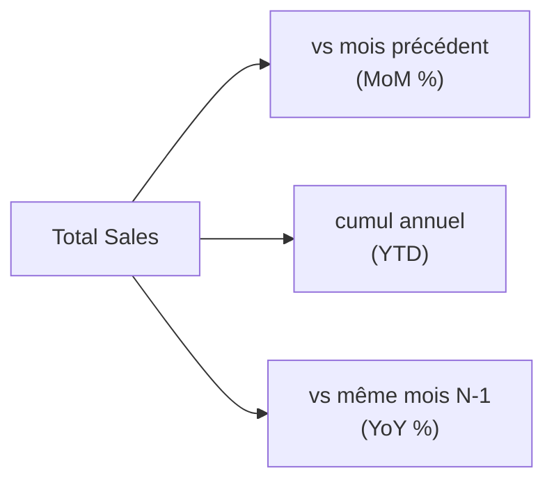

# Comparer dans le temps

Un CA absolu intéresse moins que son **évolution**. « +8 % vs le mois dernier » est l'indicateur que tout manager regarde en premier. DAX a des fonctions dédiées — qui exigent la **table de dates** marquée du module 3.

## Variation vs période précédente

On combine `CALCULATE` avec une fonction de décalage temporel. `PREVIOUSMONTH` renvoie le mois précédent du contexte courant :

```text
// Sales of the previous month, relative to the current context
Sales Prev Month = CALCULATE ( [Total Sales], PREVIOUSMONTH ( 'Date'[date] ) )

// Absolute and relative variation
Sales MoM        = [Total Sales] - [Sales Prev Month]
Sales MoM %      = DIVIDE ( [Sales MoM], [Sales Prev Month] )
```

Dans un tableau par mois, chaque ligne compare son CA à celui du mois d'avant. On construit la variation en **étapes lisibles** (`Prev`, puis `MoM`, puis `MoM %`) plutôt qu'une formule monolithique.

## Cumul depuis le début d'année (YTD)

`TOTALYTD` cumule une mesure depuis le 1er janvier jusqu'à la date du contexte :

```text
// Year-to-date sales
Sales YTD = TOTALYTD ( [Total Sales], 'Date'[date] )
```

En mars, `Sales YTD` = janvier + février + mars. Très demandé pour suivre l'atteinte d'un objectif annuel.

## Comparaison à l'an dernier (YoY)

`SAMEPERIODLASTYEAR` décale d'un an la même période :

```text
// Same period one year earlier
Sales LY    = CALCULATE ( [Total Sales], SAMEPERIODLASTYEAR ( 'Date'[date] ) )

// Year-over-year growth
Sales YoY % = DIVIDE ( [Total Sales] - [Sales LY], [Sales LY] )
```

Comparer mars 2025 à mars 2024 neutralise la **saisonnalité** (un pic de décembre se compare à décembre, pas à novembre).

## Le tableau de bord temporel typique



> **À retenir —** Variation = `[mesure] - CALCULATE([mesure], <décalage temporel>)`, puis `DIVIDE` pour le %. `TOTALYTD` pour le cumul annuel, `SAMEPERIODLASTYEAR` pour le N-1. Tout cela repose sur une **table de dates marquée** — sans elle, rien ne fonctionne.
