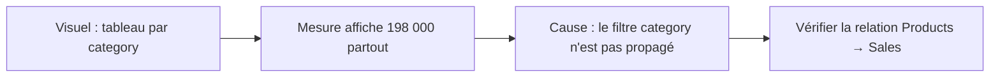

# Les erreurs qui trompent tout le monde

Même des analystes expérimentés tombent dans ces pièges. Les comprendre une fois pour toutes, c'est écrire des mesures DAX fiables dès le premier coup.

## Piège 1 — Le total qui ne correspond pas à la somme des lignes

Dans un tableau par `category`, si tu vois un **total inférieur** (ou supérieur) à la somme des cellules, le premier réflexe est de chercher un doublon ou une relation cassée. Mais parfois, c'est la mesure elle-même.

**Exemple problématique** :

```text
// BAD: this divides THEN sums — the total row gets a different computation
Ratio Per Row = Sales[amount] / Sales[quantity]
```

Une colonne calculée divise ligne par ligne. Dans le total, Power BI applique la **mesure implicite** (souvent SUM), pas une moyenne pondérée. Résultat : le total ne correspond à rien de logique.

**Solution** : utiliser des mesures explicites et atomiques :

```text
// CORRECT: the total row uses the same formula as any other row
Revenue Per Unit = DIVIDE ( SUM ( Sales[amount] ), SUM ( Sales[quantity] ) )
```

Le `SUM` du numérateur et du dénominateur s'adapte au contexte → la ligne Total calcule le ratio sur l'ensemble, cohérent.

## Piège 2 — La mesure donne la même valeur partout



Si `[Total Sales]` affiche le même grand total sur chaque ligne d'un tableau par `Products[category]`, la **relation entre `Products` et `Sales` est absente ou dans le mauvais sens**. Le filtre de catégorie ne se propage pas vers `Sales`.

**Correction** : vérifier dans la vue Modèle que la relation est bien `Products (1) → Sales (*)` avec la flèche orientée vers `Sales`.

## Piège 3 — `ALL` retire trop de filtres

```text
// Intended: share of each category in the total
// BUT: ALL(Products) removes ALL filters on the Products table
// including filters from slicers on brand, price range, etc.
Share Overkill % =
DIVIDE (
    [Total Sales],
    CALCULATE ( [Total Sales], ALL ( Products ) )
)
```

Si un slicer sur `Products[brand]` est actif, `ALL(Products)` l'ignore aussi → le dénominateur inclut toutes les marques, pas juste celles sélectionnées.

**Choisir le bon niveau de ALL** :

| Besoin | Fonction |
|---|---|
| Ignorer le filtre sur une **seule colonne** | `ALL ( Products[category] )` |
| Ignorer **tous** les filtres d'une table | `ALL ( Products )` |
| Ignorer les filtres internes du visuel mais garder les slicers | `ALLSELECTED ( Products[category] )` |
| Garder certains filtres, supprimer les autres | `ALLEXCEPT ( Products, Products[brand] )` |

## Piège 4 — La time intelligence silencieuse

`PREVIOUSMONTH`, `TOTALYTD`, `SAMEPERIODLASTYEAR` — ces fonctions retournent un **blanc** sans erreur visible si :

1. La table `Date` n'est pas marquée (`Mark as Date Table`) ;
2. La plage de dates de `Date` ne couvre pas toutes les dates de `Sales[order_date]` ;
3. La mesure est affichée dans un contexte **sans dimension date** (ex. une carte seule).

```text
// Diagnosing: is the Date table continuous?
Date Gap Check =
COUNTROWS ( 'Date' )
- DATEDIFF ( MIN ( 'Date'[date] ), MAX ( 'Date'[date] ), DAY ) - 1
// Should return 0 if no gaps
```

Si la valeur est positive, il manque des dates dans la table.

## Piège 5 — Confondre mesure et colonne dans `CALCULATE`

```text
// WRONG: referencing a measure inside FILTER like a column
CALCULATE (
    [Total Sales],
    FILTER ( Sales, [Total Sales] > 1000 )   -- [Total Sales] here = SUM in row context
)
```

Dans `FILTER(Sales, ...)`, on est dans un **contexte de ligne** sur `Sales`. Une mesure référencée ici s'évalue dans ce contexte de ligne — elle peut donner des résultats inattendus ou très lents. Utiliser une colonne, ou `KEEPFILTERS` + une table virtuelle.

> **À retenir** — Les cinq pièges : (1) total incohérent = mesure mal composée, (2) valeur identique partout = relation absente ou inversée, (3) `ALL` trop large = utiliser la bonne granularité, (4) time intelligence silencieuse = table de dates non marquée ou incomplète, (5) mesure dans FILTER = comportement inattendu en contexte de ligne.
