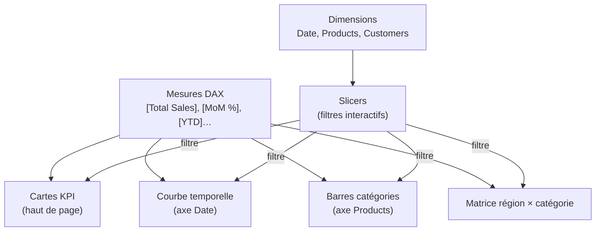
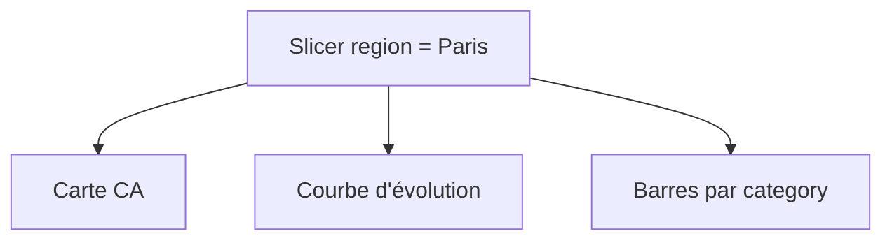
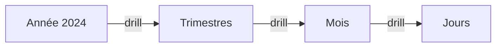

# Donner vie au rapport

Données nettoyées, modèle en étoile, mesures DAX prêtes : on construit enfin le **rapport**. L'enjeu n'est plus le calcul mais l'**interaction** — laisser le lecteur explorer sans te solliciter.

> **Objectif de l'étape —** assembler un rapport interactif (visuels + slicers + drill-down), le mettre en page proprement et savoir le publier/partager.

## Poser les visuels

Dans la **vue Rapport**, on choisit un visuel, on y glisse des **champs** (dimensions sur l'axe, mesures dans les valeurs). Les essentiels :

| Visuel | Pour | Champ type |
|---|---|---|
| Carte (Card) / KPI | un chiffre clé (CA total, marge %) | `[Total Sales]`, `[Gross Margin %]` |
| Graphique en barres | comparer des catégories | Axe : `Products[category]`, Valeur : `[Total Sales]` |
| Graphique en courbes | l'évolution dans le temps | Axe : `Date[month_name]`, Valeur : `[Total Sales]`, `[Sales LY]` |
| Tableau / Matrice | le détail ventilé, le croisement de dimensions | Lignes : `Customers[region]`, Colonnes : `Products[category]` |
| Carte géographique (Map) | une dimension `region` | Emplacement : `Customers[region]`, Taille : `[Total Sales]` |

## Les slicers : filtrer toute la page

Un **slicer** (segment) est un filtre visible que l'utilisateur manipule : liste de `region`, plage de `Date`, choix de `category`. Quand il change un slicer, **tous les visuels** de la page se mettent à jour ensemble — c'est ça, un dashboard interactif.

## L'interactivité croisée

Par défaut, **cliquer sur un élément d'un visuel filtre les autres** (cross-filter). Cliquer la barre `Electronics` met en surbrillance la part d'Electronics dans les autres visuels. C'est gratuit et puissant — on peut régler ce comportement (filtrer, surligner, ou ignorer) par paire de visuels.

## Le drill-down : du résumé au détail

Le **drill-down** permet de descendre dans une **hiérarchie** : Année → Trimestre → Mois → Jour, ou Région → Ville. On définit la hiérarchie (en empilant les champs), puis l'utilisateur clique pour « entrer » dans un niveau.

Cela évite de saturer la page : un seul visuel offre plusieurs niveaux de lecture, à la demande.

> **À retenir —** Slicers = filtres globaux de la page. Cross-filter = cliquer un visuel filtre les autres. Drill-down = descendre une hiérarchie à la demande. Ces trois mécanismes transforment des graphiques figés en un **outil d'exploration**.
