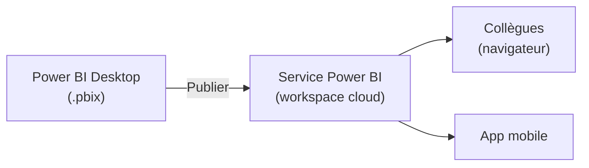

# Du brouillon au livrable partagé

Un rapport interactif qui marche ne suffit pas : il doit être **lisible** et **accessible** aux bonnes personnes. Deux sujets : la mise en page, puis la publication.

## Mise en page : quelques règles qui changent tout

- **Hiérarchie visuelle** : KPI en haut, tendances au milieu, détail en bas (la pyramide du module 1).
- **Alignement et grille** : aligne les visuels, garde des marges régulières. Power BI propose des repères d'alignement — utilise-les.
- **Cohérence des couleurs** : un thème (Theme) unique, une couleur d'accent pour l'important, du gris pour le reste. Évite l'arc-en-ciel.
- **Respiration** : ne remplis pas chaque pixel. L'espace vide guide l'œil.
- **Titres parlants** : chaque visuel porte un titre-message (module 1), pas une étiquette d'axe.
- **Limiter le nombre de visuels** par page (≈ 5-7). Au-delà, on crée une **autre page**.

## Publier sur le service Power BI

Power BI **Desktop** sert à *construire* ; le **service Power BI** (powerbi.com, dans le cloud) sert à *partager*. Le bouton **Publier** (Publish) envoie ton `.pbix` vers un **espace de travail** (workspace) en ligne.

## Partager proprement

- On partage via un **workspace** ou une **app** Power BI, pas en envoyant le fichier par mail.
- Les **permissions** déterminent qui voit quoi (lecteur / contributeur).
- Le **rafraîchissement planifié** (Scheduled refresh) rejoue l'ETL Power Query automatiquement (ex. chaque matin) : le rapport reste à jour sans intervention.

> Le rafraîchissement est le retour de la boucle ETL du module 2 : source mise à jour → étapes Power Query rejouées → modèle rechargé → visuels actualisés. Une seule construction, une mise à jour automatique.

## Desktop vs Service — qui fait quoi

| | Power BI Desktop | Service Power BI |
|---|---|---|
| Rôle | construire (Power Query, modèle, DAX, visuels) | partager, collaborer, rafraîchir |
| Où | application locale (Windows) | cloud, navigateur |
| Sortie | fichier `.pbix` | rapports/dashboards en ligne |

> **À retenir —** On **construit** dans Desktop, on **publie** vers le Service, on **partage** via un workspace/app (jamais le fichier par mail), et on **planifie le rafraîchissement** pour garder le tout à jour automatiquement.
