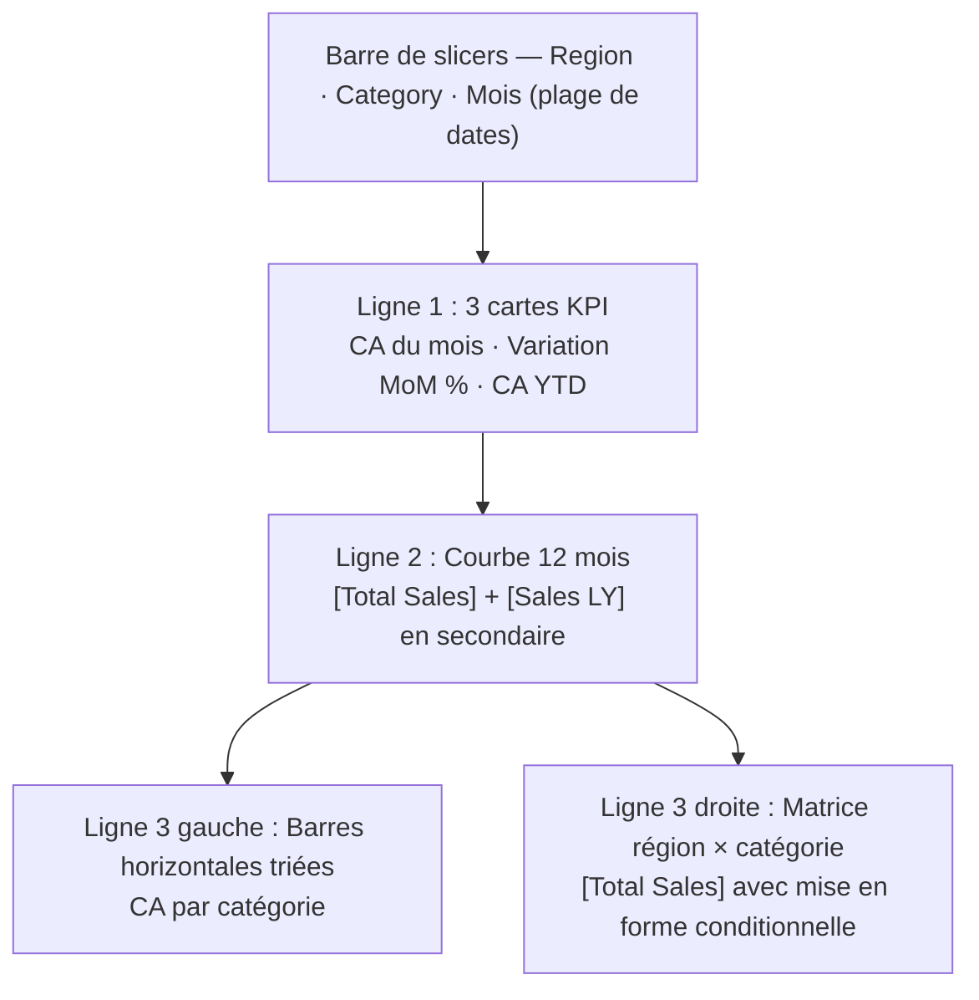

## Énoncé

Le directeur commercial de la société Objectif Commerce veut un **dashboard mensuel de pilotage des ventes**. Il te décrit ses besoins :

> « Je veux voir en un coup d'œil si le CA du mois est bon ou non. Je dois pouvoir filtrer par région et par gamme de produits. Je veux voir la tendance sur 12 mois, comprendre quelle catégorie performe le mieux, et repérer les régions à creuser. Quand je clique sur une région, tout se met à jour. »

**Questions :**

1. Quels **visuels** places-tu sur la page, et dans quel ordre (haut → bas) ?
2. Quelles **mesures DAX** sont nécessaires pour répondre à ces besoins ? Liste-les.
3. Quels **slicers** proposes-tu ?
4. Quel **titre** donnez-vous à la page et à chaque visuel (le message, pas l'axe) ?
5. Cite **deux pièges de mise en page** à éviter sur ce rapport.

<!--correction-->

## Correction

### 1. Structure de la page (de haut en bas)



On suit la **pyramide** : vue synthétique (KPI) → tendance → détail. Le directeur lit en Z, l'essentiel en haut à gauche.

### 2. Mesures DAX nécessaires

```text
Total Sales          = SUM ( Sales[amount] )
Sales Prev Month     = CALCULATE ( [Total Sales], PREVIOUSMONTH ( 'Date'[date] ) )
Sales MoM %          = DIVIDE ( [Total Sales] - [Sales Prev Month], [Sales Prev Month] )
Sales YTD            = TOTALYTD ( [Total Sales], 'Date'[date] )
Sales LY             = CALCULATE ( [Total Sales], SAMEPERIODLASTYEAR ( 'Date'[date] ) )
```

Pour la mise en forme conditionnelle de la matrice (rouge si sous objectif) : ajouter une mesure `Is Below Target = IF([Total Sales] < [Target Sales], 1, 0)` et l'utiliser comme règle de couleur.

### 3. Slicers recommandés

| Slicer | Colonne | Type recommandé |
|---|---|---|
| Région | `Customers[region]` | Liste (multi-sélection) |
| Catégorie de produit | `Products[category]` | Liste déroulante |
| Période | `Date[date]` | Plage de dates (slider) |

On **évite** un slicer `order_id` (aucun intérêt pour la direction) ou un slicer sur une mesure.

### 4. Titres parlants (exemples)

| Visuel | Titre mou (à éviter) | Titre parlant (à utiliser) |
|---|---|---|
| Carte CA | « Total Sales » | « CA du mois — en ligne avec l'objectif ? » |
| Courbe | « CA par mois » | « Le CA recule depuis septembre (-8 %) » |
| Barres catégories | « Sales by category » | « Electronics représente 36 % du CA total » |
| Matrice | « Region vs Category » | « Régions × Catégories — cliquez pour filtrer » |

> Les titres des KPI cards peuvent rester courts (ils donnent le contexte par leur valeur + variation). Les titres des graphiques analytiques gagnent à porter le message.

### 5. Deux pièges de mise en page à éviter

1. **Trop de visuels sur une seule page** : si on ajoute un scatter, une carte géo, un nuage de mots et une jauge en plus, la page devient illisible. Règle : ≈ 5-7 visuels max. Au-delà, créer une deuxième page « Détail géographique » ou « Analyse achat ».

2. **Couleurs incohérentes** : chaque catégorie dans une couleur vive différente, plus un fond coloré et des axes de couleurs différentes = surcharge cognitive. Un thème (Theme) unique, une couleur d'accent (bleu foncé pour l'important), tout le reste en gris clair.
