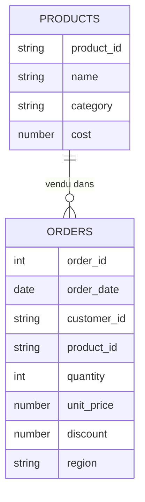
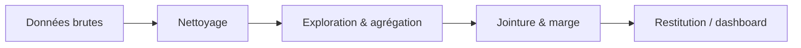

# Étape 1 — Cadrer le projet

Bienvenue dans le **projet fil rouge** du cursus. C'est ta pièce maîtresse de portfolio :
un cas Vente/Achat **réaliste, bout-en-bout**, que tu pourras refaire seule et présenter
en entretien. Pas de stage ? Ce projet **est** ton expérience.

> **Comment suivre —** chaque étape montre la logique métier en **SQL** et **pandas**
> (repliée, pour le réalisme), puis te fait **implémenter** la même chose dans un exercice
> interactif **TypeScript**. C'est en codant l'agrégation toi-même que tu la comprends.

## Le brief (ce qu'on te demande au boulot)

Imagine ta responsable Vente/Achat. Elle ne veut pas une base de données, elle veut des
**réponses** :

- **« Quel chiffre d'affaires a-t-on fait ce trimestre ? »**
- **« Quels sont nos top produits ? »**
- **« Quelle catégorie nous fait le plus de marge ? »**
- **« Comment ça évolue mois par mois ? »**

Ton travail : partir de données brutes (et un peu sales), les nettoyer, les agréger, et
**raconter** ce qu'elles disent. Le livrable final : un **dashboard Power BI** + une
courte présentation d'insights.

## Le dataset fil rouge

Deux tables, comme dans une vraie boutique. On les réutilise dans **toutes** les étapes.

**`orders`** — une ligne par produit commandé :

| order_id | order_date | customer_id | product_id | quantity | unit_price | discount | region |
|---|---|---|---|---|---|---|---|
| 1001 | 2024-01-05 | C001 | P01 | 2 | 20 | 0 | North |
| 1002 | 2024-01-18 | C002 | P02 | 1 | 50 | 0.10 | South |
| 1003 | 2024-02-02 | C001 | P03 | 3 | 12 | 0 | North |
| … | … | … | … | … | … | … | … |

**`products`** — le catalogue, avec le **coût d'achat** (clé pour la marge) :

| product_id | name | category | cost |
|---|---|---|---|
| P01 | Wireless Mouse | Accessories | 12 |
| P02 | Office Chair | Furniture | 30 |
| P03 | Notebook | Stationery | 5 |
| P04 | Ballpoint Pen | Stationery | 3 |

> **Note sur les colonnes —** `discount` est un **taux** (0.10 = −10 %). Le **revenu d'une
> ligne** vaut donc `quantity * unit_price * (1 - discount)`. Le **coût** d'une ligne vaut
> `quantity * cost`. La **marge** = revenu − coût. Garde cette formule en tête, on s'en
> sert partout.

## Le modèle de données

`product_id` est la **clé** qui relie les deux tables : c'est sur elle qu'on fera la
jointure pour récupérer la catégorie et le coût.

## Le flux de travail

## Ce que tu vas livrer

1. Un jeu de données **propre** (étape 2).
2. Des **KPI** : CA total, panier moyen, CA par catégorie/région/mois (étape 3).
3. La **marge** par catégorie et les **top produits** (étape 4).
4. Un **dashboard Power BI** + une mini-présentation d'**insights** (étape 5).
5. Des pistes pour **étoffer** ton portfolio (étape 6).

> **À retenir** — Un bon projet data part **d'une question métier**, pas d'une table. Avant
> de coder, écris noir sur blanc les 3-4 questions auxquelles tu veux répondre.

> **Prérequis utiles —** ce projet mobilise tout le cursus : `parcours-sql` (requêtes),
> `parcours-python` (pandas), `parcours-powerbi` (dashboard). Le hub
> `parcours-data-analyst` relie tout ça.
