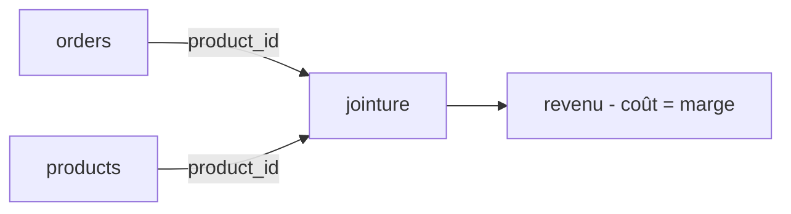

# Étape 4 — Joindre les produits et calculer la marge

Le CA, c'est bien. Mais la responsable Achat veut savoir ce qui **rapporte vraiment** :
la **marge**. Pour ça il faut le **coût** de chaque produit — qui est dans la table
`products`, pas dans `orders`. On doit **joindre** les deux sur `product_id`.



Rappel des formules :
- **revenu** de ligne = `quantity * unit_price * (1 - discount)`
- **coût** de ligne = `quantity * cost`
- **marge** de ligne = revenu − coût

## La version métier : SQL & pandas (repliée)

<details>
<summary><strong>Voir la jointure + marge par catégorie en SQL</strong></summary>

```sql
SELECT p.category,
       ROUND(SUM(o.quantity * o.unit_price * (1 - o.discount)
                 - o.quantity * p.cost), 2) AS margin
FROM clean_orders o
JOIN products p ON p.product_id = o.product_id
GROUP BY p.category
ORDER BY margin DESC;
```

</details>

<details>
<summary><strong>Voir la même chose en pandas</strong></summary>

```python
merged = orders.merge(products, on="product_id")
merged["line_margin"] = (
    merged["quantity"] * merged["unit_price"] * (1 - merged["discount"])
    - merged["quantity"] * merged["cost"]
)
margin_by_cat = merged.groupby("category")["line_margin"].sum().round(2)
```

</details>

> `JOIN ... ON p.product_id = o.product_id` (SQL) et `orders.merge(products, on="product_id")`
> (pandas) font la même opération : **rapprocher** deux tables par une clé commune. En TS,
> on le fait avec un **dictionnaire** (`index`) `product_id → product` pour un accès en O(1).

## Le résultat attendu sur notre dataset

| category | revenue | margin | taux de marge |
|---|---|---|---|
| Furniture | 125 € | 35 € | 28,0 % |
| Accessories | 59 € | 23 € | 39,0 % |
| Stationery | 76 € | 46 € | **60,5 %** |

Surprise utile : **Furniture** fait le plus de CA (48 % du total), mais **Stationery**
dégage la plus **grosse marge absolue et le meilleur taux** (60,5 %). Furniture, malgré son
poids en CA, n'atteint que 28 % de marge — en partie parce que deux commandes ont bénéficié
de remises élevées (−10 % et −20 %).

> **Insight métier** — Un analyste qui ne regarde que le CA peut croire que Furniture est
> la catégorie à prioriser. L'analyse de la marge renverse le diagnostic : Stationery est
> plus rentable à l'unité et mérite une meilleure visibilité marketing. C'est le type
> d'argument qui impressionne dans une présentation à un comité de direction.

## La part de marché par catégorie

On peut aussi exprimer le CA de chaque catégorie en **pourcentage du total** — c'est la
« part de marché » interne, utile pour les slides :

| category | CA | part de marché |
|---|---|---|
| Furniture | 125 € | **48,1 %** |
| Stationery | 76 € | 29,2 % |
| Accessories | 59 € | 22,7 % |

<details>
<summary><strong>Voir la part de marché en SQL & pandas</strong></summary>

```sql
-- Market share by category
SELECT p.category,
       ROUND(SUM(o.quantity * o.unit_price * (1 - o.discount)), 2) AS revenue,
       ROUND(
           SUM(o.quantity * o.unit_price * (1 - o.discount)) * 100.0
           / SUM(SUM(o.quantity * o.unit_price * (1 - o.discount))) OVER (),
           2
       ) AS market_share_pct
FROM clean_orders o
JOIN products p ON p.product_id = o.product_id
GROUP BY p.category
ORDER BY revenue DESC;
```

```python
merged = orders.merge(products, on="product_id")
merged["line_revenue"] = (
    merged["quantity"] * merged["unit_price"] * (1 - merged["discount"])
)
cat_rev = merged.groupby("category")["line_revenue"].sum()
cat_share = (cat_rev / cat_rev.sum() * 100).round(2)
# Furniture 48.08 | Stationery 29.23 | Accessories 22.69
```

</details>

## À toi : la jointure en TS

Trois exercices interactifs (dont un nouveau sur la part de marché) :

1. `revenueByCategory(orders, products)` puis `marginByCategory(orders, products)` —
   la jointure par dictionnaire + group by.
2. `topNProducts(orders, products, n)` — classer les produits par CA.
3. `marketShareByCategory(orders, products)` — la part de marché en pourcentage.

> **À retenir** — Une jointure efficace = on **indexe** la petite table dans un objet
> (`{ product_id: product }`), puis on parcourt la grande une seule fois. Évite le double
> `for` qui rejoue tout le catalogue à chaque commande.

> Pour creuser les jointures et les `GROUP BY` côté base, voir `parcours-sql` ; pour
> `merge` et `groupby`, voir `parcours-python`.
