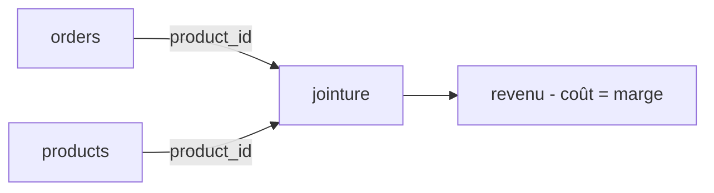

# Étape 4 — Joindre les produits et calculer la marge

Le CA, c'est bien. Mais la responsable Achat veut savoir ce qui **rapporte vraiment** :
la **marge**. Pour ça il faut le **coût** de chaque produit — qui est dans la table
`products`, pas dans `orders`. On doit **joindre** les deux sur `product_id`.



Rappel des formules :
- **revenu** de ligne = `quantity * unit_price * (1 - discount)`
- **coût** de ligne = `quantity * cost`
- **marge** de ligne = revenu − coût

## La version métier : SQL & pandas (repliée)

<details>
<summary><strong>Voir la jointure + marge par catégorie en SQL</strong></summary>

```sql
SELECT p.category,
       ROUND(SUM(o.quantity * o.unit_price * (1 - o.discount)
                 - o.quantity * p.cost), 2) AS margin
FROM clean_orders o
JOIN products p ON p.product_id = o.product_id
GROUP BY p.category
ORDER BY margin DESC;
```

</details>

<details>
<summary><strong>Voir la même chose en pandas</strong></summary>

```python
merged = orders.merge(products, on="product_id")
merged["line_margin"] = (
    merged["quantity"] * merged["unit_price"] * (1 - merged["discount"])
    - merged["quantity"] * merged["cost"]
)
margin_by_cat = merged.groupby("category")["line_margin"].sum().round(2)
```

</details>

> `JOIN ... ON p.product_id = o.product_id` (SQL) et `orders.merge(products, on="product_id")`
> (pandas) font la même opération : **rapprocher** deux tables par une clé commune. En TS,
> on le fait avec un **dictionnaire** (`index`) `product_id → product` pour un accès en O(1).

## Le résultat attendu sur notre dataset

| category | revenue | margin |
|---|---|---|
| Furniture | 125 | 35 |
| Accessories | 59 | 23 |
| Stationery | 76 | 46 |

Surprise utile : **Furniture** fait le plus de CA, mais **Stationery** dégage la plus
**grosse marge**. C'est exactement le genre d'insight qu'on cherche (on y revient à
l'étape 5).

## À toi : la jointure en TS

Deux exercices interactifs :

1. `revenueByCategory(orders, products)` puis `marginByCategory(orders, products)` —
   la jointure par dictionnaire + group by.
2. `topNProducts(orders, products, n)` — classer les produits par CA.

> **À retenir** — Une jointure efficace = on **indexe** la petite table dans un objet
> (`{ product_id: product }`), puis on parcourt la grande une seule fois. Évite le double
> `for` qui rejoue tout le catalogue à chaque commande.

> Pour creuser les jointures et les `GROUP BY` côté base, voir `parcours-sql` ; pour
> `merge` et `groupby`, voir `parcours-python`.
