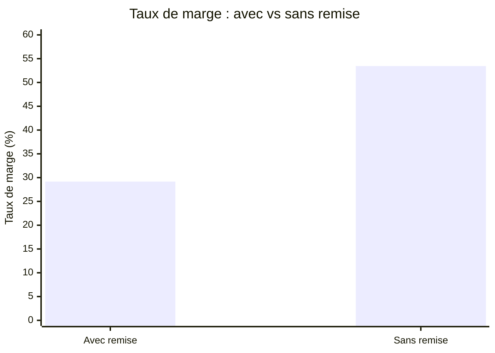
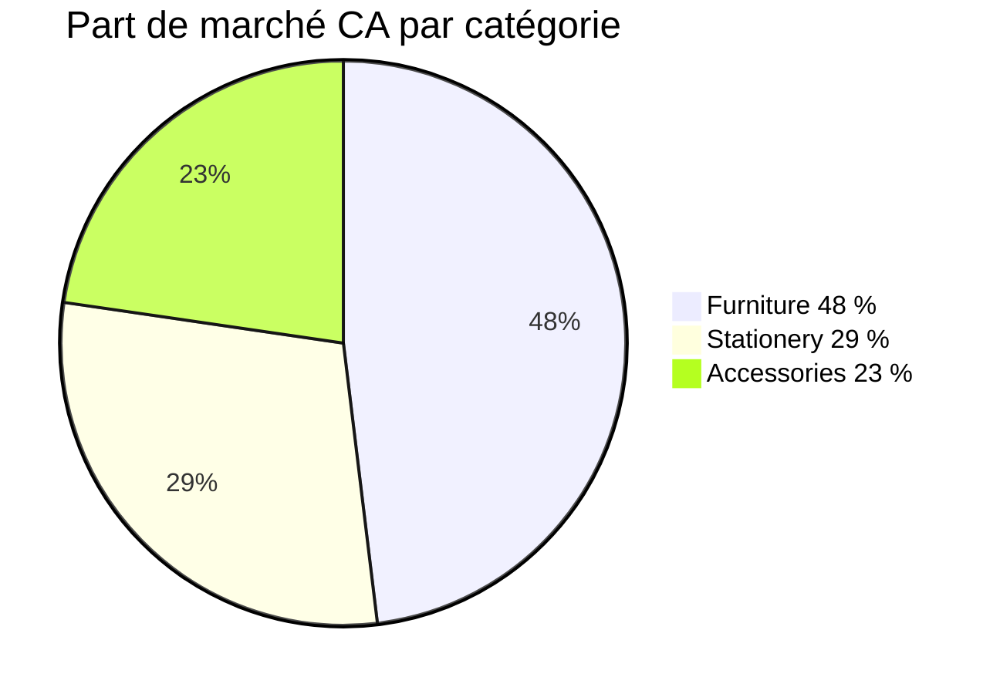

# Étape 4b — Aller plus loin : analyses avancées

Les étapes précédentes ont produit les KPI de base. Maintenant on creuse les
**questions que la direction pose en deuxième lecture** : nos remises nous coûtent-elles
trop cher ? Qui sont nos clients fidèles ? Quelle catégorie domine vraiment ?

## 1. L'effet des remises sur la marge

Trois commandes sur six de notre dataset comportent une remise (`discount > 0`). Voici
ce que ça donne en taux de marge :

| Groupe | CA | Marge | Taux de marge |
|---|---|---|---|
| Avec remise (1002, 1004, 1006) | 144 € | 42 € | **29,2 %** |
| Sans remise (1001, 1003, 1005) | 116 € | 62 € | **53,5 %** |

La remise ampute le taux de marge de **24 points**. Sur l'Office Chair (P02), une remise
de 20 % (commande 1006) ramène la marge de la catégorie Furniture à 28 % — son niveau le
plus bas.

> **Insight** — Ce n'est pas la remise en elle-même qui pose problème, c'est la remise
> **sans contrepartie de volume**. La commande 1006 (2 chaises, −20 %) est plus rentable
> que la commande 1002 (1 chaise, −10 %) en valeur absolue (20 € vs 15 €), mais son taux
> est plus bas. La politique commerciale devrait lier le niveau de remise à un volume
> minimal de commande.

## 2. La fidélité client

Sur 4 clients distincts, **2 sont récurrents** (C001 et C002) :

| client | commandes | CA |
|---|---|---|
| C002 | 2 | **85 €** (meilleur client) |
| C001 | 2 | 76 € |
| C004 | 1 | 80 € |
| C003 | 1 | 19 € |

C002 et C001 représentent **4 commandes sur 6** (67 %) et **161 € sur 260 €** (62 % du
CA). Ce ratio est caractéristique d'une base client encore jeune : on a peu de clients mais
une bonne rétention.

> **Pour aller plus loin —** sur un vrai dataset annuel, on calculerait le
> **Customer Lifetime Value** (CLV) et le taux de churn mensuel. Mais même sur 6 lignes,
> on peut déjà segmenter : qui reçoit une newsletter de fidélité ? Qui mérite une remise
> de remerciement ? Ces décisions découlent directement du group-by.

## 3. Part de marché interne par catégorie

La **matrice volume × rentabilité** synthétise tout :

| catégorie | part de CA | taux de marge | diagnostic |
|---|---|---|---|
| Furniture | **48 %** | 28 % | Locomotive de volume, mais marges à défendre |
| Stationery | 29 % | **61 %** | Vache à lait : petit volume, très rentable |
| Accessories | 23 % | 39 % | Potentiel de croissance avec bonne marge |

> **Recommandation —** augmenter la visibilité de Stationery (SEO, mises en avant) sans
> sacrifier le volume Furniture. Les Accessories ont un taux de marge intermédiaire (39 %)
> : un effort commercial limité pourrait les faire passer en deuxième locomotive.

## Ce que tu vas implémenter

Trois exercices interactifs (ci-après) :

1. `discountEffect(orders, products)` — taux de marge avec vs sans remise.
2. `recurringCustomers(orders)` — clients fidèles et CA par client.
3. `marketShareByCategory(orders, products)` + `marginRateByCategory(...)` — volume et
   rentabilité croisés.

> **À retenir** — Ces trois analyses partagent une même structure : filter ou group-by,
> puis division. Ce qui change c'est le **critère de segmentation** (remise ? client ?
> catégorie ?). Maîtriser ce patron te permet de répondre à n'importe quelle question
> métier du type « compare les groupes A et B ».
