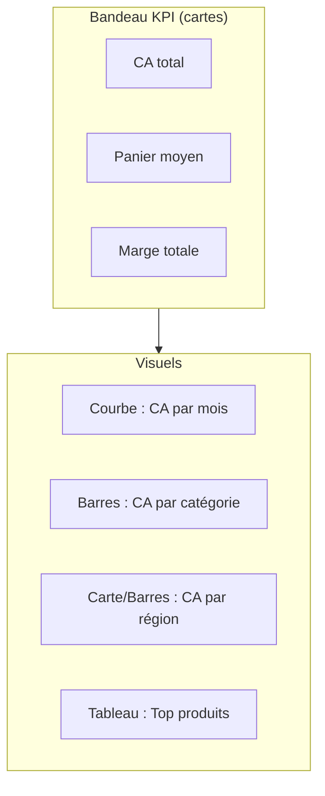

# Étape 5 — Des chiffres aux insights

Un tableau de nombres n'est **pas** un livrable. La valeur d'un analyste, c'est de
**raconter** ce que disent les données et de **recommander** une action. C'est cette étape
qui impressionne en entretien.

## De la mesure à l'insight

Reprends tes résultats des étapes 3 et 4, et transforme chaque chiffre en **phrase
décidable** :

| Chiffre brut | Insight (ce qu'on en dit) |
|---|---|
| CA total = 260 | « 260 € de CA sur le trimestre, panier moyen de 43 €. » |
| Furniture = 125 € de CA | « Furniture pèse ~48 % du CA : notre locomotive. » |
| Stationery marge = 46 € | « Mais Stationery dégage la plus grosse **marge** malgré un petit CA : produit rentable à pousser. » |
| CA mensuel 85 → 55 → 120 | « Creux en février, fort rebond en mars : vérifier la saisonnalité. » |

> **La règle du « donc » —** un insight contient toujours un *donc* implicite :
> « Stationery marge le mieux **donc** on devrait augmenter sa visibilité. » Si tu ne peux
> pas finir la phrase par une action, ce n'est pas encore un insight.

## Esquisser le dashboard Power BI

Le dashboard est le support visuel de ces insights. On le construit dans Power BI Desktop
(voir `parcours-powerbi` pour le pas-à-pas). Voici la **maquette** à viser :

### Le bon visuel pour la bonne question

| Question métier | Visuel Power BI | KPI / mesure DAX |
|---|---|---|
| Combien on vend ? | **Carte** | `Total Revenue` |
| Quel panier moyen ? | **Carte** | `Avg Basket` |
| Ça évolue comment ? | **Graphique en courbes** | `Revenue` par mois |
| Quelle catégorie ? | **Barres horizontales** | `Revenue` / `Margin` par catégorie |
| Où ça se vend ? | **Carte géographique** ou barres | `Revenue` par région |
| Quels top produits ? | **Tableau** trié | `Revenue` par produit |

> **À retenir** — KPI = **cartes** en haut (le « combien »). Tendances = **courbes**.
> Comparaisons de catégories = **barres**. Détail = **tableau**. Évite le camembert au-delà
> de 3-4 parts, et bannis la 3D.

## Structurer ta mini-présentation

5 slides suffisent pour un portfolio :

1. **Contexte & question** — le brief Vente/Achat (étape 1).
2. **Données & méthode** — les 2 tables, le nettoyage fait (étape 2), les outils.
3. **Résultats** — le dashboard, 2-3 KPI clés.
4. **Insights & reco** — les 2-3 phrases « donc » qui comptent.
5. **Limites & suites** — petit échantillon, pistes d'approfondissement (étape 6).

> **Pour creuser le dashboard —** mesures DAX, modèle en étoile, Power Query : tout est
> dans `parcours-powerbi`. Ce projet est précisément le cas d'usage qu'il illustre.
