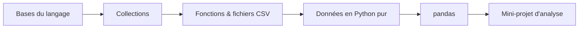

# Étape 1 — Python, les bases

Tu as déjà vu Python en cours, mais sans pratique récente. Cette première étape est un **refresher rapide** : on remet en mémoire les variables, les types, les conditions, les boucles et le formatage de texte. Rien d'académique — juste de quoi raisonner sur du code et enchaîner vers la data.

> **Objectif de l'étape —** être à l'aise avec les variables, les types, les conditions, les boucles et les f-strings, pour bâtir dessus toute la suite (collections → fichiers → pandas).

## Au programme

- Variables, affectation et types de base (`int`, `float`, `str`, `bool`)
- Conditions : `if` / `elif` / `else`
- Boucles : `for`, `while`, `range`, `enumerate`
- Affichage avec `print` et **f-strings**
- Opérations sur les chaînes utiles à la data : `split`, `strip`, `replace`, formatage

## Comment travailler ce parcours

> **À noter —** Python n'est **pas (encore) exécutable dans le navigateur**. Les exercices sont donc en mode **énoncé + correction repliable** : tu réfléchis, tu écris ta solution à la main (ou dans ton éditeur local), puis tu déroules la correction pour comparer. Un runner Python (par ex. **Pyodide**) pourra être ajouté plus tard pour les rendre interactifs.

Ce parcours est entièrement orienté **data** : chaque étape prépare l'analyse de données, jusqu'à `pandas`. Les exemples utilisent des relevés, des enregistrements, des ventes — pas des `foo`/`bar`.

## Repère mental

Allons-y.
