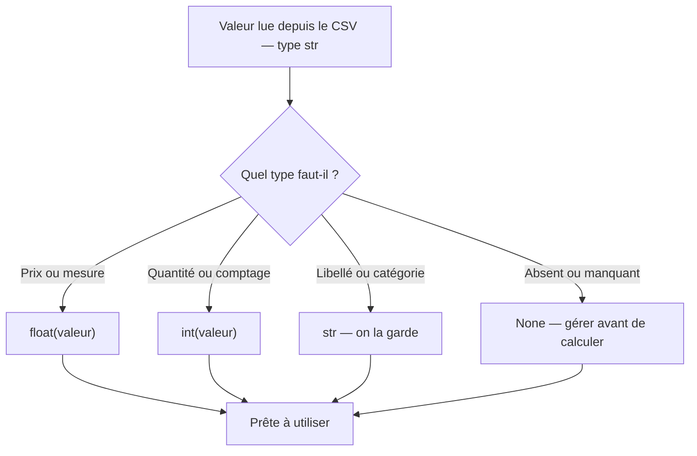

# Variables et types

En Python, une variable n'a pas besoin d'être déclarée : on l'affecte, et son type est déduit automatiquement.

```python
city = "Paris"        # str
population = 2148000   # int
density = 20754.5      # float
is_capital = True      # bool
```

Le type n'est pas figé à une variable : tu peux réaffecter une valeur d'un autre type (Python est **dynamiquement typé**). En analyse de données, on évite quand même de changer le sens d'une variable en cours de route — ça rend le code illisible.

## Problème de départ : une liste de courses

Imaginons que tu gères une liste de courses dont les données arrivent d'un fichier. Tout est lu comme du texte brut — même les nombres :

```python
item_name = "apples"    # str
item_price = "1.50"     # looks like a number, but it's still text!
item_quantity = "3"     # same problem
```

Si tu tentes `item_price * item_quantity` directement, Python répète la chaîne au lieu de multiplier. Il faut **convertir** avant de calculer. Voici le schéma complet, étape par étape :

```python
# Step 1: read (everything from a file is a str)
item_name = "apples"
item_price = "1.50"
item_quantity = "3"

# Step 2: convert to the correct type
item_price = float(item_price)        # 1.5
item_quantity = int(item_quantity)    # 3

# Step 3: compute
total_item = item_price * item_quantity    # 4.5
print(f"{item_name}: {total_item:.2f} €")  # apples: 4.50 €
```

Ce schéma **lire → convertir → calculer** revient à chaque fois qu'on traite des données issues d'un fichier.

## Les quatre types de base

| Type | Exemple | Usage en data |
|---|---|---|
| `int` | `42` | comptages, quantités |
| `float` | `19.99` | montants, mesures, moyennes |
| `str` | `"product"` | libellés, catégories, dates brutes |
| `bool` | `True` / `False` | filtres, indicateurs |

## Inspecter et convertir

```python
amount = "19.99"            # a string read from a CSV
print(type(amount))         # <class 'str'>

amount = float(amount)      # convert to a number
print(type(amount))         # <class 'float'>
print(amount * 2)           # 39.98
```

> **Crucial pour la data —** ce qui sort d'un fichier CSV est **toujours une chaîne**. Convertir au bon type (`int(...)`, `float(...)`) est l'une des toutes premières étapes de nettoyage.

Le chemin d'une valeur depuis un fichier CSV jusqu'au calcul :



## Opérateurs

```python
a, b = 7, 2
print(a + b)    # 9
print(a / b)    # 3.5   (division flottante)
print(a // b)   # 3     (integer division)
print(a % b)    # 1     (reste / modulo)
print(a ** b)   # 49    (puissance)
```

L'affectation multiple `a, b = 7, 2` est très idiomatique en Python — on la retrouvera partout (échange de valeurs, décomposition de tuples…).

## La valeur `None`

`None` représente l'absence de valeur (équivalent du `null` ailleurs). On le rencontre dès qu'une donnée manque.

```python
discount = None
if discount is None:
    discount = 0.0
```

## Erreurs fréquentes des débutants

### `None` n'est ni `0` ni `""`

Ces trois valeurs semblent "vides" mais ont des significations très différentes :

| Valeur | Signification | Calculable directement ? |
|---|---|---|
| `None` | donnée **absente** | Non → `TypeError` si on essaie |
| `0` | nombre valant zéro | Oui |
| `""` | chaîne **vide** | Avec d'autres chaînes seulement |

```python
discount = None
total = 100 + discount    # TypeError: unsupported operand type(s) for +: 'int' and 'NoneType'
```

La parade : tester avec `is None` avant de calculer.

```python
discount = None
if discount is None:
    discount = 0.0
total = 100 + discount    # 100.0 — correct
```

### Oublier de convertir une chaîne en nombre

```python
price = "19.99"
quantity = 2
print(price * quantity)   # "19.9919.99" — Python répète la chaîne, n'additionne pas !

# Fix: convert first
price = float(price)
print(price * quantity)   # 39.98
```

---

## À toi de jouer

**Problème :** trois valeurs arrivent d'un fichier — tout est en chaîne. Calcule le montant final en appliquant la remise si elle est présente.

```python
product = "desk lamp"
unit_price = "34.00"    # str
quantity = "2"          # str
discount_pct = None     # no discount for this product
```

Résultat attendu : `desk lamp : 68.00 €`

**Solution :**

```python
unit_price = float(unit_price)        # 34.0
quantity = int(quantity)              # 2

if discount_pct is None:
    discount_pct = 0.0

subtotal = unit_price * quantity               # 68.0
final = subtotal * (1 - discount_pct / 100)   # 68.0
print(f"{product} : {final:.2f} €")           # desk lamp : 68.00 €
```

> **À retenir —** un type par variable, et on **convertit** explicitement les chaînes du CSV en nombres avant de calculer. `None` se teste avec `is None`, jamais avec `==`.
