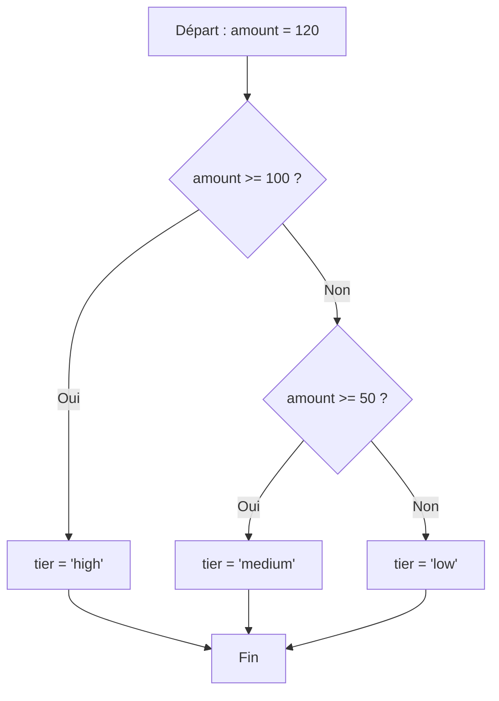
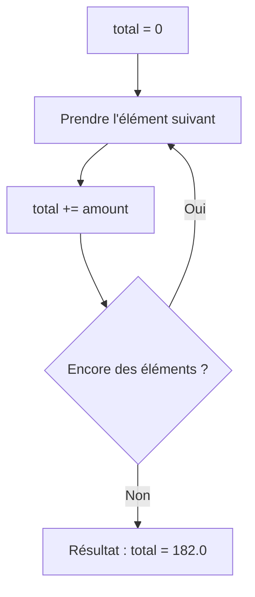

# Conditions et boucles

C'est le cœur de toute logique de traitement : décider, et répéter. En data, on s'en sert pour catégoriser des valeurs et parcourir des relevés.

## Conditions : `if` / `elif` / `else`

L'indentation **fait partie de la syntaxe** en Python (4 espaces, pas d'accolades).

```python
amount = 120

if amount >= 100:
    tier = "high"
elif amount >= 50:
    tier = "medium"
else:
    tier = "low"

print(tier)   # "high"
```

Le flux de décision de ce code :



Les opérateurs de comparaison : `==`, `!=`, `<`, `<=`, `>`, `>=`. Les opérateurs logiques s'écrivent en toutes lettres : `and`, `or`, `not`.

```python
if amount > 0 and tier == "high":
    print("big sale")
```

### Ce qui est « faux » (falsy)

Une condition n'a pas besoin d'être un booléen. Sont considérés comme faux : `0`, `0.0`, `""`, `[]`, `{}`, `None`. Tout le reste est vrai.

```python
readings = []
if not readings:          # empty list → falsy
    print("no data")
```

## Boucle `for` : parcourir une collection

```python
amounts = [12.0, 50.0, 120.0]

for amount in amounts:
    print(amount)
```

### `range` : répéter / générer des nombres

```python
for i in range(3):        # 0, 1, 2
    print(i)

for i in range(1, 4):     # 1, 2, 3  (start inclusive, end exclusive)
    print(i)
```

### `enumerate` : index + valeur

Très utile pour numéroter des lignes.

```python
products = ["pen", "notebook", "eraser"]

for index, product in enumerate(products):
    print(index, product)
# 0 pen
# 1 notebook
# 2 eraser
```

## Boucle `while` : tant que…

À réserver aux cas où l'on ne connaît pas le nombre d'itérations à l'avance.

```python
balance = 100
while balance > 0:
    balance -= 30
print(balance)   # -20
```

## Accumuler dans une boucle

Le motif le plus courant en data : initialiser, puis accumuler.

```python
total = 0.0
for amount in amounts:
    total += amount        # accumulate
print(total)               # 182.0
```

La logique de cette boucle d'accumulation :



## Erreurs fréquentes des débutants

### L'indentation : un espace de trop ou de moins

L'indentation **fait partie de la syntaxe** en Python. Un niveau incorrect est une **erreur de syntaxe** :

```python
if amount > 0:
print("positive")    # IndentationError: expected an indented block

if amount > 0:
    print("positive")   # correct — 4 spaces
```

Règle : toujours **4 espaces** (jamais des tabulations mélangées à des espaces).

### La boucle `while` infinie

Si la variable testée n'est jamais mise à jour, le programme tourne indéfiniment :

```python
balance = 100
while balance > 0:
    print(balance)
    # forgot: balance -= 30  → infinite loop!

# Correct: update the variable in the loop body
balance = 100
while balance > 0:
    print(balance)
    balance -= 30   # balance reaches -20 and the loop stops
```

### Confondre `=` (affectation) et `==` (comparaison)

```python
amount = 120
if amount = 100:    # SyntaxError! — = is assignment, not a test
    print("match")

if amount == 100:   # correct — == tests equality
    print("match")
```

---

## À toi de jouer

**Problème :** tu as une liste de températures en °C. Catégorise chaque température en `"cold"` (< 10), `"mild"` (10 à 25 inclus) ou `"hot"` (> 25), et compte combien il y en a dans chaque catégorie.

```python
temperatures = [3, 15, 28, 10, -2, 22, 31, 18]
```

Résultat attendu : cold = 3, mild = 4, hot = 2.

**Solution :**

```python
temperatures = [3, 15, 28, 10, -2, 22, 31, 18]
counts = {"cold": 0, "mild": 0, "hot": 0}

for temp in temperatures:
    if temp < 10:
        counts["cold"] += 1
    elif temp <= 25:
        counts["mild"] += 1
    else:
        counts["hot"] += 1

print(f"cold: {counts['cold']}, mild: {counts['mild']}, hot: {counts['hot']}")
# cold: 3, mild: 4, hot: 2
```

> **À retenir —** `for` pour parcourir une collection (le cas standard en data), `while` quand le nombre de tours est inconnu. `enumerate` donne l'index, `range` génère une séquence de nombres.
