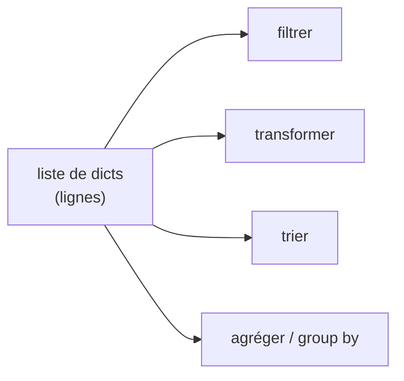

# Étape 2 — Collections

Les données vivent dans des **collections**. Maîtriser les listes et les dictionnaires, c'est déjà savoir représenter un jeu de données — bien avant `pandas`.

> **Objectif de l'étape —** stocker, parcourir, filtrer et transformer des collections, et écrire des compréhensions concises et lisibles.

## Au programme

- **Listes** : indexation, slicing, méthodes utiles (`append`, `sort`…)
- **Dictionnaires** : la « ligne » de données (`{"product": ..., "amount": ...}`)
- **Tuples** et **set** : quand et pourquoi
- **Compréhensions** de liste et de dictionnaire, avec filtre `if`
- **Tri** : `sorted`, le paramètre `key=`, ordre décroissant

## La structure clé de la data

Un jeu de données tabulaire se représente naturellement comme une **liste de dictionnaires** : chaque dictionnaire est une ligne, chaque clé est une colonne.

```python
sales = [
    {"product": "notebook", "category": "office", "amount": 19.99},
    {"product": "pen",      "category": "office", "amount": 2.50},
    {"product": "lamp",     "category": "home",   "amount": 34.00},
]
```

C'est exactement ce que `pandas` chargera plus tard dans un `DataFrame`. Apprendre à le manipuler **à la main** d'abord rend `pandas` beaucoup plus clair ensuite.


