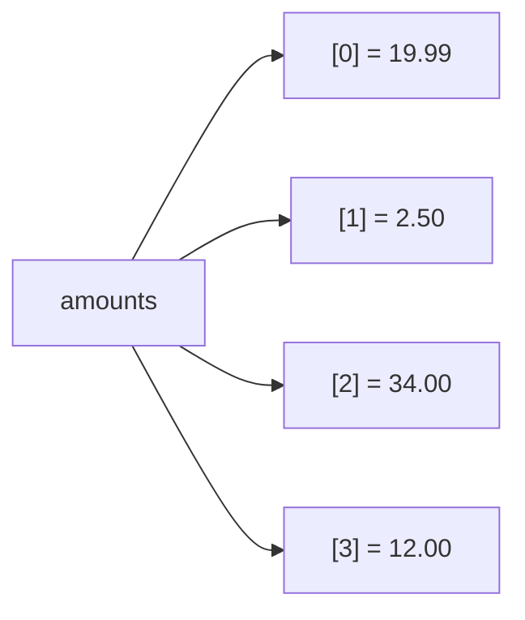

# Les listes

Une liste est une séquence **ordonnée** et **modifiable**. C'est la collection la plus courante pour stocker une série de valeurs ou d'enregistrements.

```python
amounts = [19.99, 2.50, 34.00, 12.00]
```

Chaque élément occupe une position numérotée à partir de 0 :



## Problème concret : calculer sa liste de courses

Partons d'une vraie liste de courses pour voir les outils en action :

```python
grocery_prices = [1.50, 3.00, 0.80, 4.20, 2.50]  # prices of 5 items

count = len(grocery_prices)           # 5 items
total = sum(grocery_prices)           # 12.0 €
most_expensive = max(grocery_prices)  # 4.20 €
average = total / count               # 2.4 €

print(f"Items: {count}")
print(f"Total: {total:.2f} €")
print(f"Average: {average:.2f} €")
print(f"Most expensive: {most_expensive:.2f} €")
```

On va ensuite voir comment accéder à chaque élément, extraire des tranches, et modifier la liste.

## Indexation

L'index commence à `0`. Les index négatifs partent de la fin.

```python
amounts[0]    # 19.99  → first
amounts[-1]   # 12.00  → last
amounts[-2]   # 34.00  → second to last
```

## Slicing : extraire une tranche

`liste[start:stop]` — `start` inclus, `stop` exclu. Outil de base pour prendre « les 3 premiers », « les 5 derniers »…

```python
amounts[0:2]    # [19.99, 2.50]   → indices 0 and 1
amounts[:2]     # [19.99, 2.50]   → from the start
amounts[2:]     # [34.00, 12.00]  → to the end
amounts[-2:]    # [34.00, 12.00]  → last 2 items
amounts[::-1]   # [12.0, 34.0, 2.5, 19.99] → reversed
```

## Méthodes utiles

```python
amounts.append(5.00)      # appends to the end
amounts.insert(0, 99.0)   # inserts at index 0
amounts.remove(2.50)      # removes the first occurrence of that value
last = amounts.pop()      # removes AND returns the last element
amounts.sort()            # sorts IN PLACE (modifies the list)
amounts.reverse()         # reverses in place
```

> **Attention —** `sort()` modifie la liste d'origine et renvoie `None`. Pour obtenir une **copie triée** sans toucher l'original, utilise `sorted(amounts)` (vu plus loin).

## Fonctions d'agrégation intégrées

Pas besoin d'une boucle pour ces opérations courantes :

```python
total = sum(amounts)
count = len(amounts)
average = total / count
biggest = max(amounts)
smallest = min(amounts)
```

## Tester l'appartenance

```python
if 19.99 in amounts:
    print("found")
```

## Copier sans surprise

Affecter une liste ne la copie **pas** : les deux noms pointent vers la même liste.

```python
a = [1, 2, 3]
b = a            # same list!
b.append(4)
print(a)         # [1, 2, 3, 4]  → a changed too

c = a.copy()     # real copy (or a[:])
```

## Erreurs fréquentes des débutants

### `IndexError` : accéder hors des limites

Une liste de 4 éléments a les indices 0, 1, 2, 3. L'indice 4 n'existe pas :

```python
amounts = [19.99, 2.50, 34.00, 12.00]   # 4 elements, indices 0 to 3
print(amounts[4])   # IndexError: list index out of range

# Safe alternatives:
print(amounts[3])   # 12.00 — last element by exact index
print(amounts[-1])  # 12.00 — last element, always works regardless of size
```

Le réflexe : préfère `for item in liste` pour parcourir sans manipuler les indices, et `amounts[-1]` pour le dernier élément.

### `sort()` renvoie `None`

C'est le piège classique :

```python
amounts = [34.00, 2.50, 19.99]
result = amounts.sort()     # sort() modifies in place and returns None!
print(result)               # None — oops

# What you probably wanted: sorted() returns a NEW list
sorted_amounts = sorted(amounts)
print(sorted_amounts)       # [2.5, 19.99, 34.0]
print(amounts)              # [2.5, 19.99, 34.0] — original also modified by sort()!
```

---

## À toi de jouer

**Problème :** tu as les notes d'un élève. Calcule la moyenne, trouve la meilleure note, et affiche les notes en ordre croissant **sans modifier la liste d'origine**.

```python
grades = [14, 9, 17, 12, 8, 16, 11]
```

Résultats attendus : moyenne ≈ 12.43, meilleure = 17, liste triée = `[8, 9, 11, 12, 14, 16, 17]`.

**Solution :**

```python
grades = [14, 9, 17, 12, 8, 16, 11]

average = sum(grades) / len(grades)     # 12.428...
best = max(grades)                       # 17
sorted_grades = sorted(grades)          # new list — original untouched

print(f"Average: {average:.2f}")         # Average: 12.43
print(f"Best grade: {best}")             # Best grade: 17
print(f"Sorted: {sorted_grades}")        # Sorted: [8, 9, 11, 12, 14, 16, 17]
print(f"Original: {grades}")            # Original: [14, 9, 17, 12, 8, 16, 11]
```

> **À retenir —** indexation à partir de 0, slicing `[start:stop]` (stop exclu), `sum`/`len`/`max`/`min` pour agréger sans boucle. `sort()` modifie en place ; pour ne pas toucher l'original, utilise `sorted()`.
