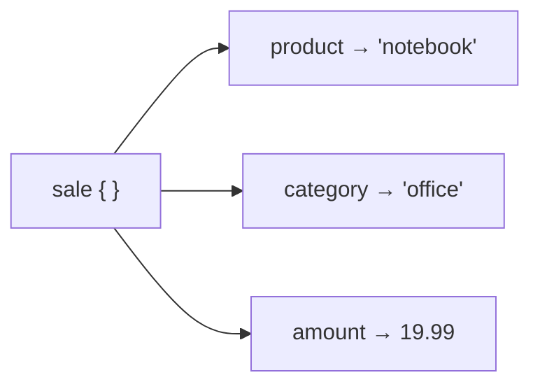

# Les dictionnaires

Un dictionnaire associe des **clés** à des **valeurs**. En data, c'est *la* structure pour représenter une **ligne** : chaque clé est un nom de colonne.

```python
sale = {"product": "notebook", "category": "office", "amount": 19.99}
```

Chaque clé est unique et pointe vers sa valeur — comme des cases nommées :



## Accéder à une valeur

```python
sale["product"]     # "notebook"
sale["amount"]      # 19.99
```

Accéder à une clé **absente** avec `[]` lève une erreur (`KeyError`). Pour s'en prémunir, `get` renvoie une valeur par défaut :

```python
sale.get("discount")          # None  (missing key → no error)
sale.get("discount", 0.0)     # 0.0   (default value)
```

> **Réflexe data —** une donnée manque souvent. `get(key, default)` évite que ton script plante sur la première ligne incomplète.

## Modifier et ajouter

```python
sale["amount"] = 17.99        # updates the value
sale["quantity"] = 3          # adds a new key
del sale["category"]          # removes a key
```

## Parcourir un dictionnaire

```python
for key in sale:                  # by default, iterates over keys
    print(key)

for key, value in sale.items():   # key AND value — most common pattern
    print(f"{key} = {value}")

sale.keys()      # view of keys
sale.values()    # view of values
```

## Tester la présence d'une clé

```python
if "discount" in sale:
    print(sale["discount"])
```

## Une liste de dictionnaires = un jeu de données

C'est le motif qu'on va exploiter tout le reste du parcours :

```python
sales = [
    {"product": "notebook", "amount": 19.99},
    {"product": "pen",      "amount": 2.50},
    {"product": "lamp",     "amount": 34.00},
]

total = 0.0
for row in sales:
    total += row["amount"]
print(f"Total: {total:.2f} €")    # Total: 56.49 €
```

## Erreurs fréquentes des débutants

### `KeyError` : clé absente

Accéder à une clé inexistante avec `[]` fait planter le programme :

```python
sale = {"product": "notebook", "amount": 19.99}
print(sale["discount"])          # KeyError: 'discount' — this key doesn't exist!

# Safe alternative:
print(sale.get("discount"))      # None — no crash
print(sale.get("discount", 0.0)) # 0.0 — with a default value
```

La règle : **utilise `get()`** pour toute clé dont la présence n'est pas garantie (données réelles, colonnes optionnelles dans un CSV…).

### Typo dans le nom de clé

```python
sale = {"product": "notebook", "amount": 19.99}
print(sale["prodcut"])   # KeyError: 'prodcut' — typo!
print(sale["product"])   # "notebook" — correct
```

Python est sensible à la casse et aux espaces : `"Amount"` et `"amount"` sont deux clés différentes.

---

## À toi de jouer

**Problème :** tu as deux enregistrements clients. Certaines données peuvent manquer. Calcule la remise (si présente) et le montant final pour chacun.

```python
order1 = {"customer": "Alice", "amount": 80.00, "discount_pct": 10}
order2 = {"customer": "Bob",   "amount": 55.00}   # no discount key
```

Résultat attendu : Alice → 72.00 €, Bob → 55.00 €.

**Solution :**

```python
def compute_final(order):
    amount = order["amount"]
    discount_pct = order.get("discount_pct", 0)   # 0 if the key is missing
    return amount * (1 - discount_pct / 100)

print(f"Alice: {compute_final(order1):.2f} €")   # Alice: 72.00 €
print(f"Bob: {compute_final(order2):.2f} €")     # Bob: 55.00 €
```

> **À retenir —** le dictionnaire représente une ligne (clé = colonne). `get(key, default)` pour gérer les valeurs manquantes sans crash, `.items()` pour parcourir clés + valeurs. Une **liste de dictionnaires** est ta première représentation d'un jeu de données.
