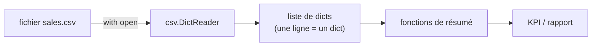

# Étape 3 — Fonctions, modules & fichiers

Pour analyser des données, il faut savoir **organiser** son code en fonctions réutilisables et **lire** des fichiers — à commencer par le CSV, format pivot de la BI.

> **Objectif de l'étape —** écrire des fonctions claires, importer des modules de la bibliothèque standard, et charger un fichier CSV en mémoire sous forme de liste de dictionnaires.

## Au programme

- **Fonctions** : paramètres, arguments par défaut, arguments nommés, valeur de retour
- **Modules** : `import`, `from ... import ...`, la bibliothèque standard
- **Fichiers** : `with open(...)`, lecture/écriture sûre
- **CSV** : le module `csv` et surtout `DictReader` (chaque ligne → un dict)

## Le flux qu'on vise

C'est précisément ce pipeline que `pandas` automatisera à l'étape suivante. Le comprendre « à la main » rend `read_csv` limpide.
