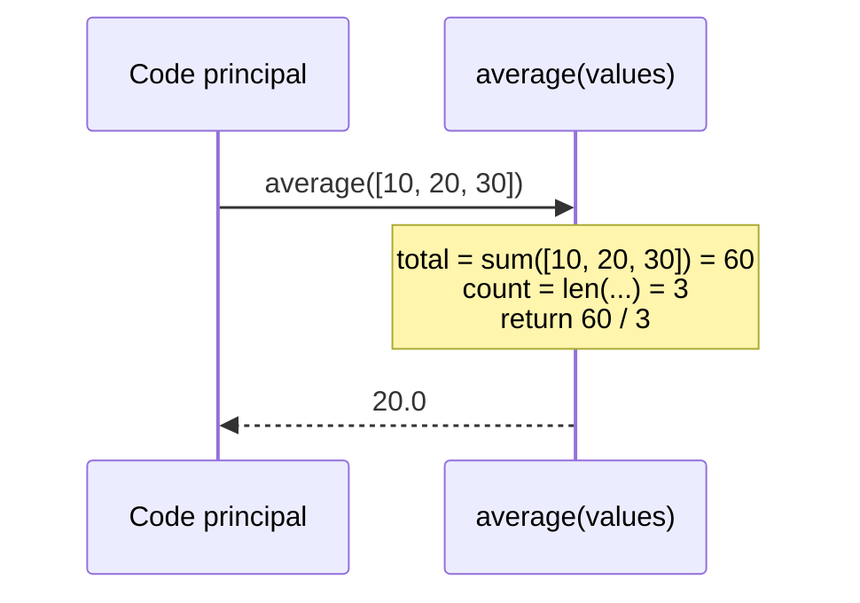

# Les fonctions

Une fonction encapsule un traitement réutilisable. En data, on factorise les calculs récurrents (nettoyer une valeur, calculer un KPI…) pour ne pas se répéter.

## Définir et appeler

```python
def average(values):
    return sum(values) / len(values)

average([10, 20, 30])    # 20.0
```

Le `return` renvoie le résultat. Sans `return`, la fonction renvoie `None`.

Ce qui se passe lors d'un appel à `average([10, 20, 30])` :



## Plusieurs paramètres

```python
def total_with_tax(amount, rate):
    return amount * (1 + rate)

total_with_tax(100, 0.20)    # 120.0
```

## Arguments par défaut

Donner une valeur par défaut rend un paramètre **optionnel**.

```python
def total_with_tax(amount, rate=0.20):
    return amount * (1 + rate)

total_with_tax(100)         # 120.0   → utilise rate=0.20
total_with_tax(100, 0.05)   # 105.0   → on surcharge
```

> **Piège classique —** ne jamais utiliser une **liste** (ou un dict) comme valeur par défaut mutable (`def f(items=[])`). Elle serait partagée entre les appels. Utilise `None` puis crée la liste dans le corps :
>
> ```python
> def f(items=None):
>     if items is None:
>         items = []
>     ...
> ```

## Arguments nommés (keyword arguments)

On peut passer les arguments par leur nom, dans n'importe quel ordre. C'est plus lisible quand il y en a plusieurs.

```python
def report(product, amount, currency="€"):
    return f"{product}: {amount:.2f} {currency}"

report(amount=19.99, product="notebook")          # "notebook: 19.99 €"
report("lamp", 34.0, currency="$")                # "lamp: 34.00 $"
```

## Renvoyer plusieurs valeurs

On renvoie un tuple, qu'on décompose à la réception.

```python
def stats(values):
    return min(values), max(values), sum(values) / len(values)

low, high, avg = stats([10, 20, 30])
print(low, high, avg)     # 10 30 20.0
```

## Une docstring pour documenter

Une chaîne en première ligne du corps décrit la fonction (apparaît dans l'aide).

```python
def average(values):
    """Return the average of a list of numbers."""
    return sum(values) / len(values)
```

## Problème résolu étape par étape : analyse d'une liste de courses

Construisons les fonctions une par une, du simple au complet.

**Étape 1 — calcul de base :**

```python
def total(prices):
    """Return the sum of all prices."""
    return sum(prices)

total([1.50, 3.00, 4.20])   # 8.7
```

**Étape 2 — ajouter un paramètre optionnel :**

```python
def total_with_tax(prices, tax_rate=0.20):
    """Return the total price including tax."""
    subtotal = sum(prices)
    return subtotal * (1 + tax_rate)

total_with_tax([1.50, 3.00])                  # 5.4   (20% default)
total_with_tax([1.50, 3.00], tax_rate=0.05)   # 4.725 (5% override)
```

**Étape 3 — renvoyer plusieurs valeurs :**

```python
def shopping_stats(prices):
    """Return total, average, and item count."""
    total_amount = sum(prices)
    count = len(prices)
    average = total_amount / count
    return total_amount, average, count

total_price, avg, n = shopping_stats([1.50, 3.00, 4.20, 0.80])
print(f"Total: {total_price:.2f} €, avg: {avg:.2f} €, {n} items")
# Total: 9.50 €, avg: 2.38 €, 4 items
```

## Erreurs fréquentes des débutants

### Oublier le `return` → la fonction renvoie `None`

```python
def double(x):
    result = x * 2
    # forgot return!

value = double(5)
print(value)   # None — not 10!
```

Si une variable récupère le résultat d'une fonction et vaut `None`, c'est presque toujours un `return` manquant.

### Utiliser un argument mutable par défaut

```python
# BAD: the list is created once and shared between all calls
def add_item(item, cart=[]):
    cart.append(item)
    return cart

print(add_item("apple"))   # ["apple"]
print(add_item("bread"))   # ["apple", "bread"] — oops! carries over from previous call

# GOOD: use None, then create the list inside the function
def add_item(item, cart=None):
    if cart is None:
        cart = []
    cart.append(item)
    return cart
```

---

## À toi de jouer

**Problème :** écris une fonction `average_above(values, threshold)` qui calcule la moyenne des valeurs **strictement supérieures** au seuil. Si aucune valeur ne dépasse le seuil, renvoie `0.0`.

```python
scores = [45, 72, 88, 61, 90, 55]
# average_above(scores, 70) → (72 + 88 + 90) / 3 = 83.33...
# average_above(scores, 95) → 0.0
```

**Solution :**

```python
def average_above(values, threshold):
    """Return the average of values strictly above threshold."""
    filtered = [v for v in values if v > threshold]
    if not filtered:       # empty list is falsy
        return 0.0
    return sum(filtered) / len(filtered)

scores = [45, 72, 88, 61, 90, 55]
print(f"Average above 70: {average_above(scores, 70):.2f}")   # 83.33
print(f"Average above 95: {average_above(scores, 95):.2f}")   # 0.00
```

> **À retenir —** une fonction = un traitement nommé et réutilisable. Arguments par défaut pour les options (jamais de mutable comme défaut), arguments nommés pour la lisibilité, tuple pour renvoyer plusieurs valeurs.
