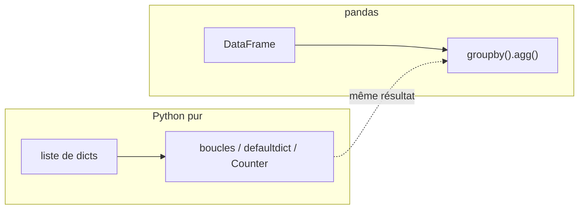

# Étape 4 — Manipuler des données, vers pandas

On rassemble tout. D'abord en **Python pur** : à partir d'une liste de dictionnaires, on filtre, on trie, on agrège, et on apprend le **group by « à la main »**. Puis on découvre **pandas**, l'outil de référence du Data-Analyst, qui fait tout ça en quelques lignes — mais que tu comprendras désormais en profondeur.

> **Objectif de l'étape —** transformer un jeu de données brut en réponses : en Python pur d'abord (pour comprendre), puis avec `pandas` (pour la productivité).

## Au programme

- Un jeu de données = liste de dictionnaires : filtrer / trier / agréger / compter
- **Group by « à la main »** avec `dict`, `defaultdict`, `Counter`
- **pandas** : `Series`, `DataFrame`, `read_csv`
- Sélection : colonnes, `loc` / `iloc`, **filtres booléens**
- Agréger : `groupby().agg()`, `describe`, tri
- **Fusionner** deux tables (`merge`) et **exporter**

## Le pont Python pur → pandas

> **Pourquoi apprendre les deux ?** Parce que `groupby` de pandas n'est pas magique : c'est le `defaultdict` que tu vas écrire à la main, en optimisé. Comprendre le « à la main » te rend autonome pour déboguer pandas.
