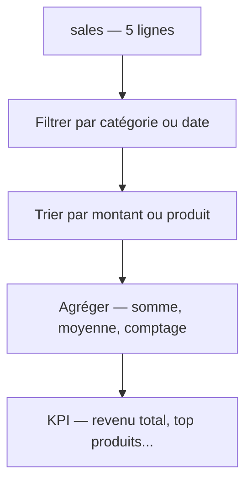

# Données en Python pur

Avant pandas, voyons comment répondre à des questions d'analyse avec uniquement les outils déjà vus. Jeu de référence pour toute l'étape :

```python
sales = [
    {"date": "2024-01-05", "product": "notebook", "category": "office", "quantity": 2,  "amount": 39.98},
    {"date": "2024-01-08", "product": "lamp",     "category": "home",   "quantity": 1,  "amount": 34.00},
    {"date": "2024-01-12", "product": "pen",      "category": "office", "quantity": 10, "amount": 25.00},
    {"date": "2024-02-03", "product": "desk",     "category": "home",   "quantity": 1,  "amount": 149.00},
    {"date": "2024-02-15", "product": "notebook", "category": "office", "quantity": 5,  "amount": 99.95},
]
```

Les opérations qu'on va enchaîner sur ces données :



## Filtrer

« Les ventes de catégorie `home` » :

```python
home_sales = [row for row in sales if row["category"] == "home"]
# lamp, desk
```

## Agréger : somme, moyenne, comptage

```python
total_revenue = sum(row["amount"] for row in sales)        # 347.93
order_count = len(sales)                                    # 5
average_order = total_revenue / order_count                # 69.586

print(f"Revenue: {total_revenue:,.2f} € over {order_count} orders")
print(f"Average order: {average_order:,.2f} €")
```

## Min / max et l'enregistrement associé

`max` avec `key=` renvoie la **ligne** dont le montant est le plus grand (pas juste la valeur) :

```python
biggest = max(sales, key=lambda row: row["amount"])
print(biggest["product"])     # "desk"  (149.00)
```

## Trier

« Top 3 des ventes par montant » :

```python
top3 = sorted(sales, key=lambda row: row["amount"], reverse=True)[:3]
for row in top3:
    print(f'{row["product"]:<10} {row["amount"]:>8.2f} €')
# desk        149.00 €
# notebook     99.95 €
# notebook     39.98 €
```

## Compter par valeur (sans module)

« Combien de ventes par catégorie ? » — la version naïve :

```python
counts = {}
for row in sales:
    category = row["category"]
    counts[category] = counts.get(category, 0) + 1
print(counts)     # {"office": 3, "home": 2}
```

Le motif `counts.get(key, 0) + 1` est le **comptage de base**. On le simplifiera avec `Counter` à la leçon suivante.

## Erreurs fréquentes des débutants

### `KeyError` : mauvais nom de clé dans les données

En data, ce type d'erreur survient souvent à cause d'un nom de colonne mal orthographié :

```python
# The correct key is "amount", not "total"
for row in sales:
    print(row["total"])    # KeyError: 'total'

# Fix: use the correct key name
for row in sales:
    print(row["amount"])   # 39.98, 34.0, 25.0, ...

# If a key might be missing in some rows:
for row in sales:
    amount = row.get("amount", 0.0)   # 0.0 if the key is absent
```

### Oublier d'initialiser l'accumulateur avant la boucle

```python
# WRONG: total is not defined before the loop
for row in sales:
    total += row["amount"]   # NameError: name 'total' is not defined

# CORRECT: always initialize before the loop
total = 0.0
for row in sales:
    total += row["amount"]
```

---

## À toi de jouer

**Problème :** en utilisant le jeu de données `sales` de cette leçon, réponds aux deux questions :

1. Quel est le **produit le plus vendu** en quantité totale (toutes lignes cumulées) ?
2. Quel est le **chiffre d'affaires moyen par commande** ?

**Solution :**

```python
# 1. Product with the highest total quantity across all orders
qty_by_product = {}
for row in sales:
    product = row["product"]
    qty_by_product[product] = qty_by_product.get(product, 0) + row["quantity"]

top_product = max(qty_by_product, key=lambda p: qty_by_product[p])
print(f"Most sold: {top_product} ({qty_by_product[top_product]} units)")
# Most sold: pen (10 units)

# 2. Average revenue per order
average_order = sum(row["amount"] for row in sales) / len(sales)
print(f"Average order: {average_order:.2f} €")   # Average order: 69.59 €
```

> **À retenir —** avec compréhensions, `sum(... for ...)`, `sorted(key=...)` et `max(key=...)`, tu réponds déjà à beaucoup de questions. Le seul motif qui devient lourd à la main, c'est le **regroupement** — d'où la leçon suivante.
