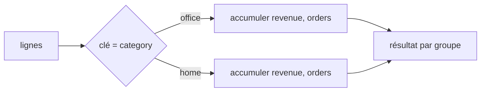

# Regrouper par catégorie, à la main

L'opération reine de l'analyse : **regrouper** des lignes par une clé, puis agréger chaque groupe (CA par catégorie, par mois, par produit…). C'est le `GROUP BY` du SQL, le `groupby` de pandas. Voyons-le en Python pur pour le comprendre une fois pour toutes.

Même jeu de données :

```python
sales = [
    {"product": "notebook", "category": "office", "amount": 39.98},
    {"product": "lamp",     "category": "home",   "amount": 34.00},
    {"product": "pen",      "category": "office", "amount": 25.00},
    {"product": "desk",     "category": "home",   "amount": 149.00},
    {"product": "notebook", "category": "office", "amount": 99.95},
]
```

## Version `dict` + `get`

CA total par catégorie :

```python
revenue_by_category = {}
for row in sales:
    category = row["category"]
    revenue_by_category[category] = revenue_by_category.get(category, 0.0) + row["amount"]

print(revenue_by_category)
# {"office": 164.93, "home": 183.00}
```

`get(category, 0.0)` initialise à 0 la première fois qu'une catégorie apparaît, puis accumule.

## Version `defaultdict` (plus propre)

`defaultdict(float)` crée automatiquement une entrée à `0.0` pour toute clé absente — fini le `get(..., 0.0)`.

```python
from collections import defaultdict

revenue_by_category = defaultdict(float)
for row in sales:
    revenue_by_category[row["category"]] += row["amount"]

print(dict(revenue_by_category))    # {"office": 164.93, "home": 183.0}
```

Pour **collecter les lignes** d'un groupe (et pas seulement une somme), `defaultdict(list)` :

```python
rows_by_category = defaultdict(list)
for row in sales:
    rows_by_category[row["category"]].append(row)

len(rows_by_category["office"])    # 3
```

## Version `Counter` (pour compter)

Quand on veut juste **compter** les occurrences, `Counter` est imbattable :

```python
from collections import Counter

counts = Counter(row["category"] for row in sales)
print(counts)                  # Counter({"office": 3, "home": 2})
print(counts.most_common(1))   # [("office", 3)]  → the most frequent category
```

## Group by + plusieurs agrégats

En vrai, on veut souvent **plusieurs mesures par groupe** (somme, nombre, moyenne). On accumule dans un dict de dicts :

```python
from collections import defaultdict

agg = defaultdict(lambda: {"revenue": 0.0, "orders": 0})
for row in sales:
    bucket = agg[row["category"]]
    bucket["revenue"] += row["amount"]
    bucket["orders"] += 1

for category, stats in agg.items():
    avg = stats["revenue"] / stats["orders"]
    print(f'{category:<8} revenue={stats["revenue"]:>8.2f}  orders={stats["orders"]}  avg={avg:.2f}')
# office   revenue=  164.93  orders=3  avg=54.98
# home     revenue=  183.00  orders=2  avg=91.50
```



> **À retenir —** `defaultdict(float)` pour sommer par clé, `defaultdict(list)` pour collecter les lignes, `Counter` pour compter. Ce schéma « parcourir → ranger par clé → agréger » EST `groupby`. La leçon pandas va remplacer ces 5 lignes par une seule — mais tu sais désormais ce qu'elle fait.
