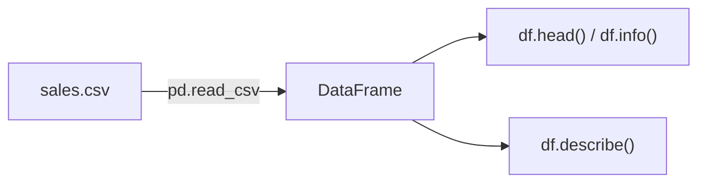

# Découverte de pandas

`pandas` est la bibliothèque centrale du Data-Analyst en Python. Elle apporte deux structures : la **`Series`** (une colonne) et le **`DataFrame`** (un tableau de colonnes). Tout ce que tu as fait à la main devient déclaratif et vectorisé.

```python
import pandas as pd     # convention universelle
```

## La `Series` : une colonne nommée

```python
amounts = pd.Series([39.98, 34.00, 25.00, 149.00])

amounts.sum()      # 247.98
amounts.mean()     # 61.995
amounts.max()      # 149.0
amounts * 1.2      # applies VAT to the ENTIRE column at once (vectorised)
```

Pas de boucle : une opération s'applique à tous les éléments à la fois.

## Le `DataFrame` : un tableau

C'est notre liste de dictionnaires… en mieux. On peut le créer directement :

```python
sales = [
    {"date": "2024-01-05", "product": "notebook", "category": "office", "quantity": 2,  "amount": 39.98},
    {"date": "2024-01-08", "product": "lamp",     "category": "home",   "quantity": 1,  "amount": 34.00},
    {"date": "2024-02-03", "product": "desk",     "category": "home",   "quantity": 1,  "amount": 149.00},
]

df = pd.DataFrame(sales)
print(df)
#          date   product category  quantity  amount
# 0  2024-01-05  notebook   office         2   39.98
# 1  2024-01-08      lamp     home         1   34.00
# 2  2024-02-03      desk     home         1  149.00
```

## Charger un CSV : `read_csv`

Le cas réel : tout ce qu'on a écrit à la main avec `csv.DictReader` + conversions se réduit à **une ligne** (les types numériques sont même détectés automatiquement).

```python
df = pd.read_csv("sales.csv")
```

## Premiers réflexes d'inspection

```python
df.head()        # first 5 rows
df.shape         # (nb_lignes, nb_colonnes)
df.columns       # column names
df.dtypes        # data type of each column
df.info()        # overview: columns, types, non-null counts
df.describe()    # descriptive stats for numeric columns
```

`describe()` est un excellent point de départ d'analyse :

```python
df.describe()
#         quantity      amount
# count        3.0    3.000000
# mean         1.3   74.660000
# std          0.5   62....
# min          1.0   34.000000
# 25%          1.0   ...
# 50%          1.0   39.980000
# 75%          1.5   ...
# max          2.0  149.000000
```



> **À retenir —** `Series` = une colonne, `DataFrame` = un tableau. `pd.read_csv("...")` charge et type un CSV en une ligne. Premiers gestes systématiques : `df.head()`, `df.info()`, `df.describe()` pour prendre la mesure du jeu de données.
