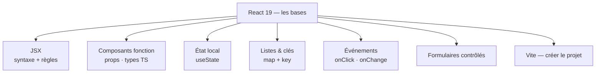
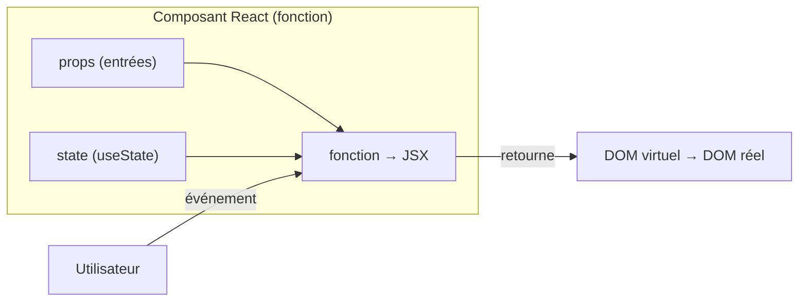

# Étape 3 — React : les bases

Tu arrives ici avec JavaScript solide et TypeScript en poche. On entre dans React 19 :
des **composants fonction**, du **JSX** et la mécanique du rendu déclaratif. On construit
le premier composant brique par brique, dans l'ordre où un composant prend réellement vie.

> **Objectif de l'étape —** comprendre le modèle mental React (UI = f(state)), écrire des
> composants, passer des props, afficher des listes et gérer un état local simple.



## Au programme

- JSX : la syntaxe et ses règles (une racine, `className`, expressions `{}`)
- Composants fonction et **props** typées en TypeScript
- État local : `useState`
- Rendu conditionnel : opérateur ternaire et `&&`
- Listes et la prop `key`
- Gestion d'événements
- Formulaires contrôlés
- Démarrer avec **Vite**

## Le modèle mental React

React est une bibliothèque **à composants**. Chaque composant est une **fonction** qui
reçoit des **props** et retourne du JSX. L'interface est le résultat d'une seule
équation :

> **UI = f(state)**

Quand l'état change, React recalcule la fonction et met à jour le DOM — tu ne touches
**jamais** le DOM directement.



### Comparaison avec Vue et Angular

| Concept | React | Vue 3 | Angular |
|---|---|---|---|
| Syntaxe de template | **JSX** (JS + HTML mélangés) | Template HTML + directives | Template HTML + directives |
| Réactivité | `useState` / hooks | `ref` / `reactive` | Signals / détection de changements |
| Logique réutilisable | **Hooks** (`useXxx`) | **Composables** (`useXxx`) | Services injectables |
| État global | Context / Zustand / Redux | Pinia | Services singleton |
| Binding bidirectionnel | manuel (`value` + `onChange`) | `v-model` | `[(ngModel)]` |

### Ce qui change radicalement par rapport à Angular et Vue

Venant d'Angular ou de Vue, trois ruptures cognitives sont à intégrer dès le départ :

**1. Pas de two-way binding natif**

En Angular tu écris `[(ngModel)]="username"` ; en Vue `v-model="username"`. En React,
il n'y a pas d'équivalent direct : tu décomposes toi-même la liaison en deux parties —
la valeur descendante (`value`) et le callback remontant (`onChange`). C'est plus
verbeux, mais c'est intentionnel : le flux reste toujours explicite.

```tsx
// Angular: [(ngModel)]="username"
// Vue:     v-model="username"
// React:   décomposition explicite
const [username, setUsername] = useState('')
<input value={username} onChange={(e) => setUsername(e.target.value)} />
```

**2. Pas de système de détection de changements — tout est re-rendu**

Angular a son `ChangeDetector` (et maintenant les Signals). Vue traque les dépendances
réactives automatiquement. React recalcule le composant **en entier** à chaque setState.
C'est le Virtual DOM qui évite les mises à jour DOM superflues — mais c'est toi qui
contrôles l'optimisation avec `useMemo`, `useCallback` et `React.memo`.

**3. Les hooks ont des règles strictes**

Contrairement aux composables Vue (qu'on peut appeler conditionnellement) ou aux
services Angular (injectés une fois), les hooks React doivent être appelés **au
niveau racine du composant**, toujours dans le même ordre. Jamais dans un `if`, un
`for` ou une fonction imbriquée.

```tsx
// INTERDIT — le hook est dans un if
function BadComponent({ isAdmin }: { isAdmin: boolean }) {
  if (isAdmin) {
    const [data, setData] = useState(null) // Rules of Hooks violation
  }
}

// CORRECT — hooks toujours au niveau racine
function GoodComponent({ isAdmin }: { isAdmin: boolean }) {
  const [data, setData] = useState(null) // always called
  if (!isAdmin) return null
}
```

### Vue d'ensemble : composant Angular / Vue SFC / React

Le même composant « carte produit » dans les trois frameworks :

```tsx
// --- ANGULAR ---
// product-card.component.ts
@Component({
  selector: 'app-product-card',
  template: `
    <div class="card">
      <h2>{{ product.name }}</h2>
      <p>{{ product.price }} €</p>
      <button (click)="addToCart.emit(product)">Ajouter</button>
    </div>
  `,
})
export class ProductCardComponent {
  @Input() product!: Product
  @Output() addToCart = new EventEmitter<Product>()
}
```

```vue
<!-- --- VUE SFC --- -->
<!-- ProductCard.vue -->
<script setup lang="ts">
const props = defineProps<{ product: Product }>()
const emit = defineEmits<{ addToCart: [product: Product] }>()
</script>

<template>
  <div class="card">
    <h2>{{ product.name }}</h2>
    <p>{{ product.price }} €</p>
    <button @click="emit('addToCart', product)">Ajouter</button>
  </div>
</template>
```

```tsx
// --- REACT ---
// ProductCard.tsx
interface ProductCardProps {
  product: Product
  onAddToCart: (product: Product) => void
}

function ProductCard({ product, onAddToCart }: ProductCardProps) {
  return (
    <div className="card">
      <h2>{product.name}</h2>
      <p>{product.price} €</p>
      <button onClick={() => onAddToCart(product)}>Ajouter</button>
    </div>
  )
}
```

> **Repère —** `@Input()` Angular = `defineProps` Vue = premier paramètre de la fonction
> React. `@Output()` Angular = `defineEmits` Vue = callback passé en prop en React.

> **À noter —** les composants React ne s'exécutent pas dans le bac à sable des exercices
> interactifs (réservé à JS/TS pur). Les exercices interactifs portent donc sur la **logique
> TypeScript** pure ; le code JSX est présenté en **mode correction** et dans les blocs de
> code illustratifs.
