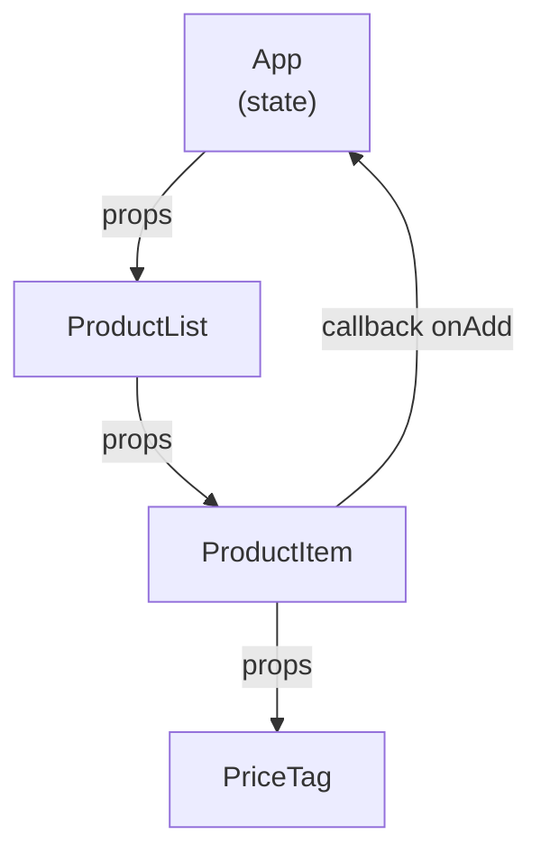

# Composants & props

Un composant React est une **fonction TypeScript** qui reçoit des **props** et retourne
du JSX. C'est tout. La puissance vient de la **composition** : on imbrique des composants
comme des blocs Lego.

## Définir un composant

```tsx
// A component is just a function that starts with an uppercase letter
function Greeting() {
  return <h1>Bonjour tout le monde !</h1>
}

// Arrow function — same thing
const Greeting = () => <h1>Bonjour tout le monde !</h1>
```

> La majuscule est obligatoire : `<greeting />` est interprété comme une balise HTML
> inconnue ; `<Greeting />` est un composant React.

## Props typées avec TypeScript

Les props sont simplement le **premier paramètre** de la fonction. On les type avec une
interface ou un type :

```tsx
interface CardProps {
  title: string
  description?: string   // optional
  count: number
}

function Card({ title, description, count }: CardProps) {
  return (
    <div className="card">
      <h2>{title}</h2>
      {description && <p>{description}</p>}
      <span className="badge">{count}</span>
    </div>
  )
}
```

Utilisation (dans le JSX du composant parent) :

```tsx
function App() {
  return (
    <main>
      <Card title="Articles" count={42} />
      <Card title="Commentaires" description="En attente" count={7} />
    </main>
  )
}
```

## Props spéciales

### `children`

La prop `children` reçoit ce qui est placé **entre** les balises ouvrante et fermante :

```tsx
interface PanelProps {
  title: string
  children: React.ReactNode
}

function Panel({ title, children }: PanelProps) {
  return (
    <section className="panel">
      <h3>{title}</h3>
      <div className="panel__body">{children}</div>
    </section>
  )
}

// Usage:
<Panel title="Résumé">
  <p>Voici le contenu du panneau.</p>
  <ul><li>Item 1</li></ul>
</Panel>
```

## Listes avec `.map()` et `key`

Pour afficher une liste, on utilise `.map()` — une expression JS normale dans les `{}` :

```tsx
interface Product {
  id: number
  name: string
  price: number
}

function ProductList({ products }: { products: Product[] }) {
  return (
    <ul>
      {products.map((product) => (
        <li key={product.id}>
          {product.name} — {product.price} €
        </li>
      ))}
    </ul>
  )
}
```

> **La prop `key` est obligatoire** quand on rend une liste. React l'utilise pour
> identifier chaque élément et éviter des re-rendus inutiles. Utilise un identifiant
> **stable et unique** (un `id` de base de données, pas l'index du tableau — sauf si la
> liste est statique et ne change jamais d'ordre).

## Flux de données : sens unique (top-down)



Les données descendent toujours du parent vers l'enfant via les props. Un enfant ne peut
pas modifier directement les props de son parent — il doit **remonter un événement**
(un callback passé en prop).

> **Passerelle Vue —** c'est exactement la même règle qu'avec `defineProps` et `defineEmits`.
> **Passerelle Angular —** c'est `@Input()` (descente) et `@Output()` (remontée).

## Comparaison Angular / Vue / React : le même composant

| Aspect | Angular | Vue 3 (script setup) | React |
|---|---|---|---|
| Déclarer les props | `@Input() title: string` | `defineProps<{ title: string }>()` | premier paramètre typé |
| Émettre vers le parent | `@Output() clicked = new EventEmitter()` | `defineEmits<{ clicked: [] }>()` | callback `onClicked: () => void` en prop |
| Binding de template | `{{ title }}` | `{{ title }}` | `{title}` dans le JSX |
| Binding événement | `(click)="handler()"` | `@click="handler"` | `onClick={handler}` |
| Styles scoped | `styleUrls` + `encapsulation` | `<style scoped>` | `className` + CSS modules / Tailwind |
| Contenu transclus | `<ng-content>` | `<slot>` | prop `children` |

## Prop drilling et ses limites

Quand l'arbre devient profond, passer des props à travers plusieurs niveaux
intermédiaires devient fastidieux — c'est le **prop drilling** :

```mermaid
flowchart TD
  A["App<br/>user: User"] -->|"user"| B["Dashboard"]
  B -->|"user"| C["Sidebar"]
  C -->|"user"| D["UserAvatar<br/>(consumer réel)"]
  style B fill:#f5f5f5,color:#999
  style C fill:#f5f5f5,color:#999
```

`Dashboard` et `Sidebar` ne font que transmettre `user` — ils n'en ont pas besoin
eux-mêmes. La solution : le **Context** (module 3). C'est l'équivalent de
`provide`/`inject` en Vue ou d'un service singleton `providedIn: 'root'` en Angular.

## Pattern : compound components

Les **compound components** (composants composés) exposent plusieurs sous-composants
qui partagent un état interne via Context. C'est l'équivalent React d'un composant
Angular avec `ContentChild` / `@ContentChildren`, ou d'un slot nommé Vue.

```tsx
// A Tab system: Tabs, Tabs.List, Tabs.Panel share state via Context
import { createContext, useContext, useState, ReactNode } from 'react'

interface TabsContextType {
  activeTab: string
  setActiveTab: (id: string) => void
}

const TabsContext = createContext<TabsContextType | null>(null)

function useTabs() {
  const ctx = useContext(TabsContext)
  if (!ctx) throw new Error('useTabs must be used inside <Tabs>')
  return ctx
}

// Root component — holds state and provides context
function Tabs({ children, defaultTab }: { children: ReactNode; defaultTab: string }) {
  const [activeTab, setActiveTab] = useState(defaultTab)
  return (
    <TabsContext.Provider value={{ activeTab, setActiveTab }}>
      <div className="tabs">{children}</div>
    </TabsContext.Provider>
  )
}

// Sub-components — consume context directly
function TabList({ children }: { children: ReactNode }) {
  return <div role="tablist" className="tabs__list">{children}</div>
}

function Tab({ id, children }: { id: string; children: ReactNode }) {
  const { activeTab, setActiveTab } = useTabs()
  return (
    <button
      role="tab"
      aria-selected={activeTab === id}
      onClick={() => setActiveTab(id)}
    >
      {children}
    </button>
  )
}

function TabPanel({ id, children }: { id: string; children: ReactNode }) {
  const { activeTab } = useTabs()
  if (activeTab !== id) return null
  return <div role="tabpanel">{children}</div>
}

// Attach sub-components as static properties
Tabs.List = TabList
Tabs.Tab = Tab
Tabs.Panel = TabPanel

// Usage — reads like HTML, hides state complexity
function App() {
  return (
    <Tabs defaultTab="overview">
      <Tabs.List>
        <Tabs.Tab id="overview">Vue d'ensemble</Tabs.Tab>
        <Tabs.Tab id="details">Détails</Tabs.Tab>
      </Tabs.List>
      <Tabs.Panel id="overview"><p>Contenu général…</p></Tabs.Panel>
      <Tabs.Panel id="details"><p>Détails techniques…</p></Tabs.Panel>
    </Tabs>
  )
}
```

> **Repère —** le pattern compound components est très répandu dans les bibliothèques
> d'UI React (Radix UI, Headless UI). Il garantit que les sous-composants ne peuvent
> pas être utilisés en dehors du contexte attendu (l'erreur est explicite).

## À retenir

- Un composant = une **fonction** qui commence par une majuscule, retourne du JSX.
- Les props = le premier paramètre ; types définis avec une `interface`.
- `children` : contenu JSX passé entre les balises ouvrante/fermante — équivalent de `<ng-content>` / `<slot>`.
- Listes : `.map()` dans les `{}` + prop `key` stable sur chaque élément.
- Données **top-down** : les props descendent, les callbacks remontent.
- Prop drilling profond → Context (module 3) ; équivalent `provide`/`inject` Vue / service Angular.
- Pattern **compound components** : sous-composants liés par un Context interne partagé.
