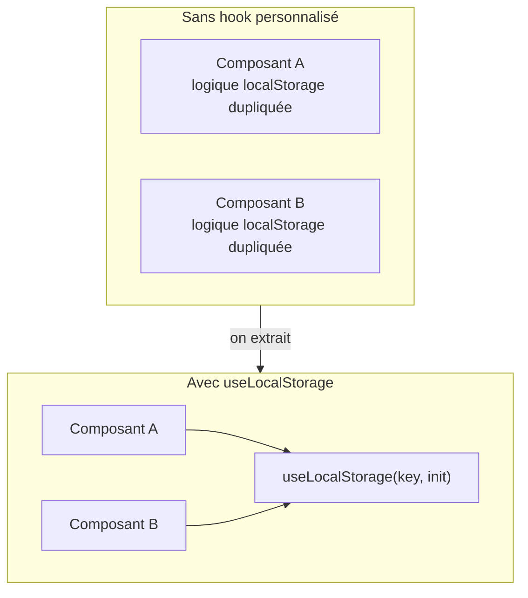

# Les hooks React

Les **hooks** sont des fonctions spéciales qui commencent par `use`. Ils permettent
d'utiliser les fonctionnalités React (état, effets, contexte…) dans des **composants
fonction** sans avoir besoin de classes.

> **Pourquoi les hooks existent-ils ?** Avant React 16.8 (2019), il fallait des **classes**
> pour avoir de l'état ou un cycle de vie. Les classes posaient des problèmes : logique
> dispersée dans plusieurs méthodes (`componentDidMount`, `componentDidUpdate`…), `this`
> déstabilisant, réutilisation difficile. Les hooks regroupent la logique **par
> préoccupation** (pas par cycle de vie) et permettent de l'extraire dans des fonctions
> réutilisables — exactement comme les composables Vue 3.

## Les hooks essentiels

| Hook | Rôle | Équivalent Vue |
|---|---|---|
| `useState` | État local | `ref` |
| `useEffect` | Effets de bord (fetch, abonnements, DOM) | `onMounted` + `watch` |
| `useMemo` | Valeur dérivée mémoïsée | `computed` |
| `useCallback` | Fonction mémoïsée (référence stable) | — |
| `useRef` | Référence mutable (sans re-rendu) / accès DOM | `ref` template |
| `useContext` | Lire un contexte global | `provide`/`inject` |
| `useReducer` | État complexe (machine à états) | — |

## Règles des hooks

Deux règles absolues [source: react.dev] :

1. **Appelez les hooks au niveau supérieur** — jamais dans des conditions (`if`), des
   boucles ou des fonctions imbriquées. React s'appuie sur l'**ordre d'appel** pour faire
   correspondre chaque hook à son état interne.

2. **Appelez les hooks uniquement depuis des composants React ou des hooks personnalisés**
   — pas depuis des fonctions JS ordinaires.

```tsx
// Incorrect — hook dans un if
function BadComponent({ condition }: { condition: boolean }) {
  if (condition) {
    const [x, setX] = useState(0)  // ← interdit !
  }
}

// Correct — hook is always called
function GoodComponent({ condition }: { condition: boolean }) {
  const [x, setX] = useState(0)
  // ... utiliser x conditionnellement si besoin
}
```

## Hooks personnalisés

Un hook personnalisé est une **fonction `useXxx`** qui appelle d'autres hooks. C'est
**l'équivalent des composables Vue** :

```tsx
// hooks/useLocalStorage.ts
import { useState } from 'react'

function useLocalStorage<T>(key: string, initial: T) {
  const [value, setValue] = useState<T>(() => {
    const stored = localStorage.getItem(key)
    return stored ? JSON.parse(stored) : initial
  })

  function set(newValue: T) {
    localStorage.setItem(key, JSON.stringify(newValue))
    setValue(newValue)
  }

  return [value, set] as const
}
```

Même convention de nom (`use`), même idée : extraire la logique réutilisable — on partage
la logique, pas l'état (chaque appel crée son propre état).



> **À retenir —** les hooks sont des fonctions `useXxx` qui encapsulent de la logique
> réactive React. Ils sont l'équivalent direct des composables Vue 3. Deux règles : au
> niveau supérieur, et dans des composants/hooks seulement.
