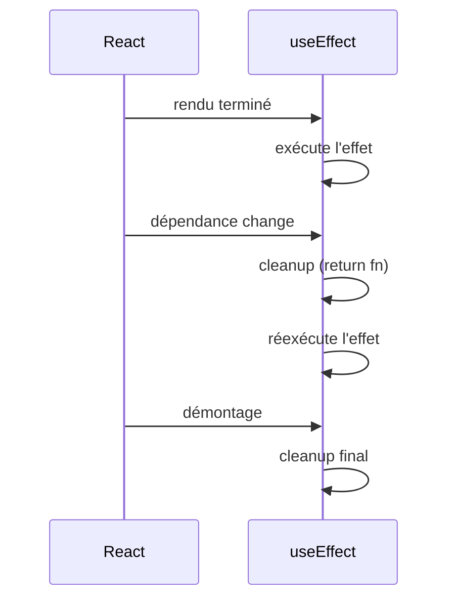
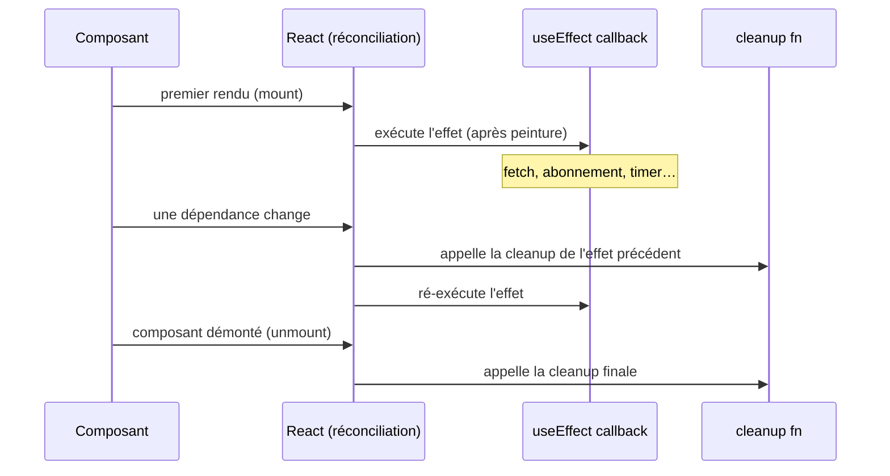

# `useEffect` — effets de bord

`useEffect` exécute du code **après le rendu** : charger des données, s'abonner à un
événement, synchroniser avec une API externe. Tout ce qui « sort » du rendu pur est un
**effet de bord**.

## Syntaxe de base

```tsx
import { useEffect } from 'react'

useEffect(() => {
  // code executed after render
}, [dependencies])
```

Le deuxième argument est le **tableau de dépendances** — il contrôle quand l'effet se
relance.

## Les trois formes

```tsx
// 1. Empty array [] → runs only once after mount (equivalent to onMounted)
useEffect(() => {
  console.log('Component mounted')
}, [])

// 2. With dependencies → re-runs when a dependency changes
useEffect(() => {
  document.title = `Page: ${page}`
}, [page])

// 3. No array → re-runs after EVERY render (rarely what you want)
useEffect(() => {
  console.log('Rendered')
})
```

## Nettoyage (cleanup)

Si l'effet crée un abonnement, un timer ou un event listener, il faut le **nettoyer** en
retournant une fonction :

```tsx
useEffect(() => {
  const interval = setInterval(() => {
    setSeconds((prev) => prev + 1)
  }, 1000)

  // Cleanup: called when the component unmounts or before the effect re-runs
  return () => clearInterval(interval)
}, [])
```

Sans cleanup, les abonnements s'accumulent en mémoire et provoquent des bugs subtils.



## Exemple : chargement de données

```tsx
import { useState, useEffect } from 'react'

interface Post {
  id: number
  title: string
}

function PostList() {
  const [posts, setPosts] = useState<Post[]>([])
  const [loading, setLoading] = useState(true)
  const [error, setError] = useState<string | null>(null)

  useEffect(() => {
    let cancelled = false  // guard against race conditions

    async function fetchPosts() {
      try {
        const res = await fetch('https://jsonplaceholder.typicode.com/posts?_limit=5')
        const data: Post[] = await res.json()
        if (!cancelled) setPosts(data)
      } catch (err) {
        if (!cancelled) setError('Erreur de chargement')
      } finally {
        if (!cancelled) setLoading(false)
      }
    }

    fetchPosts()
    return () => { cancelled = true }
  }, [])  // [] → fetch once on mount

  if (loading) return <p>Chargement…</p>
  if (error) return <p>{error}</p>
  return <ul>{posts.map((p) => <li key={p.id}>{p.title}</li>)}</ul>
}
```

> La variable `cancelled` évite les **race conditions** : si le composant est démonté
> avant la fin du fetch, on n'appelle plus le setter (évite l'erreur « setState on
> unmounted component »).

## Cycle de vie complet : render → effect → cleanup



> **Repère Angular —** le cycle `ngOnInit` / `ngOnChanges` / `ngOnDestroy` est linéaire
> et déclaratif sur la classe. En React, un seul `useEffect` couvre les trois phases :
> le corps = init/update, le return = destroy.

## Comparaison détaillée avec Vue et Angular

| Cas d'usage | React | Vue 3 | Angular |
|---|---|---|---|
| À l'initialisation | `useEffect(fn, [])` | `onMounted(fn)` | `ngOnInit()` |
| Quand `x` change | `useEffect(fn, [x])` | `watch(x, fn)` ou `watchEffect` | `ngOnChanges()` + check `x` |
| Chaque rendu | `useEffect(fn)` | `watchEffect(fn)` | — |
| Nettoyage | `return () => cleanup()` | `onUnmounted(fn)` | `ngOnDestroy()` |
| Fetch HTTP | `useEffect` + `useState` | `onMounted` + `ref` | `ngOnInit` + `HttpClient` |
| Dépendances | **déclarées manuellement** `[x]` | **trackées automatiquement** | **implicites** (Angular sait ce qu'il faut) |

La différence clé avec Vue : Vue **traque les dépendances réactives automatiquement**
dans `watchEffect`. En React, tu dois **les déclarer explicitement** — c'est la source
du piège des stale closures.

## Pièges courants (venant d'Angular/Vue)

### 1. Stale closure — la fermeture sur une valeur obsolète

C'est le piège React le plus courant pour quelqu'un venant de Vue ou Angular, où les
bindings sont réactifs par nature.

```tsx
// BUG: count is always 0 inside the effect (stale closure)
function Counter() {
  const [count, setCount] = useState(0)

  useEffect(() => {
    const id = setInterval(() => {
      console.log('count is:', count) // always reads 0 !
      setCount(count + 1)             // always sets 1
    }, 1000)
    return () => clearInterval(id)
  }, []) // [] captures count=0 once and never updates

  return <p>{count}</p>
}

// FIX 1: declare count as dependency
useEffect(() => {
  const id = setInterval(() => {
    setCount(count + 1)
  }, 1000)
  return () => clearInterval(id)
}, [count]) // re-creates interval on each count change

// FIX 2 (better): use the functional updater — no dependency needed
useEffect(() => {
  const id = setInterval(() => {
    setCount((prev) => prev + 1) // reads latest value, not closure
  }, 1000)
  return () => clearInterval(id)
}, []) // stable: no dependency
```

> **Pourquoi ça n'arrive pas en Vue ?** Parce que `count` est un `ref` réactif : la
> fermeture sur `.value` lit toujours la valeur courante. En React, `count` est une
> variable JS ordinaire figée au moment du rendu.

### 2. Les hooks ne peuvent pas être conditionnels (Rules of Hooks)

En Vue, un composable peut être appelé à l'intérieur d'un `if`. En React, c'est
interdit : React identifie les hooks par leur **ordre d'appel** entre les rendus.

```tsx
// INTERDIT — React ne peut pas garantir l'ordre des hooks
function BadComponent({ userId }: { userId?: string }) {
  if (userId) {
    useEffect(() => {          // Hook called conditionally → crash
      fetchUser(userId)
    }, [userId])
  }
}

// CORRECT — hook toujours appelé, condition à l'intérieur
function GoodComponent({ userId }: { userId?: string }) {
  useEffect(() => {
    if (!userId) return        // guard inside the effect
    fetchUser(userId)
  }, [userId])
}
```

### 3. `useEffect` ne peut pas être async directement

```tsx
// INTERDIT — useEffect ne peut pas être async
useEffect(async () => {   // async renvoie une Promise, pas une cleanup fn
  const data = await fetchData()
  setData(data)
}, [])

// CORRECT — fonction async définie et appelée à l'intérieur
useEffect(() => {
  async function load() {
    const data = await fetchData()
    setData(data)
  }
  load()
}, [])
```

### 4. Dépendances manquantes détectées par ESLint

L'extension `eslint-plugin-react-hooks` (incluse dans les projets Vite / CRA par défaut)
signale les dépendances oubliées avec la règle `react-hooks/exhaustive-deps`. **Fais-lui
confiance** — si tu supprimes l'avertissement avec `// eslint-disable`, tu introduis
probablement un stale closure.

> **À retenir —** `useEffect(fn, [deps])` est l'outil pour les effets de bord : fetch,
> timers, event listeners. Retourne une fonction cleanup pour nettoyer. Tableau vide =
> montage uniquement. Dépendances = relancé quand elles changent. Le piège principal :
> les **stale closures** sur des valeurs capturées au premier rendu.
