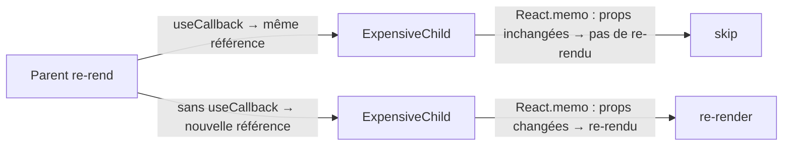

# `useMemo` & `useCallback`

Ces deux hooks mémoïsent des valeurs pour éviter des **calculs ou re-créations
inutiles** à chaque rendu. Ils sont à utiliser avec discernement — pas partout.

## `useMemo` — valeur dérivée coûteuse

`useMemo` mémoïse le **résultat** d'un calcul. Il ne se recalcule que quand ses
dépendances changent — exactement comme `computed` en Vue.

```tsx
import { useMemo } from 'react'

function ProductList({ products, filter }: Props) {
  // Recalculated only when products or filter changes
  const filtered = useMemo(
    () => products.filter((p) => p.category === filter),
    [products, filter]
  )

  return <ul>{filtered.map((p) => <li key={p.id}>{p.name}</li>)}</ul>
}
```

> **Passerelle Vue —** `useMemo(() => expr, [deps])` est l'équivalent exact de
> `computed(() => expr)`. La différence : en Vue les dépendances sont **trackées
> automatiquement** ; en React on les déclare **explicitement** dans le tableau.

### Quand utiliser `useMemo` ?

- Calcul **réellement coûteux** (tri de milliers d'items, traitement d'une grande liste).
- Résultat utilisé comme **dépendance** d'un autre `useMemo` ou `useEffect`.

Ne pas l'utiliser pour des calculs simples (addition, accès à une propriété) — la
mémoïsation a elle-même un coût.

## `useCallback` — fonction mémoïsée (référence stable)

`useCallback` mémoïse la **référence** d'une fonction. Sans lui, une nouvelle fonction
est créée à chaque rendu, ce qui peut déclencher des re-rendus inutiles des composants
enfants.

```tsx
import { useCallback } from 'react'

function Parent() {
  const [count, setCount] = useState(0)

  // Without useCallback: new function reference on every render
  // → child re-renders every time Parent renders, even if count hasn't changed
  const handleClick = useCallback(() => {
    setCount((prev) => prev + 1)
  }, [])  // stable reference: created once

  return <ExpensiveChild onAction={handleClick} />
}
```

### Quand utiliser `useCallback` ?

- La fonction est passée en prop à un composant enfant **mémoïsé** (`React.memo`).
- La fonction est dans les dépendances d'un `useEffect` ou `useMemo`.

## Comparaison avec Vue et Angular

| Optimisation | React | Vue 3 | Angular |
|---|---|---|---|
| Valeur dérivée mémoïsée | `useMemo(() => expr, [deps])` | `computed(() => expr)` (auto-track) | `pipe` pur, ou getter calculé |
| Fonction stable | `useCallback(fn, [deps])` | — (les méthodes de setup sont stables) | `@HostListener` / méthode de classe |
| Composant mémoïsé | `React.memo(Component)` | `v-memo` (directive) | `OnPush` change detection |
| Pourquoi nécessaire | **tout re-rend** à chaque render | réactivité fine-grained (seuls les watchers réagissent) | zone.js + ChangeDetector (OnPush = manuel) |

> **Repère clé —** Vue et Angular ont une réactivité **fine-grained** : seuls les
> consommateurs d'une valeur réactive se mettent à jour. React re-rend le composant
> **en entier** ; `useMemo`/`useCallback`/`React.memo` sont les instruments pour éviter
> le sur-rendu.

## Résumé comparatif

| | `useMemo` | `useCallback` |
|---|---|---|
| Mémoïse | une **valeur** | une **fonction** |
| Équivalent Vue | `computed` | — (méthodes stables par défaut) |
| Équivalent Angular | getter + `OnPush` | méthode de classe |
| Utiliser quand | calcul coûteux | prop vers enfant mémoïsé |
| Syntaxe | `useMemo(() => val, [deps])` | `useCallback(fn, [deps])` |

> `useCallback(fn, deps)` est exactement `useMemo(() => fn, deps)` — c'est juste une
> version plus lisible pour le cas spécifique des fonctions.

## `React.memo` — ne re-rendre un enfant que si ses props changent

`React.memo` enveloppe un composant : il ne se re-rend que si ses props **changent**
(comparaison référentielle). Il se marie avec `useCallback` pour éviter les re-rendus
en cascade :

```tsx
const ExpensiveChild = React.memo(function ExpensiveChild({
  onAction,
}: {
  onAction: () => void
}) {
  console.log('ExpensiveChild rendered')
  return <button onClick={onAction}>Action</button>
})
```



## Quand mesurer avant d'optimiser

La règle d'or : **ne pas ajouter `useMemo`/`useCallback` par défaut**. Venant
d'Angular `OnPush` (qu'on active dès le début par discipline), l'instinct est
d'optimiser tôt. En React, le compilateur React 19 (React Compiler, anciennement
« Forget ») mémoïse automatiquement les composants dans les projets opt-in — mais
en attendant, voici le workflow :

1. Ouvre **React DevTools Profiler** (onglet « Profiler » dans les DevTools).
2. Enregistre une interaction.
3. Identifie les composants avec des re-rendus fréquents et inutiles.
4. Applique `React.memo` + `useCallback` / `useMemo` **uniquement là**.

```tsx
// RxJS vs useMemo : un parallèle pour les habitués Angular
// RxJS (Angular) :
const filtered$ = items$.pipe(
  map(items => items.filter(i => i.active))
)

// useMemo (React) — même idée, mais synchrone et déclaratif
const filteredItems = useMemo(
  () => items.filter((i) => i.active),
  [items]
)
```

> **À retenir —** `useMemo` mémoïse une valeur (= `computed` Vue), `useCallback`
> mémoïse une référence de fonction (= méthode de classe Angular, stable par nature).
> Utilise-les avec parcimonie : **mesure d'abord**, optimise ensuite. React.memo +
> useCallback = équivalent du mode OnPush Angular.
