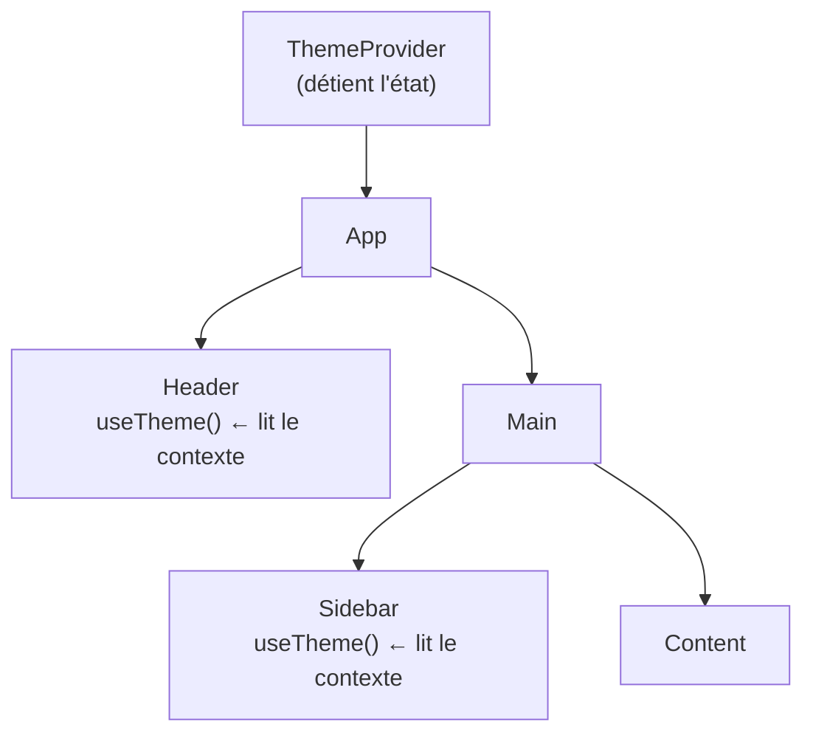
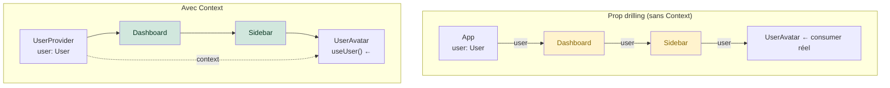

# Context — état global léger

Quand plusieurs composants **sans lien parent/enfant direct** ont besoin du même état
(utilisateur connecté, thème, langue), passer des props à travers tous les intermédiaires
est pénible — c'est le **prop-drilling**. Le **Context** React résout ça.

> **Passerelle Vue —** `useContext` joue le même rôle que `provide`/`inject` en Vue 3.
> **Passerelle Angular —** c'est l'équivalent d'un service singleton (`providedIn: 'root'`).

## Créer et utiliser un context

### 1. Définir le context

```tsx
// contexts/ThemeContext.tsx
import { createContext, useContext, useState, ReactNode } from 'react'

type Theme = 'light' | 'dark'

interface ThemeContextType {
  theme: Theme
  toggleTheme: () => void
}

// Create context with a default value (used when there's no Provider above)
const ThemeContext = createContext<ThemeContextType>({
  theme: 'light',
  toggleTheme: () => {},
})
```

### 2. Fournir le context (Provider)

```tsx
export function ThemeProvider({ children }: { children: ReactNode }) {
  const [theme, setTheme] = useState<Theme>('light')

  const toggleTheme = () =>
    setTheme((prev) => (prev === 'light' ? 'dark' : 'light'))

  return (
    <ThemeContext.Provider value={{ theme, toggleTheme }}>
      {children}
    </ThemeContext.Provider>
  )
}
```

### 3. Consommer le context

```tsx
export function useTheme() {
  return useContext(ThemeContext)
}

// In any component anywhere in the tree:
function Header() {
  const { theme, toggleTheme } = useTheme()
  return (
    <header className={`header header--${theme}`}>
      <button onClick={toggleTheme}>
        {theme === 'light' ? 'Mode sombre' : 'Mode clair'}
      </button>
    </header>
  )
}
```

### 4. Monter le Provider dans l'arbre

```tsx
// src/main.tsx
createRoot(document.getElementById('root')!).render(
  <StrictMode>
    <ThemeProvider>
      <App />
    </ThemeProvider>
  </StrictMode>,
)
```

## Flux de données avec Context



Tout composant sous le `Provider` peut lire le contexte via `useTheme()`, sans que les
intermédiaires (`App`, `Main`) aient besoin de connaître le thème.

## Prop drilling vs Context : visualisation



`Dashboard` et `Sidebar` n'ont plus besoin de connaître `user` — ils restent propres.

## Comparaison Angular / Vue / React pour l'état global

| Problème | Angular | Vue 3 | React |
|---|---|---|---|
| Partager un état simple | Service `providedIn: 'root'` | `provide`/`inject` + `reactive` | `createContext` + `useContext` |
| Mettre à jour l'état partagé | Méthode du service | Fonction exportée depuis le composable | Fonction dans le Provider |
| Réactivité | Signals / RxJS BehaviorSubject | `ref`/`reactive` (auto-tracked) | `useState` dans le Provider (re-render) |
| Store dédié (complexe) | NgRx / Akita | Pinia | Zustand / Redux Toolkit |

> **Attention performance —** quand le context est mis à jour (ex. le thème change),
> **tous** les composants qui appellent `useContext(ThemeContext)` se re-rendent, même
> s'ils n'utilisent qu'une partie de la valeur. Ce n'est pas le cas avec `provide`/`inject`
> Vue (réactif fine-grained) ni avec les services Angular (Observable cold). C'est pourquoi
> on split les contexts pour les données qui changent souvent.

## useReducer + Context : le pattern « mini-Redux »

Pour un état plus complexe (plusieurs actions, transitions d'état), combiner `useReducer`
avec Context donne un pattern proche de NgRx / Pinia, sans bibliothèque externe.

```tsx
// store/cart.tsx
import { createContext, useContext, useReducer, ReactNode } from 'react'

interface CartItem {
  id: number
  name: string
  quantity: number
}

interface CartState {
  items: CartItem[]
}

// Discriminated union — TypeScript garantit que chaque action a la bonne payload
type CartAction =
  | { type: 'ADD_ITEM'; item: CartItem }
  | { type: 'REMOVE_ITEM'; id: number }
  | { type: 'CLEAR' }

function cartReducer(state: CartState, action: CartAction): CartState {
  switch (action.type) {
    case 'ADD_ITEM':
      return { items: [...state.items, action.item] }
    case 'REMOVE_ITEM':
      return { items: state.items.filter((i) => i.id !== action.id) }
    case 'CLEAR':
      return { items: [] }
  }
}

// --- Context setup ---
interface CartContextType {
  state: CartState
  dispatch: React.Dispatch<CartAction>
}

const CartContext = createContext<CartContextType | null>(null)

export function CartProvider({ children }: { children: ReactNode }) {
  const [state, dispatch] = useReducer(cartReducer, { items: [] })
  return (
    <CartContext.Provider value={{ state, dispatch }}>
      {children}
    </CartContext.Provider>
  )
}

export function useCart() {
  const ctx = useContext(CartContext)
  if (!ctx) throw new Error('useCart must be used inside <CartProvider>')
  return ctx
}
```

```tsx
// Usage in any component
function CartSummary() {
  const { state, dispatch } = useCart()
  return (
    <div>
      <p>{state.items.length} article(s)</p>
      <button onClick={() => dispatch({ type: 'CLEAR' })}>Vider</button>
    </div>
  )
}
```

> **Passerelle NgRx —** `useReducer` est l'équivalent de la fonction reducer NgRx.
> Les actions `{ type, payload }` sont identiques. La différence : NgRx découple le
> store de l'arbre de composants ; ici le store vit dans le Context (donc dans l'arbre).

## Context vs state management

Le Context est idéal pour les données **peu fréquemment modifiées** (thème, langue,
utilisateur). Pour un état **fréquemment mis à jour** (panier actif, formulaire),
il vaut mieux une bibliothèque dédiée comme **Zustand** — plus légère et plus performante
que Redux.

| Solution | Usage | Passerelle |
|---|---|---|
| `useState` + props | état **local** ou **peu profond** | `ref` + props Vue |
| `useContext` | état **global peu modifié** | `provide`/`inject` Vue / service Angular |
| `useReducer` + Context | état global avec **logique de transition** | NgRx (simplifié) / Pinia actions |
| **Zustand** | état global **fréquemment modifié** | Pinia / service partagé |
| Redux Toolkit | très grande app, historique des actions | NgRx complet |

> **À retenir —** Context = `createContext` + `Provider` + `useContext`. Idéal pour thème,
> langue, utilisateur. Crée un hook custom (`useTheme`) pour ne pas exposer le context
> directement. Combine `useReducer` + Context pour un mini-store typé. Pour l'état
> transactionnel fréquent, préfère Zustand.
