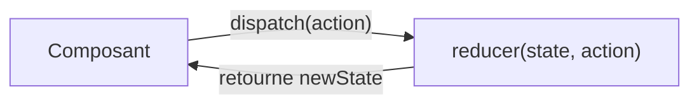

# `useReducer` — état complexe

Quand l'état d'un composant comporte plusieurs sous-valeurs interdépendantes ou des
transitions complexes, `useState` empilé devient difficile à lire. `useReducer` offre un
modèle **centralisé** : tout l'état évolue via une fonction **reducer** pure.

## Syntaxe

```tsx
const [state, dispatch] = useReducer(reducer, initialState)
```

- `reducer` : une **fonction pure** `(state, action) => newState`.
- `dispatch` : envoie une action au reducer pour déclencher une transition.

## Exemple : formulaire multi-étapes

```tsx
interface FormState {
  step: number
  name: string
  email: string
  submitting: boolean
  error: string | null
}

type FormAction =
  | { type: 'SET_FIELD'; field: 'name' | 'email'; value: string }
  | { type: 'NEXT_STEP' }
  | { type: 'SUBMIT' }
  | { type: 'SUBMIT_SUCCESS' }
  | { type: 'SUBMIT_ERROR'; message: string }

const initialState: FormState = {
  step: 1,
  name: '',
  email: '',
  submitting: false,
  error: null,
}

function formReducer(state: FormState, action: FormAction): FormState {
  switch (action.type) {
    case 'SET_FIELD':
      return { ...state, [action.field]: action.value }
    case 'NEXT_STEP':
      return { ...state, step: state.step + 1 }
    case 'SUBMIT':
      return { ...state, submitting: true, error: null }
    case 'SUBMIT_SUCCESS':
      return { ...state, submitting: false, step: 3 }
    case 'SUBMIT_ERROR':
      return { ...state, submitting: false, error: action.message }
    default:
      return state
  }
}
```

```tsx
function MultiStepForm() {
  const [state, dispatch] = useReducer(formReducer, initialState)

  return (
    <form>
      {state.step === 1 && (
        <>
          <input
            value={state.name}
            onChange={(e) => dispatch({ type: 'SET_FIELD', field: 'name', value: e.target.value })}
            placeholder="Nom"
          />
          <button onClick={() => dispatch({ type: 'NEXT_STEP' })}>Suivant</button>
        </>
      )}
      {state.step === 2 && (
        <>
          <input
            value={state.email}
            onChange={(e) => dispatch({ type: 'SET_FIELD', field: 'email', value: e.target.value })}
            placeholder="Email"
          />
          <button
            disabled={state.submitting}
            onClick={() => dispatch({ type: 'SUBMIT' })}
          >
            {state.submitting ? 'Envoi…' : 'Envoyer'}
          </button>
        </>
      )}
      {state.error && <p className="error">{state.error}</p>}
    </form>
  )
}
```

## `useState` vs `useReducer`

| Critère | `useState` | `useReducer` |
|---|---|---|
| État simple (1-2 valeurs) | Parfait | Overkill |
| État complexe interdépendant | Difficile à gérer | Idéal |
| Transitions nommées | Non | Oui (`action.type`) |
| Testabilité | Difficile | Le reducer est une **fonction pure** — facile à tester |
| Équivalent Vue | `ref` | — |



## Le reducer est une fonction pure

C'est sa force : on peut tester chaque transition **sans composant** :

```ts
// Simple unit test (no React needed)
const newState = formReducer(initialState, { type: 'SET_FIELD', field: 'name', value: 'Alice' })
// newState.name === 'Alice'
```

> **À retenir —** `useReducer` = état complexe centralisé dans une fonction pure `reducer`.
> On `dispatch` des actions nommées plutôt que d'appeler plusieurs setters. Le reducer est
> facilement testable en isolation. C'est le schéma de Redux simplifié, intégré à React.
