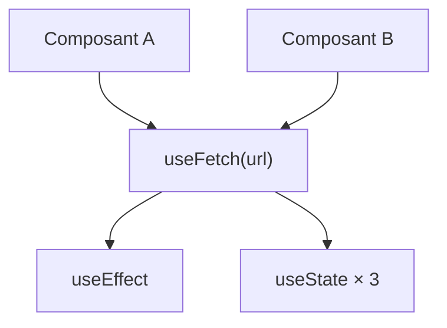

# Hooks personnalisés

Un **hook personnalisé** est une fonction `useXxx` qui appelle d'autres hooks pour
encapsuler de la **logique réactive réutilisable**. C'est le mécanisme de factorisation
de React — l'équivalent exact des **composables Vue 3**.

> **Principe —** si deux composants ont besoin de la même logique avec état, on l'extrait
> dans un hook. On partage la logique, pas l'état (chaque appel crée son propre état).

## Exemple 1 : `useFetch`

Un pattern de chargement de données revient dans chaque composant qui fetch. On l'extrait :

```tsx
// hooks/useFetch.ts
import { useState, useEffect } from 'react'

interface FetchState<T> {
  data: T | null
  loading: boolean
  error: string | null
}

function useFetch<T>(url: string): FetchState<T> {
  const [data, setData] = useState<T | null>(null)
  const [loading, setLoading] = useState(true)
  const [error, setError] = useState<string | null>(null)

  useEffect(() => {
    let cancelled = false
    setLoading(true)
    setError(null)

    fetch(url)
      .then((res) => {
        if (!res.ok) throw new Error(`HTTP ${res.status}`)
        return res.json() as Promise<T>
      })
      .then((json) => { if (!cancelled) { setData(json); setLoading(false) } })
      .catch((err: Error) => { if (!cancelled) { setError(err.message); setLoading(false) } })

    return () => { cancelled = true }
  }, [url])

  return { data, loading, error }
}
```

Utilisation :

```tsx
function UserProfile({ id }: { id: number }) {
  const { data: user, loading, error } = useFetch<User>(`/api/users/${id}`)

  if (loading) return <p>Chargement…</p>
  if (error) return <p>Erreur : {error}</p>
  return <h2>{user?.name}</h2>
}
```

Plus besoin de répéter la logique `useState + useEffect + cancelled` dans chaque composant.

## Exemple 2 : `useDebounce`

```tsx
// hooks/useDebounce.ts
import { useState, useEffect } from 'react'

function useDebounce<T>(value: T, delay: number): T {
  const [debounced, setDebounced] = useState(value)

  useEffect(() => {
    const timer = setTimeout(() => setDebounced(value), delay)
    return () => clearTimeout(timer)
  }, [value, delay])

  return debounced
}
```

```tsx
function SearchBar() {
  const [query, setQuery] = useState('')
  const debouncedQuery = useDebounce(query, 300)  // only fires 300ms after last keystroke

  useEffect(() => {
    if (debouncedQuery) {
      // fetch results for debouncedQuery
    }
  }, [debouncedQuery])

  return <input value={query} onChange={(e) => setQuery(e.target.value)} />
}
```

## Exemple 3 : `useToggle`

```tsx
// hooks/useToggle.ts
import { useState, useCallback } from 'react'

function useToggle(initial = false): [boolean, () => void] {
  const [state, setState] = useState(initial)
  const toggle = useCallback(() => setState((prev) => !prev), [])
  return [state, toggle]
}

// Usage
const [open, toggleOpen] = useToggle()
```

## Conventions

- Toujours préfixer par **`use`** — React et ESLint l'attendent.
- Retourner un **objet** (plus de clés nommées) ou un **tuple** (comme `useState`).
- Placer dans `src/hooks/` (ou `src/composables/` si on vient de Vue).
- Un hook peut appeler d'autres hooks personnalisés — on les compose.



> **À retenir —** un hook personnalisé = `useXxx(params)` qui retourne état + fonctions.
> Même convention que les composables Vue. On extrait pour factoriser, on ne partage pas
> l'état. Conventions : préfixe `use`, retour déstructurable.
