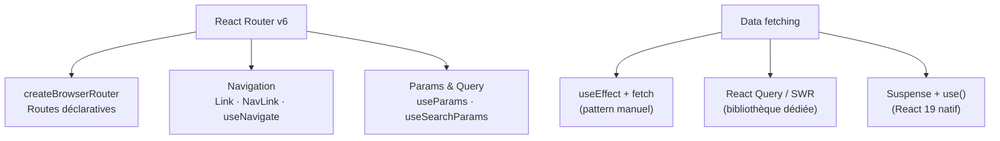

# Étape 4 — Routing & Data fetching

Une application React réelle a besoin de **navigation** entre les pages et de **données
chargées depuis une API**. Cette étape couvre React Router v6 et les patterns de data
fetching modernes.

> **Objectif de l'étape —** construire une SPA multi-pages avec React Router, charger des
> données de façon robuste et gérer les états de chargement et d'erreur.

## Au programme

- `createBrowserRouter` et `RouterProvider` (API moderne React Router v6)
- Routes imbriquées et `<Outlet>`
- Navigation : `<Link>`, `<NavLink>`, `useNavigate`
- Paramètres dynamiques : `useParams`
- Query string : `useSearchParams`
- Data fetching : patterns et comparaison
- Gestion des états loading/error
- React Query — introduction

> **Comparaison Angular —** Angular Router et React Router ont la même philosophie : routes
> déclaratives, paramètres dynamiques (`:id`), outlet pour les enfants. Différence : Angular
> Router est inclus dans le framework ; React Router est une bibliothèque à installer.
>
> **Comparaison Vue —** Vue Router et React Router v6 sont très proches dans leur conception
> (`RouterView` = `<Outlet>`, `router-link` = `<Link>`, `useRoute` = `useParams`).
