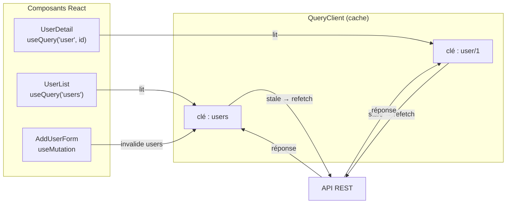

# Data fetching — patterns

Charger des données depuis une API est une opération incontournable. React 19 offre
plusieurs approches, du pattern manuel au hook dédié.

## Pattern 1 : `useEffect` + `useState` (manuel)

Le plus transparent, vu au module précédent. Utile pour comprendre ce qui se passe :

```tsx
function UserList() {
  const [users, setUsers] = useState<User[]>([])
  const [loading, setLoading] = useState(true)
  const [error, setError] = useState<string | null>(null)

  useEffect(() => {
    let cancelled = false

    fetch('/api/users')
      .then((r) => r.json())
      .then((data) => { if (!cancelled) { setUsers(data); setLoading(false) } })
      .catch((e) => { if (!cancelled) { setError(e.message); setLoading(false) } })

    return () => { cancelled = true }
  }, [])

  if (loading) return <p>Chargement…</p>
  if (error) return <p>Erreur : {error}</p>
  return <ul>{users.map((u) => <li key={u.id}>{u.name}</li>)}</ul>
}
```

Inconvénients : beaucoup de code répétitif, pas de cache, pas de revalidation.

## Pattern 2 : React Query (recommandé)

**React Query** (TanStack Query) gère le cycle de vie complet : fetch, cache, revalidation,
gestion des erreurs, états de chargement.

```bash
npm install @tanstack/react-query
```

```tsx
// src/main.tsx
import { QueryClient, QueryClientProvider } from '@tanstack/react-query'

const queryClient = new QueryClient()

createRoot(document.getElementById('root')!).render(
  <QueryClientProvider client={queryClient}>
    <App />
  </QueryClientProvider>,
)
```

```tsx
// Utilisation dans un composant
import { useQuery } from '@tanstack/react-query'

async function fetchUsers(): Promise<User[]> {
  const res = await fetch('/api/users')
  if (!res.ok) throw new Error('Network error')
  return res.json()
}

function UserList() {
  const { data: users, isLoading, error } = useQuery({
    queryKey: ['users'],        // cache key
    queryFn: fetchUsers,
  })

  if (isLoading) return <p>Chargement…</p>
  if (error) return <p>Erreur : {error.message}</p>
  return <ul>{users!.map((u) => <li key={u.id}>{u.name}</li>)}</ul>
}
```

Avantages : **cache automatique**, revalidation en arrière-plan, déduplification des
requêtes, pagination, infinite scroll, mutations avec optimistic update.

## Pattern 3 : `use()` + Suspense (React 19)

React 19 introduit le hook `use()` qui « unwrap » une Promise dans un composant. Combiné
à `<Suspense>`, il délègue la gestion du loading au parent [source: react.dev].

```tsx
// React 19 — use() hook
import { use, Suspense } from 'react'

async function fetchUser(id: number): Promise<User> {
  const res = await fetch(`/api/users/${id}`)
  return res.json()
}

function UserCard({ userPromise }: { userPromise: Promise<User> }) {
  const user = use(userPromise)  // suspends until resolved
  return <h2>{user.name}</h2>
}

function UserPage({ id }: { id: number }) {
  const userPromise = fetchUser(id)
  return (
    <Suspense fallback={<p>Chargement…</p>}>
      <UserCard userPromise={userPromise} />
    </Suspense>
  )
}
```

## Comparaison des patterns

| Pattern | Cache | Revalidation | Complexité | Quand l'utiliser |
|---|---|---|---|---|
| `useEffect` manuel | Non | Non | Faible | Apprentissage, cas simple |
| React Query | Oui | Oui | Moyenne | Applications réelles (recommandé) |
| `use()` + Suspense | Selon source | Selon source | Faible | React 19, Server Components |

## Comparaison Angular HttpClient / Vue / React Query

| Aspect | Angular `HttpClient` + RxJS | Vue + `useFetch` / VueUse | React Query |
|---|---|---|---|
| Paradigme | Flux réactif (Observable) | Composable + `ref` réactif | Cache déclaratif (query key) |
| Cache | Non (sauf `shareReplay`) | Non (sauf VueUse `useStorage`) | **Oui**, par `queryKey` |
| Revalidation | Manuelle ou `interval` | Manuelle | **Automatique** (focus, refetch) |
| Déduplification | `switchMap` + `share` | Manuelle | **Automatique** |
| Optimistic update | Manuelle | Manuelle | `onMutate` + rollback |
| Annulation | `takeUntil(destroy$)` | flag `cancelled` | `AbortController` géré en interne |

> **Repère —** `HttpClient` est centré sur le **flux** (composition d'opérateurs RxJS).
> React Query est centré sur le **cache** (stale-while-revalidate). Les deux approches
> se valent ; React Query est simplement plus « batteries included » pour le front.

## Mutations avec React Query

```tsx
import { useMutation, useQueryClient } from '@tanstack/react-query'

function AddUserForm() {
  const queryClient = useQueryClient()

  const mutation = useMutation({
    mutationFn: (newUser: CreateUserInput) =>
      fetch('/api/users', { method: 'POST', body: JSON.stringify(newUser) }).then((r) => r.json()),
    onSuccess: () => {
      // Invalidate the users cache → triggers refetch
      queryClient.invalidateQueries({ queryKey: ['users'] })
    },
  })

  return (
    <button
      disabled={mutation.isPending}
      onClick={() => mutation.mutate({ name: 'Bob', email: 'bob@example.com' })}
    >
      {mutation.isPending ? 'Ajout…' : 'Ajouter un utilisateur'}
    </button>
  )
}
```

## React Query avancé : pagination, dépendances, optimistic update

### Requête dépendante (équivalent `switchMap` RxJS)

```tsx
// Fetch user first, then fetch their posts — dependent query
function UserWithPosts({ userId }: { userId: number }) {
  const { data: user } = useQuery({
    queryKey: ['user', userId],
    queryFn: () => fetchUser(userId),
  })

  // Only runs when user is available — equivalent to switchMap in RxJS
  const { data: posts } = useQuery({
    queryKey: ['posts', user?.id],
    queryFn: () => fetchPostsByUser(user!.id),
    enabled: !!user,   // disabled until user is loaded
  })

  return <div>...</div>
}
```

### Optimistic update (mutation sans attendre la réponse serveur)

```tsx
// Show the new item immediately, rollback on error
const mutation = useMutation({
  mutationFn: addTodo,
  onMutate: async (newTodo) => {
    // Cancel any outgoing refetches
    await queryClient.cancelQueries({ queryKey: ['todos'] })

    // Snapshot the current value
    const previousTodos = queryClient.getQueryData<Todo[]>(['todos'])

    // Optimistically update
    queryClient.setQueryData<Todo[]>(['todos'], (old = []) => [
      ...old,
      { id: Date.now(), ...newTodo },
    ])

    return { previousTodos }  // context for rollback
  },
  onError: (_err, _newTodo, context) => {
    // Rollback on error
    queryClient.setQueryData(['todos'], context?.previousTodos)
  },
  onSettled: () => {
    queryClient.invalidateQueries({ queryKey: ['todos'] })
  },
})
```

## Architecture de données : flux React Query



Le `QueryClient` est le **singleton de cache** — équivalent d'un service Angular
`providedIn: 'root'` ou d'un store Pinia. Tous les composants qui partagent la même
`queryKey` reçoivent les mêmes données et se synchronisent automatiquement.

> **Passerelle Angular —** `HttpClient` + `RxJS` joue le même rôle que React Query :
> requêtes déclaratives, gestion des erreurs, transformations. React Query est plus centré
> sur le **cache** (stale-while-revalidate) ; `HttpClient` + RxJS est plus centré sur
> la **composition de flux** (opérateurs, multicast). Les deux approches sont valides ;
> React Query est le standard de facto côté React en 2024-2025.

> **À retenir —** Pour les applications réelles, utilise **React Query** : il gère le
> cache, la revalidation et les états de chargement. Le pattern `useEffect` manuel reste
> utile pour comprendre les mécanismes. Requête dépendante = `enabled: !!dep`. Optimistic
> update = `onMutate` + rollback dans `onError`.
